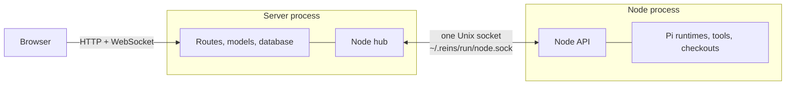
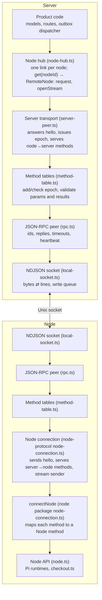
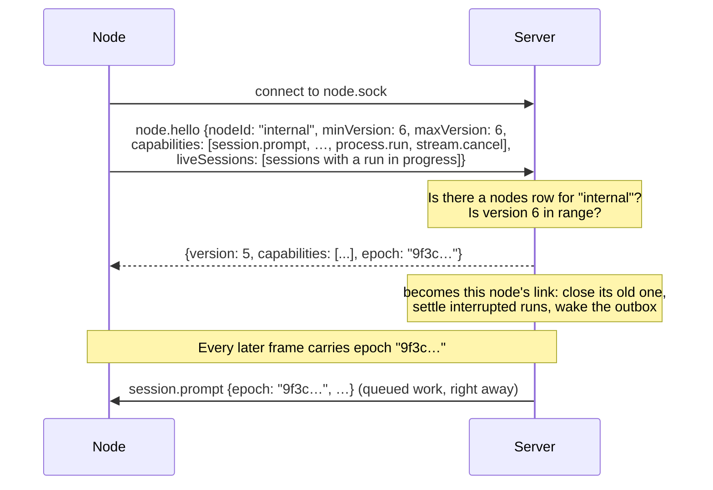
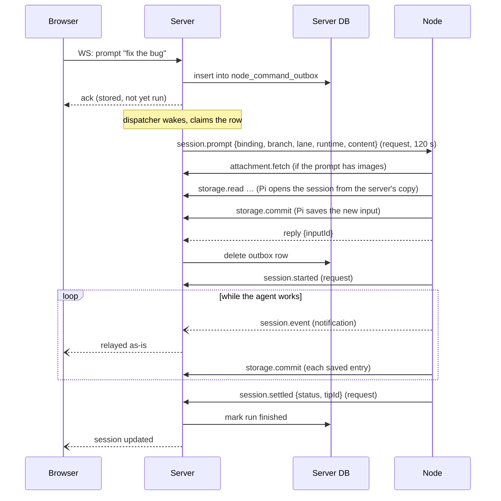
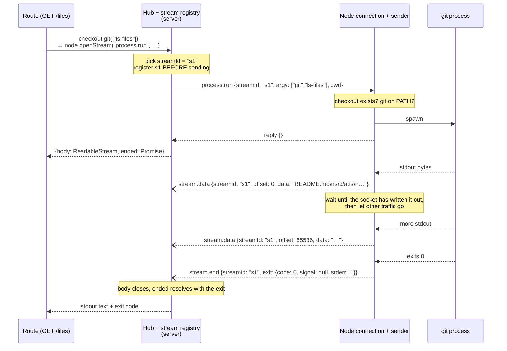
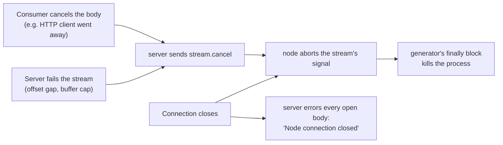
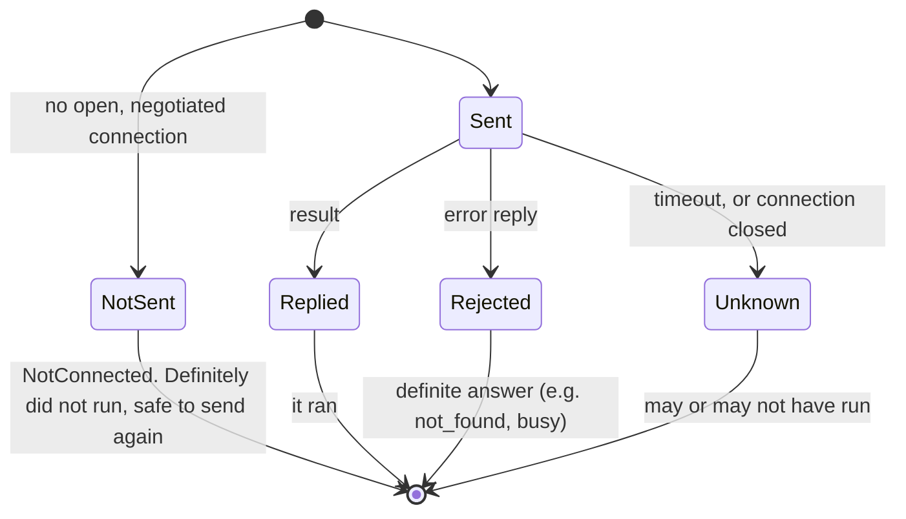
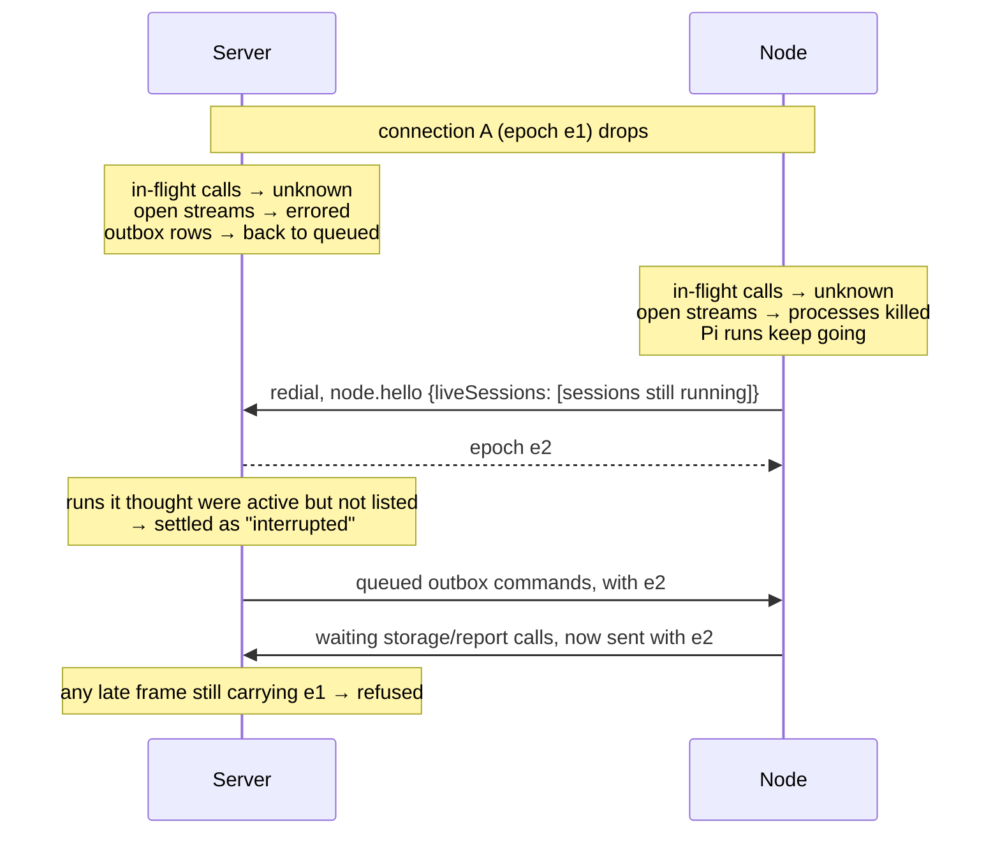

# The node link

How the Reins server and a node exchange messages, from bytes on a socket up to "the server runs `git ls-files` on the node". Each topic starts with a plain explanation and ends with the exact rules (limits, error codes, timeouts) under **Details**.

This doc covers the link itself: the socket, framing, JSON-RPC, negotiation and epochs, the heartbeat, frame caps, wire errors, the method tables, streams, reconnecting, hot reload and test links. What the server and node *say* over it (session commands, the outbox, storage, credentials, fencing, crash recovery) is in [node-contract.md](node-contract.md).

## The big picture

There are two processes. The **server** has the database, the browser UI and the credentials. The **node** runs the agent (Pi) and holds the checkout the agent works in. They share nothing in memory and meet only on one Unix socket, `~/.reins/run/node.sock`.



Both sides call each other over that socket:

| Direction | What it is for | Examples |
|---|---|---|
| Server → node | "Do something on your machine" | run a prompt, abort, list skills, run `git`, list a directory |
| Node → server | "I need something only the server has" | read or save session storage, get a credential, fetch an attachment, report that a run started or finished |
| Node → server, one way | "Here's live output, no reply needed" | agent events for the browser, stream chunks |

The node keeps nothing on disk (its data directory only holds file uploads it has not finished writing). Every time Pi reads or saves session history, the call goes back over the socket to the server's database. That is why the link carries far more node→server traffic than you might expect.

## Glossary

The code uses these words precisely. Here is what each one means.

| Word | Plain meaning |
|---|---|
| **Link** / **connection** | One open socket between the server and one node. When it drops and the node redials, that is a new connection. |
| **Frame** | One complete message on the socket. On the local link a frame is one line of JSON. |
| **NDJSON** | "Newline-delimited JSON": the bytes on the socket are JSON objects, one per line. |
| **JSON-RPC** | A standard JSON shape for messages that are *requests* (expect an answer), *replies*, or *notifications* (no answer). |
| **Peer** | The code on each end that speaks JSON-RPC: it sends requests, matches replies to them, and dispatches incoming requests to handlers. The same peer code runs on both sides. |
| **Method** | A named message type, like `storage.read` or `session.prompt`. Each one has a params schema and, for requests, a result schema. |
| **Method table** | The list of methods one side serves, with their schemas (`nodeMethods`, `serverMethods`). It is the single definition of the wire API. |
| **Request** / **reply** | A message that expects an answer, and that answer. The reply is matched to its request by an `id`. |
| **Notification** | A one-way message with no `id` and no answer. Fire and forget. |
| **Hello** / **negotiation** | The node's first request on a new connection (`node.hello`): "I am node X, I speak protocol version 6, I can do these things." The server answers with an epoch. |
| **Capability** | A server→node method the node says it supports in its hello. The server only calls methods the node listed. |
| **Epoch** | A random ID the server gives each connection at hello. Every later message carries it, so a message from an old, replaced connection is recognised and refused. |
| **Heartbeat** | `node.ping` notifications every 10 s. If one side hears nothing at all for three intervals (30–40 s), it decides the other end is dead and closes. |
| **Hub** | The server-side object (`state.nodes`) that owns all node connections and is how product code talks to nodes. |
| **Outbox** | A database table of commands waiting to be delivered to a node. A **command** is only this submitted work (prompt, steer, setModel), so it survives a disconnect or a server restart. |
| **Request-now** | A call that is never queued: if the node is offline it fails immediately (`unavailable`). Everything that is not a command works this way: abort, resume, skills, `fs.list`, `fs.read`, `fs.write`, `process.run`. |
| **Outcome unknown** | A request was sent, but no reply came back (timeout, or the connection dropped). It may or may not have run on the other side. |
| **Stream** | A way for the node to send output that is too big or too long-running for one reply, as a series of chunks. |
| **Backpressure** | Slowing a sender down so it does not produce faster than the receiver (or the socket) can take. |
| **Drained** | The socket has written out everything queued to it. |
| **Fencing** | The server refusing a node's call about a session that does not belong to that node. |

## The layers

Each layer only knows about the one below it. A message passes down through every layer on the sending side and back up through every layer on the receiving side.



The NDJSON socket, the peer, the method tables and the node's connection are shared code in `@reins/node-protocol`. The server transport, the hub and product code live in `packages/backend`; `connectNode` and the Node API in `packages/node`.

Only the bottom layer knows about Unix sockets. Everything from the peer up needs just a `WireSocket` (send a text frame, receive frames, close), so remote nodes can later use WebSocket (not built) and reuse every layer above it, authentication included ([ADR-012](../adr/012-ndjson-unix-socket-local-link.md), [ADR-023](../adr/023-node-pairing-and-challenge-authentication.md); *Details: authentication* below).

### 1. The socket: bytes ⇄ lines

`packages/node-protocol/src/local-socket.ts` (`createNdjsonSocket`)

A Unix socket is a pipe of bytes with no message boundaries. One read might return half a message, or three and a half. This layer turns bytes into whole messages and back:

- **Sending:** it takes a JSON string, appends `\n` and writes the bytes. If the OS will not accept them all right now (its buffer is full), the rest wait in a **write queue** and go out when the OS signals `drain`. `drained()` returns a promise that resolves once that queue is empty. Streams use it for pacing (see *Streams*).
- **Receiving:** it collects bytes until a `\n`, decodes that line as UTF-8 and hands it up as one frame. A line longer than the frame cap closes the connection, so a broken peer cannot make it buffer forever.

```text
bytes from OS:  {"jsonrpc":"2.0","method":"node.pi │ ng","params":{}}\n{"jsonrpc":...
                                                    ↑ one read ended mid-frame
frames out:     {"jsonrpc":"2.0","method":"node.ping","params":{}}
```

Each server handler load listens on the socket (`nodes/local-socket.ts` in the backend, bound by the load's `start` in `server.ts`) and hands each new connection to its hub (`state.nodes.accept`). The node dials it (`connectLocalNode`, `packages/node/src/local-link.ts`). Both wrap their Bun socket in one of these. Tests skip this layer and use an in-memory pair of sockets (see *Test links*).

**Details: framing.**

- Each frame is the UTF-8 of one `JSON.stringify` string followed by `\n`. `send` rejects a frame containing a raw newline (`JSON.stringify` never produces one).
- The receiver splits on the newline byte, which never occurs inside a multi-byte UTF-8 character, so a frame split anywhere (mid-character included) is reassembled. One chunk may carry several frames; they are delivered in order. Each frame is decoded whole with a fatal decoder: invalid UTF-8 closes the connection.
- A partial frame that crosses the cap closes the connection, so buffering is bounded by the cap.
- The outbound queue is not capped. A peer that stops reading is closed by the heartbeat, and streams pace themselves with `drained()`.
- Closing either end drops queued bytes and closes the peer; in-flight calls fail with outcome unknown.

**Details: endpoint and permissions** (`nodes/local-socket.ts`).

- Default path `~/.reins/run/node.sock` (`defaultLocalNodeSocketPath()`). It is not under `REINS_DATA_DIR`, so both sides agree on it without configuration. `REINS_NODE_SOCKET` overrides it for both processes.
- The path must be absolute and at most 103 bytes (the OS limit on socket paths).
- The parent directory is created 0700; an existing one must be owned by the user and not group- or world-writable. The socket is chmodded 0600. **These file permissions are the local link's authentication**: only the same OS user can connect.
- On startup: a path that exists and is not a socket fails; a socket something still accepts on fails ("Another process is already listening on the node socket"); a stale socket left by a crashed server is removed.
- The listener is separate from the browser HTTP/WebSocket server.

### 2. The peer: requests, replies, notifications

`packages/node-protocol/src/rpc.ts` (`createRpcPeer`)

Both ends run the same peer. It knows nothing about Reins: it just moves three kinds of message.

```jsonc
// A request: has an id, expects a reply.
{"jsonrpc":"2.0","id":"rpc-7","method":"fs.list","params":{"epoch":"9f3c…","sourceId":1,"cwd":"/src/app","path":"."}}
// Its reply: same id, either "result" or "error".
{"jsonrpc":"2.0","id":"rpc-7","result":{"entries":[{"name":"src","type":"directory"}]}}
// A notification: no id, never answered.
{"jsonrpc":"2.0","method":"stream.data","params":{"epoch":"9f3c…","streamId":"…","offset":0,"data":"README.md\n"}}
```

What the peer does:

- `call(method, params)` gives the request an id, sends it and returns a promise. The promise settles when the reply with that id arrives, or rejects when the timeout passes or the connection closes. Both of those leave the **outcome unknown**. A call made on a closed connection was never sent (`NotConnected`).
- `notify(method, params)` sends a notification and forgets it.
- When a request arrives, the peer looks up the handler, checks the params, runs the handler and sends back its result or error. It runs at most 64 incoming requests at once; beyond that it answers `BUSY`. It also refuses to have more than 64 of its own calls in flight.
- When a notification arrives, the peer starts its handler right away, in arrival order. An unknown, invalid or failing notification is logged and dropped; it never closes the connection.
- **Heartbeat:** see below.

Both sides can have requests in flight at once, in both directions. While the server is waiting on `session.prompt`, the node can be making `storage.read` calls back to the server on the same socket. The peer matches each reply to its own request by id.

**Details: heartbeat** (a peer option; on for the socket link). Every 10 s each side sends a `node.ping` notification, handled inside the peer (no epoch, no reply). Any frame received counts as proof of life, so a busy link needs no pings. After 3 intervals with nothing received the connection is closed. Timers are injectable for tests.

**Details: frame caps.**

- The peer's default cap is 1 MiB (`DEFAULT_MAX_FRAME_BYTES`). The socket link uses 64 MiB (`LOCAL_MAX_FRAME_BYTES`) both ways. The in-memory test loopback is uncapped.
- An outbound frame over the cap is never sent: that call rejects with `FRAME_TOO_LARGE` (`-32004`, terminal) and the connection stays open.
- Attachments cross in 512 KiB chunks. `storage.commit` and `storage.read` are not chunked, so a commit or read result over the cap fails (and the run with it). A remote link with a smaller cap will need chunked storage calls and a bound on prompt size.

**Details: errors on the wire.**

- A node rejection is `-32000` whose `error.data` is the `NodeError` `{code, message, retryable}`. An exception thrown by node code uses the same code with `{code: "internal", retryable: false}`.
- The peer validates `error.data` against the calling method's schema, bounds it to 8 KiB and messages to 2048 characters, and treats a malformed error reply as `-32603` and closes the connection.
- Server application errors are `-32000` with a message only.
- Other codes: `-32601` method not found, `-32602` invalid params, `-32603` internal error or a malformed reply, `-32001` no common version or invalid negotiation, `-32002` busy, `-32003` stale epoch, not negotiated, unknown or revoked node, or a hello for another node than the one authenticated, `-32004` frame too large.
- Code uses the names `rpc.ts` exports (`METHOD_NOT_FOUND`, `INVALID_PARAMS`, `INTERNAL_ERROR`, `NEGOTIATION_FAILED`, `BUSY`, `UNAUTHORIZED`, `FRAME_TOO_LARGE`, and `APPLICATION_ERROR` in `errors.ts`), never the bare numbers.

### 3. Method tables: the typed API

`packages/node-protocol/src/method-table.ts`, `node-methods.ts`, `server-methods.ts`

The peer moves untyped JSON. The method tables turn that into a typed API. Each wire method is defined once, in the table for its direction:

```ts
// node-methods.ts: methods the node serves (the server calls them)
"fs.list": { params: fsListParams, result: fsListResult, errorData: nodeError },
"stream.cancel": { params: streamCancelParams },   // no result: a notification
```

- `nodeMethods` (`node-methods.ts`) are server→node. Each one is a **capability**: the node lists the ones it serves in its hello, and the server calls only those.
- `serverMethods` (`server-methods.ts`) are node→server. They are base protocol, not capabilities: served only after `node.hello`, and only with the epoch it issued (`-32003` otherwise).
- An entry has the method's params schema (without `epoch`), its result schema (none for a notification), the schema its rejection data must match (`errorData`) and its default call timeout.
- Derived from the tables: `methods` (every wire name keyed `scopeName`, e.g. `methods.fsList`, plus `node.hello` and `node.ping`), the `capability` enum and the input types (`SessionInput`, `StorageRead`, …).

Two helpers use the tables:

- `methodClient(peer, table).call(method, epoch, input, {signal?, timeoutMs?})` adds the connection's epoch to the params, sends the request, applies the table's timeout and validates the reply against the result schema (and a rejection against `errorData`). `notify` sends a notification.
- `serveMethods(table, handlers, authorize)` builds the handlers the peer runs. For each incoming frame it parses the params once (the method's params plus `epoch`), checks the epoch with the serving side's `authorize`, and calls your handler with typed input without the epoch.

So the epoch is on every frame on the wire but never in a schema or a handler's arguments. It is added and checked at this layer only. Each side's `authorize`:

- **Server** (`issued` in `server-peer.ts`): accepts only the epoch this connection issued, and serves the call with the product handlers resolved for the connection's node at hello.
- **Node** (`authorized` in `createNodeConnection`): waits for negotiation to settle, then checks the epoch and that the method's capability was negotiated.

**Naming.** Methods are named for what is happening, not which side serves them:

- Session methods are imperatives named after their op: the outbox's commands `session.prompt`, `session.steer`, `session.setModel`, and the methods the server calls directly, never queued, `session.abort`, `session.resumePending`, `session.close`.
- Requests name the resource: `attachment.fetch`, `attachment.store`, `script.execute`, `script.search`, `project.createTask`, `credentials.get`, `credentials.refresh`, `credentials.list`, `skills.list`, `storage.read`, `storage.commit`, `fs.list`, `fs.read`, `fs.write`, `process.run`.
- Reports are past tense: `session.started`, `session.settled`.
- Live notifications: `session.event`, `script.cancel`, `credentials.changed`, and the stream frames `stream.data`, `stream.end`, `stream.cancel`.
- The `node.` prefix is for the node as a whole: the connection-level `node.authenticate`, `node.hello` and `node.ping`, and the command `node.reload` (a negotiated capability like the session methods).

What each method carries and means is in [node-contract.md](node-contract.md).

### 4. The connection: hello, epochs, capabilities

Server: `packages/backend/src/nodes/server-peer.ts` (`createServerTransport`). Node: `packages/node-protocol/src/node-connection.ts` (`createNodeConnection`).

This layer turns a socket into a negotiated Reins connection. The node speaks first:



The server transport serves the node→server methods with the product handlers for the node ID the hello announced. The node connection serves the server→node methods and gives the node one function per server method (`readStorage`, `commitStorage`, `started`, `getCredential`, …); each waits for negotiation, then makes the call with the epoch. The server transport's `call(method, input, options)` makes server→node calls, once their capability is negotiated; `notify(method, input)` sends a server→node notification, best effort (false when its capability was not negotiated or the frame could not be sent).

**Details: negotiation and identity.**

- The node calls `node.hello {minVersion, maxVersion, capabilities, nodeId, liveSessions}`. The server answers `{version, capabilities, epoch}`: `version` is `protocolVersion` (currently 8; both sides offer only it), and the epoch is fresh per connection.
- `liveSessions` (at most `MAX_LIVE_SESSIONS`) lists the sessions the node has a run in progress for; every other session the server sees running on the node lost its run, and the server resumes it (node-contract.md *Crash recovery*).
- The hub serves a connection only for a node ID with a `nodes` row that is not revoked. Unknown IDs get `-32003` "Unknown node: <id>", revoked ones "Node revoked: <id>"; the node closes and redials. On the local socket that plus the socket's file permissions is the whole authorization; a connection accepted with `authenticate` must also prove its node ID first (*Details: authentication*).
- Once a connection negotiates it becomes its node's link. That node's previous link is closed (other nodes' links are untouched), interrupted runs are settled and the outbox dispatcher is woken.
- The old connection's epoch is never accepted on the new one (`-32003`), and the node rejects commands carrying an epoch it was not issued.
- The server may send queued work in the same socket read as the hello reply, before the node has processed that reply. So the node's handlers wait for their side of the negotiation to settle before checking the epoch.
- Before negotiation, any other request is refused (`-32003`). On the socket link both ends close a connection that has not negotiated within 10 s (`HELLO_TIMEOUT_MS`).
- `GET /api/health` reports `nodes: [{id, name, connected}]`.

**Details: authentication** (`node-auth.ts` in the protocol package; `authenticate` in `server-peer.ts`; [ADR-023](../adr/023-node-pairing-and-challenge-authentication.md)).

- The transport decides: `state.nodes.accept(socket, {...linkOptions, authenticate: {origin}})` challenges the connection; without `authenticate` (the local socket) it is not challenged. `origin` is the server origin the transport serves; the node signs the origin it dialed, and the two must match.
- **The server speaks first.** As soon as the connection is created it calls `node.authenticate {challengeId, nonce}` (a UUID and 32 random bytes, base64url). The node (`createNodeConnection` with `identity: {nodeId, origin, privateKey}`; `connectNode` passes it through) answers `{nodeId, signature}` and only then sends `node.hello`. Without an identity a node says hello at once, as on the local link.
- The signature is Ed25519 over the UTF-8 of `JSON.stringify(["reins-node-auth-v1", origin, nodeId, challengeId, nonce])`, verified against the public key the node was paired with (`activeNodeKey`: none for an unknown, never-paired or revoked node). One challenge per connection, consumed by the first answer whatever its outcome. Any failure (no such key, a bad signature, a malformed answer, a node that does not serve the method) closes the connection and logs a warning naming the node and the reason, never the nonce or signature.
- The hello handler waits for authentication: a failed one is `-32003` "Not authenticated", and a hello for another node ID than the authenticated one `-32003` ("Connection authenticated as node A, not B").
- Params and result parse tolerantly (`z.object`): bootstrap surface, changed only additively. Not a protocol version change.
- The hello timeout bounds the whole exchange.

**Details: reconnecting** (`connectLocalNode`, `packages/node/src/local-link.ts`).

- The node redials whenever a dial fails, the hello is refused (logged with its reason) or the connection closes, including when a server handler reload closes it (*Details: server hot reload*).
- Backoff is 100 ms doubling to 5 s, with equal jitter (each delay random between half and all of it), reset once a connection negotiates.
- Each connection is a new attach: the node announces its live sessions and drops its credential cache (a `credentials.changed` it missed while offline is covered by this).
- Open runtimes outlive a connection, and node calls that were never sent wait for the next one (node-contract.md *Link loss*).
- `stop()` closes the connection and cancels redials; call it before `Node.shutdown()`.

### 5. Hub and node API: what product code sees

**Server:** the hub (`NodeHub` in `nodes/node-hub.ts`, reached as `state.nodes`) holds at most one live connection per node ID. Product code never touches a connection. To call one node it takes a `RemoteNode` from the hub, `state.nodes.get(nodeId)`:

| `RemoteNode` | Use it for |
|---|---|
| `connected` | whether the node has a negotiated connection now |
| `request(method, input, options?)` | any request-now call, e.g. `fs.list`, `skills.list`, `session.abort`, `session.resumePending`, `session.close` |
| `openStream(method, input, options?)` | a call that opens a stream, e.g. `fs.read`; the hub adds the `streamId` |
| `spawn(argv, {sourceId, cwd, env?, binary?})` | running a process in a source's checkout (`process.run`): `{stdout, exited}`, cancelling `stdout` kills it |

A `RemoteNode` is addressed by ID, not tied to a connection: each call uses the node's link at the time of the call, so holding one across reconnects is safe. Its calls are primitives (calling a method, opening a stream, running a process); what a call means to product code (its timeout, how a failure is handled) belongs to the caller, e.g. `ProjectModel`, the skills route, `Sessions.abort`/`resume`, `closeSessionOn`. The outbox dispatcher delivers its commands through the same `RemoteNode` (node-contract.md *Node hub*). `spawn` is the exception on timeouts: accepting a process is the same bounded step for every caller.

What stays on the hub is not about one node:

| Hub call | Use it for |
|---|---|
| `wake()` | tell the outbox dispatcher there is queued work |
| `credentialsChanged(providerId)` | tell every connected node a provider's credential was set or deleted (`credentials.changed`, best effort) |
| `accept(socket)`, `start()`, `close()` | the handler load's connection and lifecycle calls |

How the hub routes sessions and runs the outbox is in node-contract.md *Node hub*.

**Node:** `connectNode` (`packages/node/src/node-connection.ts`) wires every server→node method to a method on the `Node` object (`node.prompt`, `node.runProcess`, `node.listDirectory`, …) and lists them all as capabilities. It also converts a `NodeRejection` thrown by node code into the error the server receives.

**Details: server hot reload** (dev; [ADR-020](../adr/020-reloadable-node-hub.md)).

- Each handler load builds its own hub, dispatcher and socket listener. A reload closes the previous ones: the node's connection closes, the node redials the new listener and negotiates a new epoch. Nothing is handed over.
- Calls in flight on the closed connection end with outcome unknown and recover as after any drop (*When things go wrong*): outbox commands requeue, the node resends unanswered commits and reports, a `script.execute` fails as "may have run", open streams error.
- Each load opens its own database (`openDb`: migrations, then `recoverInterruptedDispatches`), after the previous load stopped: its links closed, its deliveries settled and its database closed.
- `@reins/node-protocol` stays external to dev bundles: the server keeps the protocol it started with, and protocol edits log a restart-required warning. A protocol change needs a coordinated server and node restart (a node reload alone would put the two sides on different versions).
- Tested with real processes in `server-process.process-test.ts`; `kill -USR2 <server pid>` reloads without a source change. See [hot-reload.md](hot-reload.md).

**Details: test links.** Backend tests connect an in-process node (`connectLoopbackNode`, `loopbackNodeFor`) or a scripted one (`useFakeNode`, any node ID) through `__tests__/helpers/loopback-node.ts`, which hands the server end of an in-memory socket pair (`@reins/node-protocol/testing`) to the hub's real `accept`. `createServerState({ loopbackNode: true })` connects one as the seeded node. The loopback has no hello timeout or heartbeat, and redials when its link closes, as the node process does. Production code has no test hook in the link path.

## Walkthrough: a prompt, end to end

This shows how much crosses the link for one user message, and in which direction.



Things to notice:

- **The server's call is answered early.** `session.prompt` returns as soon as Pi has *accepted* the input, not when the agent finishes. The agent's work is reported separately by `session.started` / `session.settled`.
- **The node calls back while the server is still waiting.** The peer handles requests in both directions at once.
- **Events are notifications, reports are requests.** A lost `session.event` only affects live rendering, because the transcript comes from storage. A lost report matters, so `session.started`/`settled` are requests the server acknowledges.
- **The outbox makes prompts survive failures.** If the reply never arrives (timeout or a dropped connection), the row goes back to `queued` and is sent again later. That is safe because the node recognises an input it already accepted (node-contract.md *Replay idempotency*).

## Streams

A stream carries output too big or open-ended for one reply (a diff, a file, later a background process's output) from the node to the server, mixed in with the link's other traffic. Today `process.run` opens one for a process's stdout. `RemoteNode.spawn` uses it so a `Git` runs on the node while the git logic stays on the server ([ADR-017](../adr/017-node-link-streams.md), [ADR-018](../adr/018-process-run-and-fs-methods.md); `process.run` itself is in node-contract.md *Checkout operations*).

### The happy path: `git ls-files`



How the pieces map to code:

| Piece | Where | Job |
|---|---|---|
| `Git` | `backend/src/git.ts` | Builds `argv`, reads stdout, turns a non-zero exit into an error |
| `RemoteNode.spawn` | `backend/src/nodes/node-hub.ts` | Opens the `process.run` stream; its body is stdout, its end the exit |
| `RemoteNode.openStream` | `backend/src/nodes/node-hub.ts` | Finds the node's connection (fails `unavailable` if offline), adds the stream ID, sends the request |
| Stream registry | `backend/src/nodes/node-streams.ts` | Picks IDs, buffers chunks into a `ReadableStream`, checks offsets, enforces the buffer cap |
| `process.run` handler | `node-protocol/src/node-connection.ts` | Gets a source from `node.runProcess`, starts it as stream `s1`, answers `{}` |
| `runProcess` | `node/src/checkout.ts` | Checks the request; returns a generator that spawns the process, yields stdout and returns the exit |
| Stream sender | `node-protocol/src/streams.ts` | Splits into chunks, tracks offsets, paces by `drained()`, sends `stream.end` |

### Opening a stream

A server→node request opens a stream. Its params carry a `streamId`, and the connection that received it starts the stream under that ID and answers with the method's own result. `createNodeConnection` does this for `process.run`: its `Node` handler (`runProcess`) only checks the request and returns the stream's source, and the connection serves that source and answers `{}`.

**Why the server picks the ID.** The node may start sending chunks before its reply reaches the server, and one socket read can deliver the reply and the first chunks together. If the node picked the ID and announced it in its reply, the server could receive chunks for a stream it has never heard of. So the server allocates the ID (a UUID, unique on the connection) and registers the stream before sending the request. Any chunk, whenever it arrives, has somewhere to go.

If the opening request is refused, or its outcome is unknown, the stream fails and the server sends `stream.cancel` in case the node started it anyway.

### The frames

All three are notifications, defined in the method tables.

- `stream.data {streamId, offset, data, encoding?}` (node→server): the next chunk, `data` at most `MAX_STREAM_CHUNK_CHARS`. In a text stream `data` is the text itself (a JSON string). In a binary stream `encoding` is `"base64"` and `data` is base64 of raw bytes.
- `stream.end {streamId, error?, exit?}` (node→server): the stream's last frame. `error` (at most 2048 characters) means the source failed. `exit` (`{code, signal, stderr}`, stderr's last `MAX_PROCESS_STDERR_CHARS`) is how a process stream's process ended. A non-zero exit is not a stream failure.
- `stream.cancel {streamId}` (server→node): stop the stream. It is a capability: a node lists it when it serves streams, and the server opens no stream on a connection that did not negotiate it (`unavailable`, "Node capability not negotiated").

**Offsets.** `offset` is where the chunk's first byte sits in the whole stream: its absolute byte offset, counting a text stream's UTF-8 bytes and a binary stream's raw bytes. The server tracks how many bytes it has received. A chunk whose offset does not match is a gap, which fails that stream (not the connection). Offsets also leave room for a later stream (a background process's output) to resume from where a consumer stopped; nothing resumes today.

### Node side: pacing

`createStreamSender` in `streams.ts`, served by `createNodeConnection`.

There is one socket and one write queue per connection. If the node dumped 50 MB of git output into the queue at once, every frame queued after it would wait: storage commits, `session.settled`, even heartbeats. Run long enough, that could look like a dead link. So the sender waits after every chunk:

1. Send one chunk (at most `STREAM_CHUNK_BYTES`, 64 KiB, of source bytes).
2. Wait for `drained()`: the socket has written out everything queued so far, this chunk included.
3. Yield a macrotask, so anything else waiting to send gets its turn.
4. Repeat.

```text
socket write queue over time (node → server)

  [chunk 1]                          ← stream waits for drain
  [storage.commit]                   ← other traffic slips in
  [chunk 2]
  [session.event][session.event]
  [chunk 3]
  ...
```

The queue only ever holds about one chunk of any stream. There is no "send me more" message from the server and no flow-control protocol: pacing is purely local, and the node goes as fast as the socket accepts bytes.

**Details.**

- A source is `(signal: AbortSignal) => AsyncIterable<string | Uint8Array, ProcessExit | void>` (`OpenStreamSource`); a `ReadableStream` is one. What the iteration returns becomes `stream.end`'s `exit`. `process.run`'s `binary` param makes the stream binary.
- A text stream decodes bytes as UTF-8 (invalid sequences become U+FFFD). A binary stream sends bytes, and text as its UTF-8, as base64.
- Each item is one chunk, split at `STREAM_CHUNK_BYTES` when larger.
- A source that ends sends `stream.end`; one that throws sends `stream.end` with its message.
- `stream.cancel`, the connection closing, or a chunk that cannot be sent stops the stream: `signal` aborts (the producer should stop, e.g. kill its process), the iteration is finished (`return()`: a generator runs its `finally`, a `ReadableStream` is cancelled) and nothing more is sent for it.
- A `process.run` naming a stream ID already open on the connection is refused.

### Server side: the buffer

`nodes/node-streams.ts`: one registry per connection, inside the server transport. A handler reload closes the connection, so its open streams fail like on any link loss.

`state.nodes.get(nodeId).openStream(method, input, options?)` sends a stream-opening method (one whose params carry a `streamId`, e.g. `process.run`) with the ID the registry allocated, and resolves to `{result, body, ended}` once the node answered:

- `body` is a `ReadableStream<Uint8Array>` of the stream's bytes (a text stream's UTF-8). An HTTP route can return it as `new Response(body, {headers})`.
- `ended` resolves when the stream ends, with its `exit` for a process stream, and rejects with whatever failed it (a cancelled body too). A consumer that only reads the body need not await it.
- Like other request-now calls it is never queued: it rejects `unavailable` ("Node not connected") when the node is offline.

Chunks wait in the body's queue until the consumer reads them. A route returning `new Response(body)` reads as fast as the HTTP client does. A stream with more than `MAX_STREAM_BUFFER_BYTES` (64 MiB; hub option `maxStreamBufferBytes`) unread fails ("Stream exceeded its N-byte buffer: the consumer is not reading it") and the node is told to cancel it. Nothing spills to disk.

### Stopping a stream



**Details.**

- Cancelling the body sends `stream.cancel`. `stream.end` closes the body and resolves `ended`, or, with an `error`, errors both with the node's message.
- **Failures are per stream, never the connection's.** An offset gap fails that stream ("Stream <id> offset gap: expected byte X, got Y") and cancels it on the node. A chunk for a stream that is not open (cancelled, failed or never opened) is dropped and `stream.cancel` sent. Malformed frames are dropped like any notification.
- **Link loss.** A stream belongs to the connection that opened it. Closing the connection errors every open body and `ended` (`RpcFailure` `unavailable`, outcome unknown: "Node connection closed") and stops every producer on the node. Nothing resumes on the next connection: the consumer opens a new stream.
- Tested at the protocol level (`node-connection.test.ts`: chunking, offsets, binary chunks, the exit, pacing, cancel, failure) and end to end through the hub (`__tests__/nodes/node-streams.test.ts`: over the loopback, and over the real socket for pacing).

## When things go wrong

Most of the complexity in this code is about one question: **when a call fails, did it run?**



Each kind of call handles "unknown" differently:

| Call | On outcome unknown |
|---|---|
| Prompt / steer / setModel (outbox) | Row goes back to `queued` and is sent again once the node reconnects. The node recognises a repeat. |
| Abort, resume, skills, `fs.list` | Fails to the caller (`unavailable`); the caller decides. |
| Stream (`process.run`) | Body errors with "Node connection closed". The consumer opens a new stream if it wants. |
| Node's `storage.commit` | Resent under its `commitId` on the next connection, within the 30 s wait; the server answers a repeat with the first result. Past the wait the run fails, and the node rebuilds the session from the server's copy before its next command. |
| Node's reports | Resent on the next connection, within the 30 s wait; the server recognises a repeat (`started` of the run in progress, `settled` by its `reportId`). Past the wait it is logged and lost, and the server settles its run at the next hello (node-contract.md *Crash recovery*). |
| Node's credentials, attachment calls | Fail; never resent. |

A node→server call that was **never sent** (no connection attached, or it never negotiated) is different: it waits up to 30 s for the node to reconnect and is sent on the new connection. Storage calls, reports, credentials and attachments all do this.

What happens when the connection drops:



Two other protections:

- **Frame too large.** A message over the cap is never sent. Only that call fails, with `FRAME_TOO_LARGE`; the connection stays up.
- **Fencing.** Every node→server call about a session is checked: is this session's source on the calling node? If not, it is refused with `not_owner` (node-contract.md *Fencing*). A node that missed a "this session moved" message cannot write to it.

## Where to look

| I want to understand… | Read |
|---|---|
| How bytes become messages | `node-protocol/src/local-socket.ts` |
| Request/reply matching, timeouts, heartbeat | `node-protocol/src/rpc.ts` |
| The list of every wire method and its schema | `node-protocol/src/node-methods.ts`, `server-methods.ts`, `fields.ts` |
| How epochs are added and checked | `node-protocol/src/method-table.ts` |
| The node's side of hello, and its server calls | `node-protocol/src/node-connection.ts` |
| The server's side of hello, and serving node calls | `backend/src/nodes/server-peer.ts` |
| One link per node, how product code calls nodes | `backend/src/nodes/node-hub.ts` |
| Stream sending / receiving | `node-protocol/src/streams.ts`, `backend/src/nodes/node-streams.ts` |
| How queued prompts are delivered | `backend/src/nodes/node-command-dispatcher.ts`, `node-command-store.ts` |
| Dialing and redialing | `node/src/local-link.ts` |
| Running git on the node | `backend/src/git.ts`, `backend/src/spawn.ts`, `backend/src/nodes/node-hub.ts`, `node/src/checkout.ts` |

## Adding a wire method

A new node capability, including a future plugin's, is a new wire method.

1. Add its strict params and result schemas and an entry to the table for its direction: `nodeMethods` (server calls node; this makes it a capability) or `serverMethods` (node calls server). Compose shared fields from `fields.ts`.
2. Serve it. For a server→node method: a handler in `createNodeConnection`'s `serveMethods` call, a `Node` method, and the capability in `connectNode`'s list. The server calls it only once `node.hello` negotiated it. For a node→server method: a handler in `createServerTransport`'s `serveMethods` call and the product handler behind `ServerHandlers`.
3. Call it: on the server through `state.nodes.get(nodeId)` (`request`, or `openStream` if it opens a stream), with the timeout and failure handling the caller wants; on the node through a function on the connection.
4. A change to the wire is a protocol change: server and node must restart together (see [hot-reload.md](hot-reload.md)).
5. Document what it carries and means in [node-contract.md](node-contract.md).
