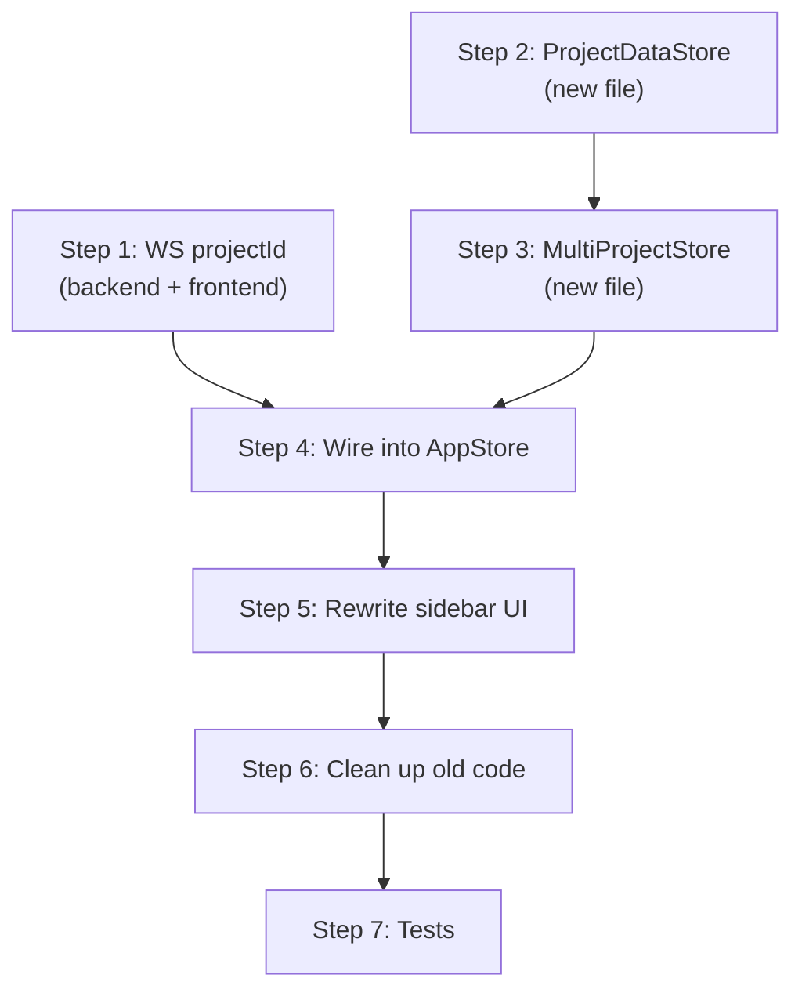

# Multi-Project Sidebar

## Goal

Show all projects in the sidebar simultaneously as collapsible sections, each with its own tasks and sessions. Currently the sidebar shows one project at a time, chosen via a dropdown in `project-sidebar.ts`.

## Current Architecture

- **`project-sidebar.ts`** — Dropdown to switch between projects. Selecting a project navigates via hash.
- **`session-sidebar.ts`** — Orchestrator. Reads `store.tasks`, `store.sessions` (from the *active* project) and renders `project-sidebar`, `task-form`, `task-list`, `session-list`.
- **`ActiveProjectStore`** — Holds tasks/sessions for *one* project. `setRoute()` clears and refetches on project change.
- **`AppStore`** — Wraps `ActiveProjectStore`, `ProjectStore`, `DiffStore`. The `taskSessions` cache is also single-project.
- **`ProjectStore`** — Holds the flat project list. No per-project task/session data.
- **`task-list.ts`** — Renders tasks for one project, with expandable session sublists.
- **`session-list.ts`** — Renders scratch sessions for one project.

## Design

### Backend: Add projectId to WS Event Broadcasts

The backend `wireSession()` function broadcasts `{ type: "event", sessionId, event }` for all agent events (`agent_start`, `agent_end`, `tool_execution_end`, etc.). It already has access to the project context — just needs to include `projectId` in the message.

This lets the frontend map any session activity to a project without needing to load that project's data first. Important for showing activity dots on collapsed project headers and for future background task notifications.

Changes:
- `wireSession()` in `sessions.ts`: accept `projectId` parameter, broadcast `{ type: "event", sessionId, projectId, event }`.
- Callers (`createNewSession`, `resumeSession`) already have `projectId` — just pass it through.
- Frontend `ServerMessage` type: add `projectId: number` to the `"event"` variant.
- Frontend `EventListener` type: `(sessionId: string, projectId: number, event: any) => void`.
- Activity state changes from `Map<sessionId, ActivityState>` to `Map<sessionId, { state: ActivityState; projectId: number }>`.

### Data Layer: Two-Tier Store Architecture

**`ProjectDataStore`** — one instance per project, lazily created. Each holds task/session list data and task session sublists for a single project. Created on demand when a project section is expanded (or auto-expanded).

```
class ProjectDataStore {
  projectId: number
  tasks: TaskListItem[]
  sessions: SessionListItem[]
  taskSessions: Map<number, SessionListItem[]>
  loading: boolean
  loaded: boolean   // true after first successful fetch

  fetchLists(): Promise<void>
  fetchTaskSessions(taskId: number): Promise<void>
}
```

**`MultiProjectStore`** — container that manages `ProjectDataStore` instances. Lazily initializes them — no store instance and no fetch until a project is expanded.

```
class MultiProjectStore {
  // Lazily-populated map — only has entries for projects that have been expanded
  private _stores: Map<number, ProjectDataStore>

  // Get or create a store for a project. Creating does NOT fetch.
  getStore(projectId: number): ProjectDataStore

  // Get a store only if it already exists (for checking without triggering creation)
  peekStore(projectId: number): ProjectDataStore | undefined

  // Ensure a project's data is loaded (creates store + fetches if needed)
  ensureLoaded(projectId: number): Promise<void>

  // Refresh a specific project's data (e.g. after WS event)
  refresh(projectId: number): Promise<void>

  // Drop a store (e.g. project deleted)
  remove(projectId: number): void
}
```

**Lazy initialization flow:**
1. Sidebar renders all projects from `ProjectStore.projects` (just names — no per-project data needed).
2. When a project section is expanded (user click or auto-expand), call `multiProjectStore.ensureLoaded(projectId)`.
3. `ensureLoaded` creates a `ProjectDataStore` if absent, then calls `fetchLists()` if not yet loaded.
4. Collapsing a project does NOT dispose its store — data stays cached for re-expansion.

**ActiveProjectStore stays unchanged.** It still tracks the *viewed* session's full data (`sessionData`). The per-project stores only hold list-level data (task list items, session list items) for rendering the sidebar.

**AppStore changes:**
- Owns a `MultiProjectStore` instance.
- Does NOT eagerly fetch all projects on connect — only expanded projects get fetched.
- WS events (`task_updated`, `session_created`, `agent_start`, `agent_end`) now carry `projectId`. Refresh the relevant project's `ProjectDataStore` *only if it already exists* (via `peekStore`).
- The single-project `_taskSessions` cache moves into `ProjectDataStore`.

### UI Layer

**Replace `project-sidebar.ts` dropdown** with a simpler header that just has the "+" button. The project list is now in the main sidebar body.

**`session-sidebar.ts` changes:**
- Instead of rendering one `task-list` + `session-list`, render a list of collapsible project sections.
- Each section has:
  - A project header (name, collapse toggle, edit/delete actions)
  - When expanded: `session-list` + `task-list` + "New Task" button, all scoped to that project
- Section collapse state is stored as a `Set<number>` of expanded project IDs.
- Expanding a section calls `multiProjectStore.ensureLoaded(projectId)`.

**Collapse behavior:**
- Default: all collapsed.
- Auto-expand: the project containing the active session (from the URL route), and projects with running activity.
- User can manually toggle any project open/closed.

**Clicking a session:**
- Dispatches `select-session` with `{ projectId, sessionId }` (add `projectId` to the event detail).
- `session-sidebar` navigates to `#/project/{projectId}/session/{sessionId}`.
- This triggers `AppStore.setRoute()` which updates `ActiveProjectStore` and `DiffStore` as today.

**`task-list.ts` and `session-list.ts`:**
- Add a `projectId` prop (task-list already has one).
- Session events include `projectId` so the parent knows which project.
- Otherwise unchanged — they render the same data, just scoped per section.

### Interaction Details

- **New Task** button appears inside each project section, scoped to that project.
- **New Session** button appears inside each project section.
- **Task form** dialog: needs the `projectId` it's creating a task for. Pass it when opening.
- **Active session highlight**: the `activeSessionId` prop is global — a session ID is unique across projects, so the highlight works naturally.

## Implementation Steps

Each step leaves the application fully functional.

### Workflow

Steps 1, 2, and 3 have no dependencies on each other and can be done in parallel. Step 4 merges those results. Steps 5–7 are sequential.



### ✅ Step 1: Add projectId to WS event broadcasts

Backend (`packages/backend/src/sessions.ts`):
- `wireSession()`: add `projectId` param, include it in the broadcast message.
- `createNewSession()`: pass `projectId` to `wireSession()`.
- `resumeSession()`: pass `projectId` (from `row.project_id`) to `wireSession()`.

Frontend (`packages/frontend/src/ws-client.ts`):
- `ServerMessage` "event" variant: add `projectId: number`.
- `EventListener` type: `(sessionId: string, projectId: number, event: any) => void`.
- `handleMessage`: pass `msg.projectId` to listeners.

Frontend (`packages/frontend/src/stores/app-store.ts`):
- Update `onEvent` callback signature to receive `projectId`.
- Store `projectId` alongside activity state *internally* (e.g. `Map<sessionId, { state, projectId }>`), but keep the public `activityMap` API as `Map<string, ActivityState>` so existing consumers (`session-list`, `task-list`, `session-sidebar`, `app.ts`) don't break.
- Add a new accessor `getActivityProjectId(sessionId): number | undefined` for the sidebar to use later.

**App stays functional:** the existing UI reads `activityMap` which keeps its shape. The new `projectId` data is stored but not consumed yet.

### ✅ Step 2: ProjectDataStore

Create `packages/frontend/src/stores/project-data-store.ts`:
- Per-project tasks, sessions, loading/loaded state.
- `fetchLists()` fetches tasks + sessions for its project.
- `fetchTaskSessions(taskId)` fetches and caches task session sublists.
- Standard subscribe/notify pattern.

**App stays functional:** new file, nothing references it yet.

### ✅ Step 3: MultiProjectStore

Create `packages/frontend/src/stores/multi-project-store.ts`:
- Lazy `Map<number, ProjectDataStore>` with `getStore`, `peekStore`, `ensureLoaded`.
- `refresh(projectId)` re-fetches if store exists.
- `remove(projectId)` drops a store.
- Bubbles notifications from child `ProjectDataStore` instances.

**App stays functional:** new file, nothing references it yet.

### Step 4: Wire into AppStore

- AppStore owns `MultiProjectStore`.
- WS events use `peekStore` to refresh only already-loaded projects (alongside existing `ActiveProjectStore` refresh — both paths run).
- Expose `multiProjectStore` to components.
- Keep existing `_taskSessions`, `tasks`, `sessions`, `loading` accessors on AppStore so the current sidebar still works.

**App stays functional:** the old sidebar code path is unchanged. The new stores are wired up but the UI doesn't read from them yet.

### Step 5: Rewrite sidebar to multi-project layout

This is the big step — changes `session-sidebar.ts`, `project-sidebar.ts`, `task-list.ts`, `session-list.ts`, and `task-form.ts` together since they form a tightly coupled rendering unit.

session-sidebar.ts:
- Render all projects as collapsible sections using data from `MultiProjectStore`.
- Manage `expandedProjects: Set<number>` state.
- On expand, call `multiProjectStore.ensureLoaded(projectId)`.
- Auto-expand the active project on route change, and projects with running activity (via `getActivityProjectId`).
- Pass per-project data from `ProjectDataStore` to child components.

project-sidebar.ts:
- Remove the project switcher dropdown.
- Keep the "Add Project" button and project-form modal.
- This becomes a thin header component.

task-list.ts and session-list.ts:
- Include `projectId` in dispatched event details (`select-session`, `new-session`, `new-task-session`).
- `session-list`: add `projectId` prop.

task-form.ts:
- Accept a `projectId` parameter when opening, use it when creating a task.

**App stays functional:** all UI changes land together — the sidebar switches from single-project to multi-project rendering in one step.

### Step 6: Clean up old single-project sidebar code

- Remove now-unused `ActiveProjectStore` delegate accessors from `AppStore` that were only used by the old sidebar (`tasks`, `sessions`, `taskSessions`, `loading`).
- Remove `_taskSessions` from `AppStore` (now in `ProjectDataStore`).
- Clean up any dead code.

**App stays functional:** only removing code that's no longer referenced.

### Step 7: Tests

- `ProjectDataStore` unit tests: fetch, task sessions.
- `MultiProjectStore` unit tests: lazy creation, ensureLoaded, refresh, remove.
- Update any existing sidebar tests if they exist.

## Non-Goals

- Changing the route structure — `#/project/:id/session/:sid` stays the same.
- Eagerly fetching all projects' data — only expanded projects are fetched.
