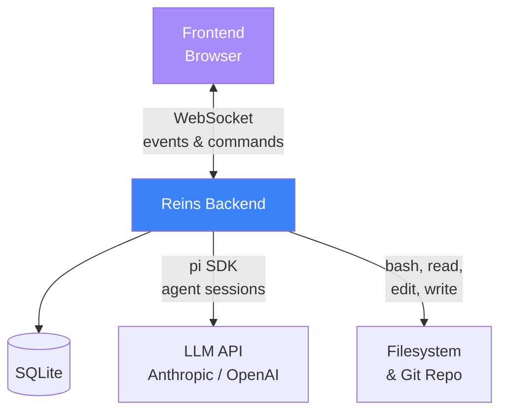
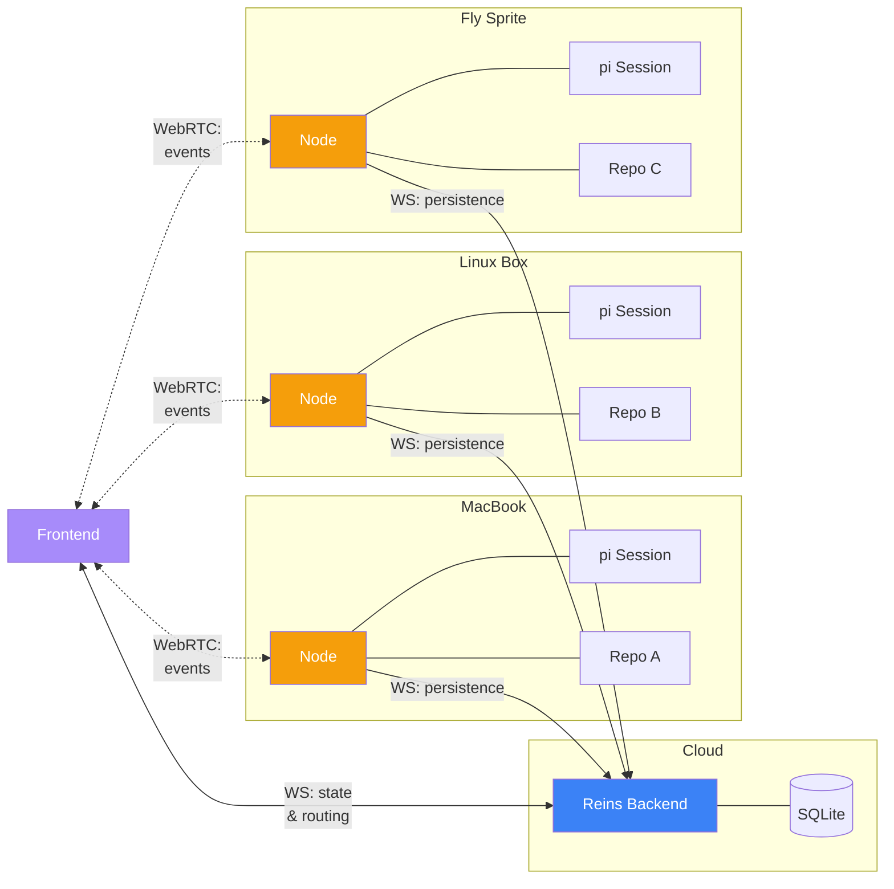
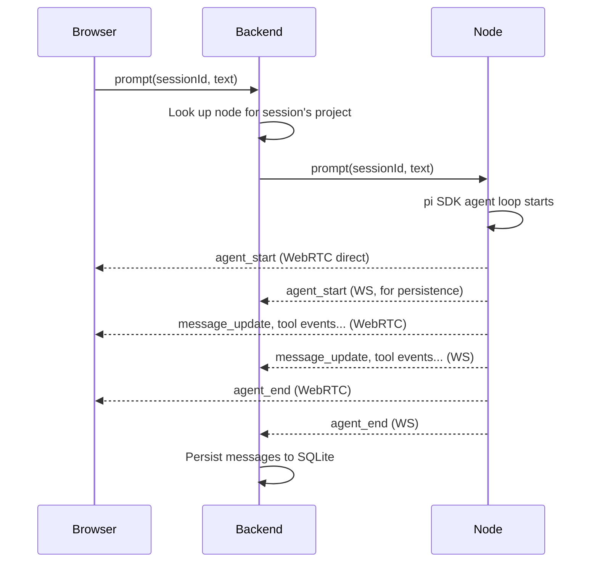
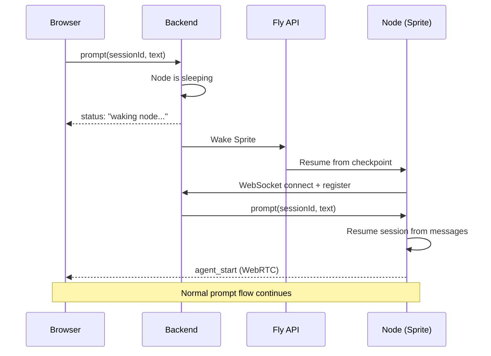

# Node Architecture

Status: **early thinking** — not ready for implementation. Capturing direction for future reference.

## Motivation

Reins currently runs as a single server that owns everything: the database, agent sessions, git operations, and filesystem access. This means you can only work with repos on the machine running the server.

The goal is to support multiple machines — e.g., a Mac and a Linux box — each with their own repos, connected to a single Reins backend. This also opens the door to a hosted backend with users connecting their own machines as execution nodes.

## Current architecture

Everything runs on one machine. The backend owns the database, the agent loop, tool execution, and filesystem access.

## New architecture

The backend is the control plane — persistence, routing, WebRTC signaling. Nodes are the data plane — each runs pi SDK locally with the user's API keys, executes tools against local filesystems, and streams events directly to frontends via WebRTC. The backend eavesdrops on the node's WS connection for persistence.

### Prompt flow

### Waking a sleeping node

## Architecture details

### Backend (cloud/central)

The backend becomes a coordination and persistence layer:

- SQLite database (sessions, messages, tasks, projects)
- WebSocket server for frontend clients
- WebSocket server (or acceptor) for node connections
- Routes prompts and commands to the correct node
- Persists messages and events streamed back from nodes
- Serves the frontend UI
- Does NOT run pi SDK, execute tools, or access repos

### Node (user's machine)

A daemon running on any machine with a codebase:

- Runs the pi SDK agent sessions
- Executes coding tools (bash, read, edit, write) locally
- Performs git operations locally
- Holds the user's own LLM API keys — authenticates directly with model providers
- Manages model selection and thinking level
- Connects to the backend over WebSocket
- Registers which projects (directories) it serves
- Streams agent events back to the backend

### Thick node design

The node is essentially today's backend for a single machine, minus the DB and UI. This is the preferred approach because:

- **User's own API keys** — the node authenticates with model providers directly, so the backend never handles credentials
- **Model selection is local** — the backend doesn't need to know which model a session uses
- **Skill and resource discovery** — pi's `DefaultResourceLoader` discovers skills, extensions, context files, and AGENTS.md from the repo's filesystem. This must run on the machine with the repo. Running pi on the node means skill discovery just works with no file proxying.
- **Simpler protocol** — the backend says "prompt session X with this text," the node handles the full agent loop and streams events back
- **Closer to current architecture** — the node is a thin wrapper around what `sessions.ts` already does

## Communication protocol

The backend-to-node protocol mirrors the existing backend-to-frontend event protocol:

**Backend → Node:**
- `prompt` (sessionId, text, images?)
- `steer` (sessionId, text)
- `abort` (sessionId)
- `create_session` (projectId, opts)
- `resume_session` (sessionId, messages)

**Node → Backend:**
- All `AgentSessionEvent` types (agent_start, message_update, tool_execution_start, etc.)
- Session created/resumed confirmations
- File content responses (proxied from frontend requests)
- Diff data responses (proxied from frontend requests)

## Project-node affinity

A project is tied to the node that has its repo on disk. When a node connects, it registers its available project directories. The backend maps projects to nodes. If a node disconnects, its projects become unavailable (sessions are preserved in SQLite but can't be prompted until the node reconnects).

## What changes

| Concern | Current (single server) | Node architecture |
|---|---|---|
| Agent sessions | Backend creates/runs pi SDK | Node creates/runs pi SDK |
| Tool execution | Local to backend | Local to node |
| Git operations | Local to backend | Local to node |
| API keys | Backend env/config | Node env/config |
| Message persistence | Backend writes to SQLite | Node streams events → backend writes to SQLite |
| File API | Backend reads local fs | Backend proxies to node |
| Diff API | Backend runs git locally | Backend proxies to node |
| Frontend WS | Backend ↔ Frontend | Backend ↔ Frontend (unchanged) |
| Session resume | Backend loads from SQLite, creates pi session | Backend loads from SQLite, sends messages to node, node creates pi session |

## Node registration

A node connects to the backend, not the other way around. This means the backend doesn't need to know the node's IP or network topology — the node just needs the backend's URL and a token.

**Setup flow:**
1. User generates a node token in the Reins UI (or CLI): `reins nodes create-token --name "Will's Mac"`
2. Backend stores the token and associates it with the user
3. User starts the node daemon on their machine: `reins-node --server https://reins.example.com --token <token> --projects ~/Workspaces/reins,~/Workspaces/other-project`
4. Node opens a persistent WebSocket to the backend, authenticates with the token
5. Node sends a registration message listing its available project directories (paths + metadata like git remote URL, current branch)
6. Backend matches node projects to existing projects (by remote URL or path) or creates new project entries
7. Node is now available — the backend can route session commands to it

**Reconnection:** The node daemon auto-reconnects on disconnect. On reconnect it re-registers its projects. Active sessions are preserved in SQLite on the backend; the node resumes them by replaying messages from the backend.

**Heartbeat:** The node sends periodic pings. If the backend doesn't hear from a node within a timeout, it marks the node's projects as offline. The UI shows them as unavailable but still browsable (history, old sessions).

**Multiple nodes:** A user could have several nodes (Mac, Linux box, cloud VM). Each registers its own projects. The backend maps each project to exactly one node. If the same repo exists on two nodes (same remote URL), the user picks which node is authoritative — or the backend could allow either and route based on which is online.

## Cloud nodes (Fly Sprites)

Fly Sprites are disposable, durable cloud computers that spin up in ~1 second and support checkpoint/restore. A Sprite is a natural node — clone a repo onto it, start the node daemon, connect to the Reins backend.

**What Reins manages — node sleep/wake lifecycle:**

The backend tracks node state: online, sleeping, or offline. When a user prompts a session whose node is sleeping, the backend triggers a wake (e.g., via Fly API), waits for the node to reconnect and re-register, then routes the prompt. From the user's perspective, there's a brief wake delay (~1s for Sprites) before the agent responds.

- Node disconnects gracefully (idle timeout) → backend marks it as sleeping
- User prompts a sleeping node's session → if the node supports wake (cloud node with a wake API), backend triggers it and waits for reconnect. If not (e.g., a MacBook that's closed), the prompt is queued and the UI shows "Node offline — waiting for it to come back"
- Node reconnects → re-registers projects, resumes sessions from SQLite messages, receives any queued prompts
- Node disappears without graceful disconnect → backend marks as offline after heartbeat timeout

Nodes register whether they're wakeable (cloud nodes provide a wake callback/URL) or passive (personal machines that the backend can't reach). The UI reflects this — a sleeping cloud node shows "Starting..." while a disconnected MacBook shows "Offline."

**What Reins does NOT manage:**

How a Sprite (or any cloud node) is provisioned, configured, or set up is outside Reins' scope. Installing tools, cloning repos, authenticating CLI tools, checkpointing — that's the user's responsibility, potentially aided by skills or scripts. Reins only cares that a node daemon connects and registers projects.

**Cost model:** Cloud nodes like Sprites only cost money while awake. The backend's sleep/wake lifecycle management keeps them asleep when idle. A user could have one node per project or share a node across projects.

## Open questions

- **Authentication**: Two layers. Nodes authenticate with the backend using registration tokens (described above). Frontends authenticate using passkeys with user accounts — the backend scopes all data (projects, nodes, sessions) to the authenticated user. Passkeys work across devices (Touch ID, Face ID, hardware keys) with no passwords to manage.
- **Multiple nodes, same project**: What if the same repo exists on two machines? Allow both, or enforce single-node-per-project?
- **Latency and direct connections**: A backend-relayed event stream adds a network hop. To minimize latency, use WebRTC data channels for direct frontend ↔ node streaming. The backend acts as the signaling server (it already has WS connections to both), brokering the WebRTC handshake. Agent events flow peer-to-peer with no relay hop. The node separately sends events to the backend over its existing WS for persistence. WebRTC handles NAT traversal via STUN/TURN, so it works across networks. Degrades gracefully — if direct connection fails, fall back to two-hop relay through the backend.
- **Offline/disconnected**: What can the backend do while a node is offline? View history, browse old sessions — but not prompt or view current files.
- **Node discovery**: Does the user configure node URLs in the backend, or do nodes discover/register with the backend?
- **Migration path**: How to get from the current single-server architecture to this without a big bang rewrite? The node daemon could start as an optional mode — run Reins as today (all-in-one) or run backend + node separately.
- **Privacy and trust**: Connecting a node gives the backend (and its operator) the ability to route prompts that execute on the user's machine. The backend also receives all events for persistence, including file contents and bash output. For self-hosted backends this is fine (you trust yourself). For a hosted multi-user service, this is a serious trust surface — a compromised or malicious backend could exfiltrate data or execute arbitrary commands via crafted prompts. Mitigations to explore: end-to-end encryption (backend persists encrypted blobs), node-side tool permissions and approval gates, audit logging of all backend-initiated commands, scoped node tokens. Self-hosted should remain the primary model.
- **Development sandboxing**: This work requires a separate Reins instance — can't rip apart session/tool execution on the same copy being used for daily development. Run a second instance on a different port/DB for the node architecture work.
