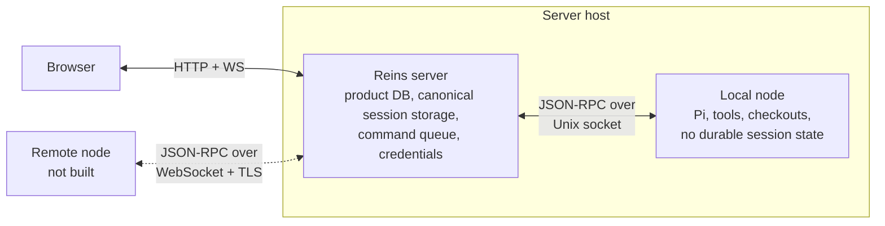

# Node Architecture

Status: **local process split done; server-canonical storage done ([ADR-015](../adr/015-server-canonical-storage-stateless-node.md)); remote node pairing and authentication done ([ADR-023](../adr/023-node-pairing-and-challenge-authentication.md)); remote transport not started.** Every session runs on a node; the server stores every session, dispatches work through a durable queue and serves the UI. The node holds nothing durable: its Pi runtime reads and commits each session on the server over the link. The local node is a separate process linked over a Unix socket. The completed phases are recorded in [completed/node-local-process-split.md](completed/node-local-process-split.md) and [completed/server-canonical-storage.md](completed/server-canonical-storage.md); the current design is in [node-contract.md](../dev/node-contract.md) and [node-runtime.md](../dev/node-runtime.md).

## Motivation

Support multiple machines (e.g. a Mac and a Linux box, or disposable cloud machines), each with their own checkouts, connected to one Reins server, and eventually a hosted server with users connecting their own machines as nodes. Browser traffic, including agent events, stays routed through the server.


```mermaid
graph LR
    Browser[Browser] <-->|HTTP + WS| Server
    subgraph Server host
        Server[Reins server\nproduct DB, canonical session storage,\ncommand queue, credentials]
        Local[Local node\nPi, tools, checkouts,\nno durable session state]
        Server <-->|JSON-RPC over\nUnix socket| Local
    end
    Remote[Remote node\nnot built] <-.->|JSON-RPC over\nWebSocket + TLS| Server
```

## Server-canonical storage (done)

The server's SQLite is the only session storage and the node holds nothing durable ([ADR-015](../adr/015-server-canonical-storage-stateless-node.md)). How it was delivered, the storage-traffic measurements behind the decision and the deferred write-behind decorator for high-latency links (not built: build it only after measuring a real remote node) are in [completed/server-canonical-storage.md](completed/server-canonical-storage.md).

## Remaining work

- [x] **Explicit node reload and automatic resume:** a CLI or an agent's `execute` script reloads the node; runs are held at clean pause points, the node restarts and the server resumes them. The server resumes every run a node lost, within a limit against crash loops; SIGTERM pauses runs instead of aborting them ([ADR-021](../adr/021-explicit-node-reload.md), [completed/node-reload.md](completed/node-reload.md)). The same path serves *Code delivery* below.
- [ ] **Idle runtime eviction:** close runtimes idle for a fixed period (they hold nothing durable), which also bounds node memory and picks up new node code between turns.
- [ ] **Chunked storage calls:** `storage.read`/`storage.commit` are not chunked, so a read result or commit over the frame cap fails its run; a remote link with a smaller cap needs them chunked.
- [ ] **Reconnect-safe node calls:** a dropped link should cost only a reconnect. Remote links will drop on their own, so they need this anyway. Then make the hub reloadable. In order:
  - [x] **Retry-safe commits:** an unanswered `storage.commit` is resent under its `commitId` on the next connection; the session row keeps the last applied commit's ID and result, and a repeat is answered with it (protocol 7; node-contract.md *Session storage*, [ADR-010](../adr/010-state-derived-idempotency.md)).
  - [x] **Retry-safe reports:** an unanswered `session.started`/`session.settled` is resent; a repeated start applies nothing and a settlement is recognised by its `reportId` (the run ID cannot tell a resend from a resumed run). A session with a report still to deliver is listed live in the hello, so crash recovery leaves it alone.
  - [x] **Reloadable hub:** a dev handler reload builds a new state (`createServerState`: a new hub) and node socket listener and closes the previous ones; the node redials and in-flight work recovers through the paths above ([ADR-020](../adr/020-reloadable-node-hub.md), [hot-reload.md](../dev/hot-reload.md)). Deleted: the `restartRequired` rules and process-owned module list, the import rewriting in dev bundles, the `NodeHubServices` port and its per-call lookup (the hub calls product code directly; a connection resolves its handlers once, at hello), `DeliveryDeferred` in the protocol package (back in the dispatcher); submission failure recipients moved onto the browser client; `node-link/` folded into `nodes/`. Only process startup code warns restart-required. `script.execute` stays non-retryable: a drop still fails that one tool call with "may have run". A `storage.read` in flight at a drop still fails its run (reads are not resent).
- [x] **Node bundle spike:** a single-file `bun build --target bun` of `packages/node/src/main.ts` (11 MB, ~150 ms to build, ~215 ms to start, deterministic) ran real sessions from a directory outside the repository with no `node_modules`. It covered AGENTS.md and skill discovery in the session cwd, slash expansion, `read`/`bash`, an image attachment, git and `fs.*` through the node, and a clean SIGTERM. The fixes it found are listed under *Bundle requirements* below and folded into *Code delivery*.
- [x] **Pairing and node authentication:** settings-page pairing codes, `reins node pair`, Ed25519 node keys, the server-first challenge (`node.authenticate`, before `node.hello`) and revocation ([ADR-023](../adr/023-node-pairing-and-challenge-authentication.md), [completed/node-pairing.md](completed/node-pairing.md), node-contract.md *Pairing and authentication*). The transport decides whether a connection authenticates (`accept(socket, {authenticate: {origin}})`); the local socket does not, so the local node needs no pairing. A revoked node is refused at hello on every transport. Tested: stolen, expired and competing codes, challenge replay, a wrong node ID in the hello, reconnect fencing, revocation, CLI re-run safety, and CLI → endpoint → challenge end to end. The one-line install command moved to *Code delivery* (it needs the install script). Left for *Remote transport*: which origin the WebSocket route passes behind a proxy, accepting from `open` (the challenge is the first frame), and a refusal a revoked node's dialer can recognise so it stops redialing.
- [ ] **Remote transport:** JSON-RPC over WebSocket at `/node-link` behind the same `WireSocket` seam, with authentication before any method is served. Bound prompt size to the remote frame cap; consider a per-node cap or fairness in the dispatcher so one slow node cannot hold every delivery slot.
- [ ] **Bundle-safe node source fixes (land first; they also change the local node):** pass `noExtensions: true` in `createPiResources`, because Pi extensions are loaded on every open, never used, and bundled they fail or get auto-installed from npm. Take the REINS docs path in the system prompt from `REINS_DOCS_DIR`, falling back to the checkout; it is wrong from a bundle today.
- [ ] **Code delivery:** the one-line install command shown with a pairing code (the settings page shows `bun run reins node pair …` until then). The server builds one platform-independent bundle (`reins.js`: the `reins` CLI plus the node code, with `docs/features` beside it) at startup from a bundle-only entry, with the photon stub and guards (see *Bundle requirements*). The build ID is the sha256. The manifest records the build ID, the hash and the pinned Bun version. Serve the install script, the manifest and the bundle. The hello carries `buildId` and gets back a `ready`/`update`/`error` reply. The update logic lives in the bundle: it downloads the new build (and the pinned Bun, if that changed), flips `current` and restarts, the way the supervisor restarts the node for `node.reload`. A process test builds the bundle into a temp directory, runs it there with `--no-install` against a test server with the faux provider, and does one turn with a `bash` call. Resuming the runs an upgrade cuts off is done (ADR-021).
  - **Use it for the local node too, and drop the restart for protocol changes.** Today a `@reins/node-protocol` edit needs `bun run dev` restarted: dev reloads keep the protocol external so the server cannot move ahead of the node. With the `update` reply that rule can go. Bundle the protocol into every handler load, so the server always reloads. The hello carries a fingerprint of the node's protocol code (a hash of its sources; the build ID once bundles exist). On a mismatch the server answers `update`, which for the local node means reload from the checkout through the existing `node.reload` path. A node whose new code does not build stays on its old code and is told again at each redial. Costs: every saved protocol edit restarts the local node, and its runs are cut off (and resumed) rather than paused at clean points, because the node cannot commit to the new server before it restarts. Have the dev supervisor restart the server process itself on process-owner edits, so only `supervisor.ts` edits still need a manual restart. Amends ADR-020 and ADR-021.
- [ ] **Node-owned sources:** node config source roots reported in the hello, attached to projects in the settings page; the node resolves `sourceId → path` and rejects others.
- [x] **Node→server streams:** `stream.data`/`stream.end`/`stream.cancel` (protocol 5), the node sender paced by socket drain and the per-connection server registry exposing each stream as a `ReadableStream` (capped in memory). See node-transport.md *Streams*. `process.run` opens them.
- [ ] **Git and file operations behind the node** ([ADR-018](../adr/018-process-run-and-fs-methods.md)): git runs through the generic `process.run` stream with the git logic staying on the server (`Git` on `RemoteNode.spawn`); the file browser's filesystem reads are typed `fs.*` methods. **Done:** `process.run`, `fs.list`, `fs.read`, `fs.write`, binary stream chunks; uploads; file listing and file content (working tree and refs), branch and task operations, sync, spread/push/rebase, files at a ref and the diffs (the working-tree diff's temporary index built on the node by one `sh -c` script), all on the call's source (node-contract.md *Which checkout a call works in*; 503 when its node is offline). **Remaining:** which checkout the frontend's file, diff and git requests read: they use the project's default source for now, and how they pick one will be handled differently once projects support multiple sources. The server runs no git of its own: `Git` (`git.ts`) always runs on a source's node, including `createProject`'s default-branch detection (in the source the trigger creates, until project creation picks a node). Part of *Remote rollout*.
- [ ] **Background process output (later):** stream a node-side process's output over the same primitive, resuming from an offset after a reconnect (the node keeps the output; offsets are already absolute). Decide whether the server spills a long-lived stream to disk instead of failing it at the buffer cap.
- [x] **Remote rollout:** moving the remaining server-local operations behind the node (see *Remote readiness* below).
- [ ] **Credential lookups per runtime open:** opening a runtime makes hundreds of `credentials.get` calls, because Pi's model runtime checks every registered provider and logged-out results are not cached on the node. Cheap locally, costly remotely. Options: cache logged-out results until the next attach, or narrow which providers Pi checks.
- [ ] **Node management screen:** Settings → Nodes lists nodes and their connection status, pairs and revokes (done with pairing); still to come: project sources per node, with source selection for new sessions once projects have sources on several nodes (replacing the "first source" default with a per-project choice). Decide whether offline nodes appear in the source picker.
- [ ] **Process-test speed (optional):** fixed waits (`[slow:3000]`/`[slow:1500]` faux-provider stalls, a 2s sleep, reconnect backoff) are most of `server-process.process-test.ts`'s ~17s; a provider that blocks until the test releases it would roughly halve it.
- [ ] **Plugin-started nodes:** a plugin that starts a node for a session or task is a server-side placement decision (pick or create the source before the first command is dispatched), not a node-side provisioning step. Add it as a hook in source selection when there is a plugin to use it.

## Remote nodes: decided direction

The local split locks nothing in: the node stores nothing, the local node always ships and restarts with the server, and server schema changes are append-only migrations. A remote node is installed on another machine, so whatever the first remote release puts on that machine's disk or into its handshake is hard to change afterwards. The decisions below settle those parts.

### Trust model (decided)

- **Private network only.** Reins is exposed only on a private network (e.g. Tailscale). This is a deployment assumption, not something code checks or enforces. Anyone who can reach the server is effectively an administrator: the browser API is unauthenticated, so they can create pairing grants, change settings and run scripts. Frontend authentication is a prerequisite for any wider exposure and is out of scope here.
- **Nodes get every credential.** [ADR-013](../adr/013-server-holds-credentials.md) stands as is: any authenticated node is served `credentials.*` for every provider. No per-node scoping.
- **Node authentication still ships in the first remote release.** It is not there to defend against the network. It exists because a node's stored identity can only be replaced by re-pairing that machine, and because a stale or mistaken node (or a copy of the database) must not be able to pose as another node. Ship the keypair design below rather than a shared token we would have to migrate away from later.
- The server can already run arbitrary bash on a node through prompts, so letting the server deliver the node's code (below) adds no new trust.

### Pairing from the settings page (decided)

Built, except the install command (*Code delivery*): see [ADR-023](../adr/023-node-pairing-and-challenge-authentication.md) and node-contract.md *Pairing and authentication*.

1. **Settings → Nodes → Add node** (optional name). The server creates a one-use pairing code (256 random bits), shows it once with the install command, and stores only its SHA-256, an expiry (10 minutes) and a consumed timestamp. A plain hash is enough: a 256-bit code cannot be brute-forced from its hash, so no server secret outside the database is needed. Never log the code.
2. **On the node machine**, the user pastes the page's one-line command, which carries the code:
   ```sh
   curl -fsSL https://reins.example.ts.net/nodes/install | sh -s -- <code>
   ```
   The install script is served by Reins and contains no secrets. It downloads the pinned official Bun release for the machine's OS and architecture into `~/.reins/bun` and the current bundle into `~/.reins/builds/<buildId>/`. It writes the `~/.reins/bin/reins` launcher script and runs `reins node pair <server URL> <code>`. The code goes in as an argument, not in the URL, so request logs and proxies never see it. It does reach shell history, which is acceptable because it is single-use and expires in 10 minutes. The page says so. The CLI then generates an Ed25519 keypair (private key 0600 under `~/.reins/`) and posts the code, its public key and its hostname. The server consumes the grant atomically, so a code redeemed concurrently has one winner. It creates the `nodes` row bound to that public key and returns the node ID. The CLI writes its config: a `version` field, the server URL, the node ID, the key path and source roots.
3. The settings page shows the node and its connection status; sources are attached there (*Sources* below).
4. **Revoke** in the settings page disables the node: it closes the link and refuses the node's key on every later connection.

Deferred: key rotation (for now, revoke and re-pair), fingerprint confirmation, an audit log, running the node as a background service (systemd user unit or launchd agent), and a Windows (PowerShell) install command.

The node machine needs `curl` and `sh` to install, and `git` and `bash` to run. Reins installs its own pinned Bun. The bundle and install script are public on the private network: they are code with no secrets, so downloading them grants nothing. Joining requires redeeming a pairing code; connecting requires the registered node key.

### Connection

- The node dials a WebSocket at a path on the existing HTTP server (`/node-link`), using `ws://` or `wss://` as the deployment provides. The private network carries the transport security, so TLS is not required. This endpoint is separate from the browser WebSocket and reads no cookies. The local Unix socket ([ADR-012](../adr/012-ndjson-unix-socket-local-link.md)) is unchanged; both sit behind the same `WireSocket` seam.
- **The server speaks first:** `{challengeId, nonce, …}`. The node signs a domain-separated tuple (`reins-node-auth-v1`, server origin, node ID, challenge ID, nonce). The server verifies the signature against the stored public key and the node's enabled state, consumes the challenge (also on failure) and binds the node ID to the socket. Only then does it accept `node.hello`, whose `nodeId` must match. Everything after the hello (epochs, fencing, heartbeat, outbox, *Link loss*) is unchanged.
- Remote links need a smaller frame cap than the local 64 MiB, so **chunked storage calls** and a prompt-size bound are prerequisites.

### Sources belong to the node

Today the server sends a binding's `cwd` and the node runs there. That is safe only while the node shares the server's machine. A remote node is the authority on its own paths: its config lists source roots, and its hello reports them. The settings page attaches a reported path to a project, which creates the `sources` row. The node then resolves `sourceId → path` itself and rejects a binding for a source it does not hold, or whose path differs. Open: whether sources are declared on the node (a `reins node` command) or picked in the settings page under node-declared roots, which would need a node-side directory listing.

### Versions: the server delivers the node's code (decided)

The node is stateless and pure JS (Pi and zod, no native modules), so the server can hand a remote node the exact code that matches it, the way VS Code Remote installs its matching server on the remote machine. **All Reins code is one bundle; Bun is the only other thing on the machine.** The CLI and the node update together, so there is one Reins version per node.

```
~/.reins/
  bun                    pinned official Bun binary for this platform
  bin/reins              runs ~/.reins/bun --no-install ~/.reins/current/reins.js "$@",
                         and runs it again when it exits with the restart code
  builds/<buildId>/      reins.js (CLI + node code) and docs/features
  current -> builds/<buildId>
  config, key            written by `reins node pair`
```

- **The bundle (`reins.js`):** the `reins` CLI (`reins node pair`, `reins node start`, `reins node status`, connection, authentication, updates) and all of `packages/node`, as one platform-independent file (`bun build --target bun`, about 2 MB gzipped), built and hashed by the server. The **build ID** is the hash. `docs/features` (about 23 KB gzipped) ships beside it in the same build; the CLI sets `REINS_DOCS_DIR` to `builds/<buildId>/docs`, so agents on a remote node read the feature docs matching the code they run, with plain `read`/grep. Work on Reins itself, and the local node, use the checkout's `docs/`.
- **Bun:** a pinned dependency. The manifest names the Bun version a build needs; the install script fetches that official release (GitHub), and an update that needs a different Bun fetches it before flipping `current`. If node machines without internet access matter, the server can cache and serve the Bun download.

On connect, after authentication, the hello carries the node's `buildId`. The server answers one of:

- `ready`: the normal negotiation.
- `update {buildId, sha256, bunVersion}`: the running bundle downloads the new build (and the pinned Bun, if it differs), verifies the hash, flips `current` and restarts on it. The running node cannot speak the new protocol, so it cannot bring its runs to a pause point: it closes its runtimes without aborting their runs (`Node.shutdown`) and exits with the restart code, as `node.reload` exits to the supervisor ([ADR-021](../adr/021-explicit-node-reload.md)). The `reins` launcher script then starts whatever `current` points to. The launcher script is installed once, so it stays a few lines of shell.
- `error {code}`: e.g. a bootstrap format this server no longer accepts. The user reinstalls with a new pairing command.

Consequences:

- **The session protocol stays lockstep and free to change**, as it is today. A node never runs code newer than its server, and an older node updates before it is served. There is no window of supported versions to maintain.
- **Only the bootstrap surface must stay compatible across releases:** the config file format, the pairing request, the auth challenge, the hello envelope (parsed tolerantly; `helloParams` is a `strictObject` today), the `ready`/`update`/`error` reply, the manifest and bundle downloads, the `~/.reins` layout and the install script's arguments. Changes there must be additive.
- **Upgrade flow:** the server restarts on a new build, so the node's link drops; its runs keep going until their next commit, which waits for a connection. The node redials, receives `update` and restarts on the new bundle, and the server resumes every run the node lost (done: node-contract.md *Crash recovery*, ADR-021). What was in flight is cut off: a model request is asked again, a tool call comes back to the model as "outcome unknown". A server restart without a build change keeps runs alive through *Link loss*, as today.
- **Later, if upgrades cutting work off proves costly:** the server could drain its nodes before restarting for an upgrade (`Node.pause` over the old protocol, bounded, then restart), so runs wait at clean points instead; and push a node-only build to connected nodes over the live link instead of waiting for a redial.
- The local node is unchanged: the supervisor runs it from source. Running it through the `reins` launcher too is optional later.

### Bundle requirements (from the spike)

The spike (2026-10) proved the bundle runs real sessions outside the repository. Shipping it needs:

- **A bundle-only entry** (e.g. `packages/node/src/bundle-entry.ts`) that calls `registerBunOAuthFlows()` from `@earendil-works/pi-ai/bun-oauth` and `setBedrockProviderModule(...)` from `pi-ai/bedrock-provider`, then dispatches the CLI commands, including starting the node from `./main.js`. Pi loads its OAuth flows and Bedrock module through computed `import()` paths a bundle cannot follow. Without the entry, every request using a stored OAuth credential fails (`Cannot find module './anthropic.js'`). This mirrors Pi's own Bun binary. The from-source node stays lazy.
- **A build plugin stubbing `@silvia-odwyer/photon-node`.** Bun writes CommonJS `__dirname` as the build machine's absolute path, so the bundle would read photon's WASM from the build checkout. It also makes the hash depend on the checkout location. The node never resizes images, and Pi treats a failed photon load as "no resize".
- **Build guards:** fail if the output contains the repository root path or a non-built-in external. `ws`, `undici` and `node-fetch` stay external because Bun provides them.
- **A launcher contract:** run `~/.reins/bun --no-install ~/.reins/current/reins.js`, so a missing module fails instead of being fetched from npm. Set `PI_PACKAGE_DIR=~/.reins/builds/<buildId>`, so Pi does not adopt the `piConfig` of the nearest `package.json` above the bundle; Pi's `VERSION` then reads `0.0.0`, which only CLI/self-update code uses. Also set `REINS_NODE_DATA_DIR` and `REINS_DOCS_DIR`.
- **Minor:** drop the `REINS_NODE_TEST_FAUX_PROVIDER` hook with a build-time define. `pi-coding-agent` only exports its root, so its TUI, jiti and babel code come along (11 MB plain, 6.7 MB minified, ~2 MB gzipped); acceptable for now.

Checked and not a problem: no native modules on the node's path, the model catalog is compiled in, and resource discovery reads only the cwd and `$HOME`.

## Remote readiness

Server code that still assumes the checkout is local and must move behind node requests (or fail closed for remote sources) before a remote session is complete:

- None left: git, file listing and reading, diffs and uploads all reach a checkout through its node (`process.run`, `fs.list`, `fs.read`, `fs.write`).

How they move ([ADR-018](../adr/018-process-run-and-fs-methods.md), node-contract.md *Checkout operations*), all `request-now` (answered immediately, `unavailable` when offline, never queued):

| Request | Inputs → result |
|---|---|
| `process.run` (built) | sourceId, cwd, argv (no shell), env → a stream of stdout ending with the exit. Every git operation: the server keeps the git logic and runs it here instead of on its own checkout. |
| `fs.list`, `fs.read` (built) | sourceId, cwd, scoped relative path → one directory's entries; a file's bytes as a binary stream. Rejects escaping paths. Working-tree reads only: a file at a ref is `git show` through `process.run`. |
| `skills.list` (built) | sourceId, cwd → the node's current skill metadata, `{skills: [{name, description}]}` (no bodies; node-contract.md *Skills*). The server sends the source's path like a binding, since the node has no source configuration to verify it against yet. |

`sourceId` is resolved server-side from the session; the node verifies it maps to its configured path (once nodes own their sources). Never accept a browser-supplied host path. `process.run` does accept an arbitrary command, from the server only: the server can already run anything on a node through a prompt (*Trust model*), so this adds no trust; what it must never do is build a command from browser input except as separate arguments (no shell).

**Skills and resources are node-local.** Two sources of one project can have different repo skills, user-global skills and AGENTS files; the node discovers them in the bound cwd at every open, and slash expansion runs on the node before admission. For UI suggestions, `skills.list` is a live per-source view (refresh on open; an offline source shows no inventory). A slash invocation that does not resolve to a skill is sent as plain text. Pinning skill versions is deferred. Tests should cover two sources with different skills, invocation on a server without the repo, and relative reference reads.

## Cloud nodes (future)

Disposable cloud machines (e.g. Fly Sprites, which resume from checkpoint in about a second) are natural nodes, and a stateless node suits them: there is nothing on the machine to back up or re-hydrate. Reins would manage only a sleep/wake lifecycle: track nodes as online, sleeping or offline; on a prompt for a sleeping wakeable node, trigger a wake and let the queued command deliver on reconnect (the command queue already holds work for disconnected nodes); show "Starting…" for a waking cloud node and "Offline" for an unreachable personal machine. Provisioning the machine (tools, clones, CLI auth) stays outside Reins. A distant cloud node is the case most likely to want the deferred write-behind decorator.

## Open questions

- **Frontend authentication:** not needed while Reins is exposed only on a private network (see *Trust model*); required before any wider exposure. Account authentication and user-scoped authorization are separate from node identity; passkeys are a candidate.
- **Privacy and trust:** a node lets the server route prompts that execute on the user's machine, and the server receives all events and transcripts. Fine for self-hosting; for a hosted multi-user service, explore node-side tool permissions and approval gates, audit logging of server-initiated commands, scoped node permissions and end-to-end encrypted storage. Self-hosted remains the primary model.
- **Latency:** server-relayed events add a hop for remote nodes. Direct browser–node streaming (e.g. WebRTC data channels with the server as signaling) is a possible later optimization with fallback to the relay.
- **Multiple sources per project:** the model allows it; decide the default-source policy and UX once it is real.
- **Protocol standards:** whether ACP could carry the server–node command/event channel (see [ADR-006](../adr/006-acpx-as-runtime-replacement.md) for the runtime-level evaluation).
