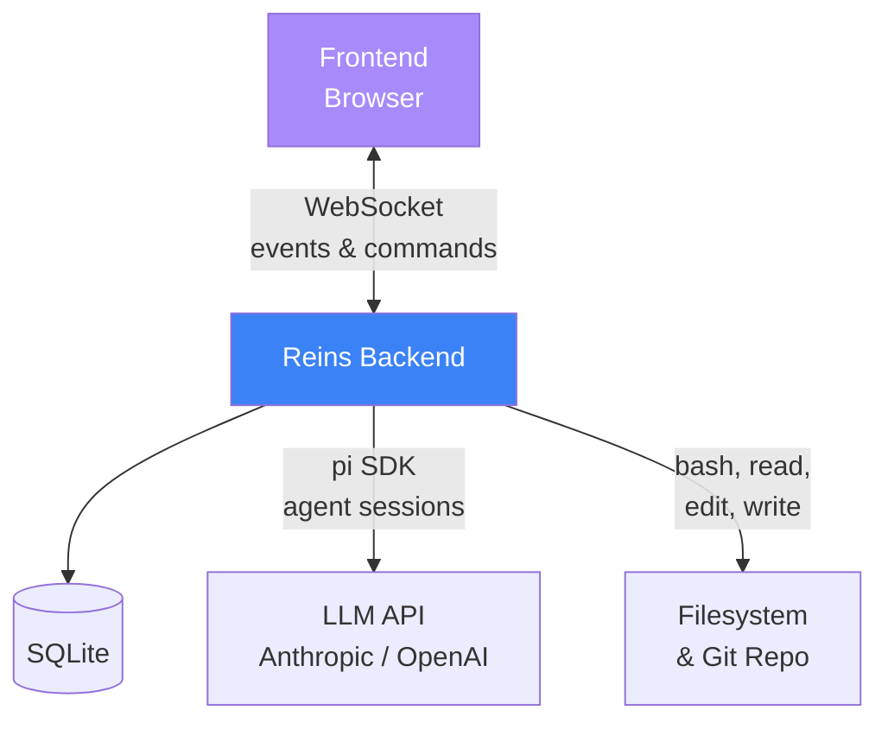
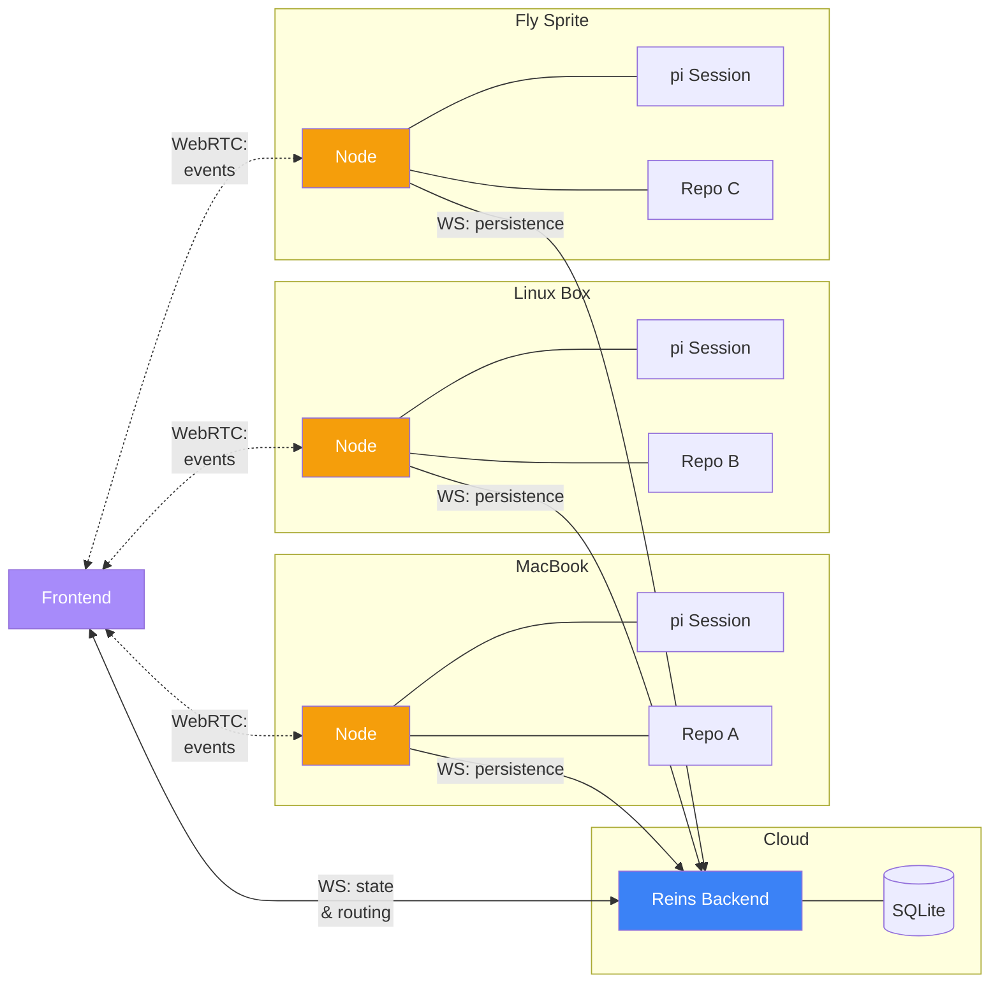
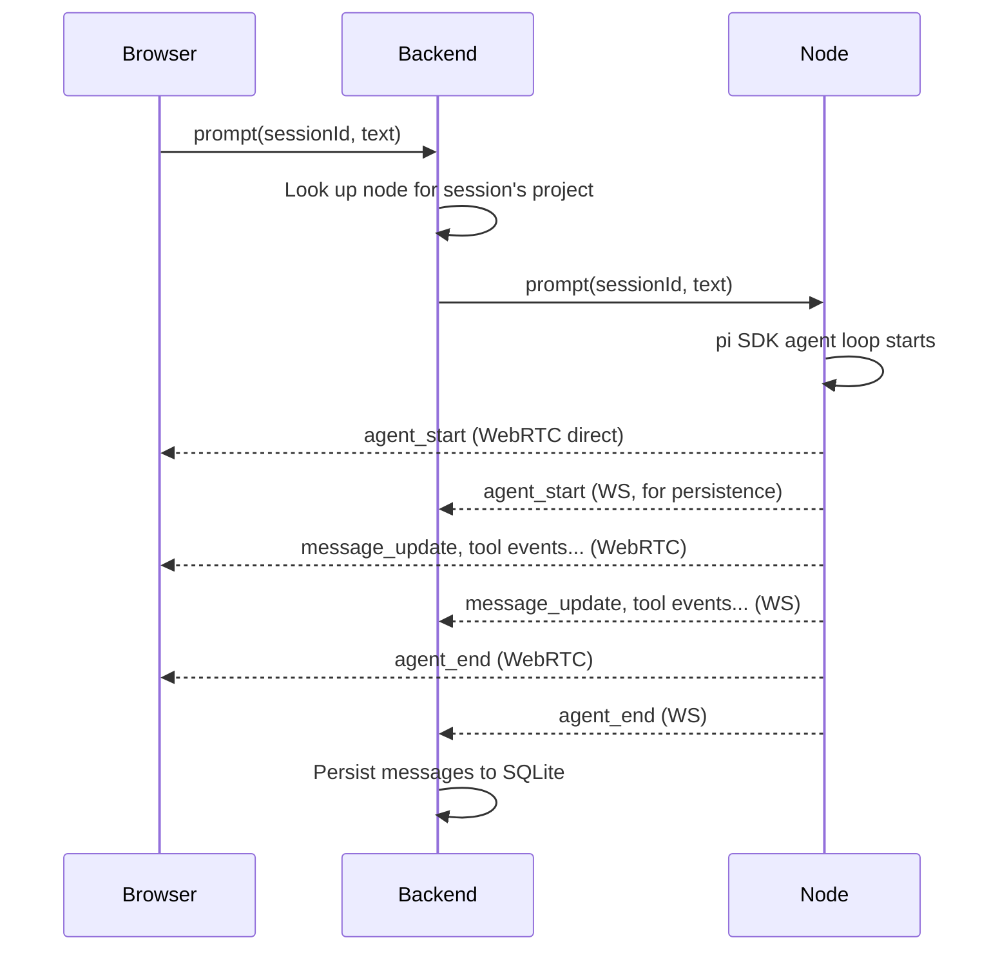
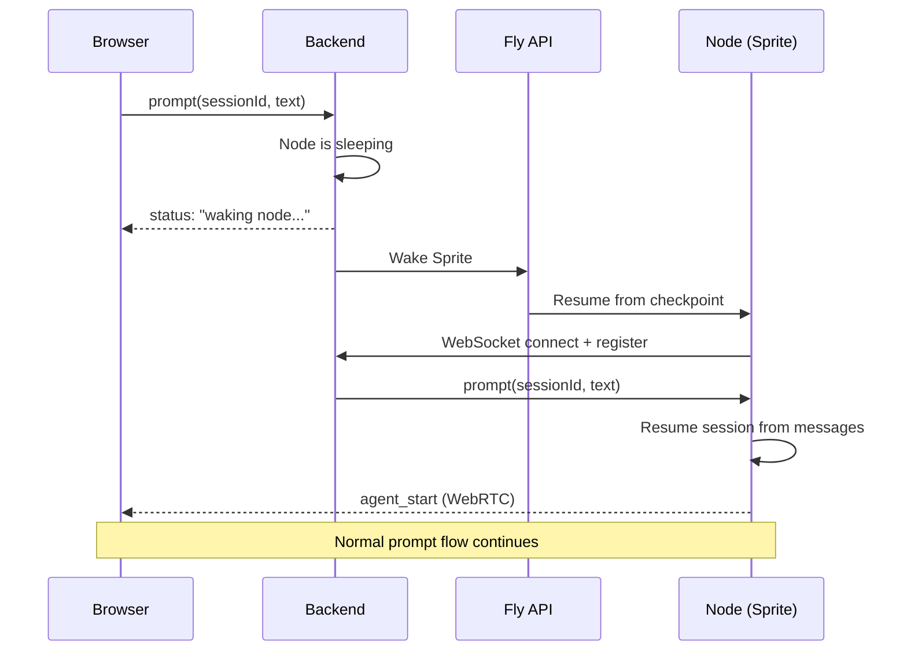

# Node Architecture

Status: **design investigation** — start by mapping current boundaries and drafting a minimal server–daemon contract; do not implement the full architecture from this sketch.

## Motivation

Reins currently runs as a single server that owns everything: the database, agent sessions, git operations, and filesystem access. This means you can only work with repos on the machine running the server.

The goal is to support multiple machines — e.g., a Mac and a Linux box — each with their own repos, connected to a single Reins backend. This also opens the door to a hosted backend with users connecting their own machines as execution nodes.

## Direction agreed for the first slice

- Route browser traffic, including agent events, through the server. Do not build WebRTC or direct browser–node connections initially; diagrams below retain the earlier exploration, not the first-slice target.
- Organize around a server-owned product state/policy boundary and a daemon-owned host-local execution boundary. The server owns projects, sessions, persistence, client APIs, and routing; daemons own pi runtime, filesystem, git, and tools. The server must not need local repo access for remote sessions.
- Bind a session to an execution daemon. Model project identity separately from host-specific source paths so one project may be available on multiple machines; do not assume one authoritative node per project.
- Investigate Reins' existing session, tool, filesystem, and git entry points before finalizing commands. Candidate commands: session start/resume, prompt, steer, abort, file reads/listing, git status/diff. Specify correlation, typed errors, ordering, persistence, retry/reconnect, and versioning for commands/results/events. Validate whether server-reconstructed messages can faithfully resume pi sessions before choosing the durable session source of truth.
- Keep the first implementation slice internal-node-only: establish node/source identity and route existing sessions through the in-process execution seam without changing browser behavior. A working external daemon and server-relayed events are the next slice, gated on canonical storage feasibility. Defer cloud sleep/wake, installers, auto-update, and direct browser transport.

## Investigation: actual seams (2026-04)

- `packages/backend/src/ws.ts` validates browser prompt/steer blocks and `clientId`, opens sessions, and acknowledges admission; abort currently acknowledges *before* awaiting cancellation. `runtimes/session-manager.ts` creates DB rows, resolves `project.path`, creates Pi runtimes, attaches broadcast and custom tools; `session-instance.ts` owns addressed sends and child reports. `routes/sessions.ts` exposes explicit pending-operation resume. Keep browser protocol separate from daemon RPC.
- `runtimes/pi/storage-adapter.ts` writes canonical AgentHarness entries, branch/lane values, lists and usage directly to server SQLite (`session_messages`, `pi_values`, `pi_lists`, `pi_usage`). `docs/dev/session-message-persistence.md` explicitly rejects message snapshots as a replay source. **Server-reconstructed display messages cannot be assumed to resume Pi**: they omit lane operation/inbox state, branch ancestry and usage. Do not ship the earlier `resume_session(messages)` sketch. Canonical storage ownership needs a deliberate transfer mechanism.
- `models/projects.ts` treats `project.path` as local cwd; `routes/projects.ts` checks local existence. `models/tasks.ts`, `models/projects.ts`, `routes/git.ts` and `git.ts` perform branch/checkout/push/rebase locally. `models/workspace.ts` and `routes/files.ts` mediate working-tree/ref listing and reads plus changed-file/diff projections. `runtimes/pi/agent-harness-builder.ts` uses cwd-scoped native tools; Reins custom `tools/` and `scripting/` reach DB-backed project/session models and git, so moving Pi alone does **not** remove server repo access or allow custom tools unchanged.

## Skill and resource ownership

Skills are **source/daemon-local execution resources**, not project-wide server records. Two sources for one project can legitimately have different repo skills, user-global skills, AGENTS files, and installed tools. The daemon runs Pi's `DefaultResourceLoader` in the selected source cwd when opening a session; it supplies discovered skill metadata, context files and prompt templates to the harness. Skill bodies and relative references are read on that daemon during execution. The server need not mirror skill files or require the same set on every host.

There is a current split that must be removed: `runtimes/pi/agent-harness-builder.ts` discovers skills through Pi's loader, but `runtimes/session-manager.ts` calls `expandPrompt()` before prompt/steer; `runtimes/prompt.ts` separately scans `project.path` with `ReinsResourceLoader` and reads SKILL.md to expand `/name`. For remote sessions this must execute on the **bound daemon**, before durable prompt admission, against the same source used by the Pi loader. Keep the browser's submitted text/clientId and optimistic reconciliation intact; return a typed `skill_not_found` or `skill_read_failed` admission error when explicit slash invocation fails, rather than silently executing an unexpanded command or searching the server filesystem. Resolve collisions and invocation permissions with Pi's discovered list so advertised and invocable skills cannot disagree.

For UI discovery, add a read-only `resources.list` command scoped to `sourceId` returning skill name, description, source, invocation flag and location (and prompt-template metadata if needed). It is a live per-source view, not a durable global catalog; refresh on open or explicitly, tolerate offline sources by showing no current inventory. Do not send skill bodies to the browser by default. Relative references stay relative to daemon paths and agent read/bash tools run there. A resumed session retains canonical conversation but re-discovers available resources on its bound source; if a skill changed between turns, subsequent invocations use the current version. Pinning skill versions for reproducibility is deferred. Tests should cover two sources with different skills, slash invocation on a server without the repo, removed skill after reconnect, and relative reference reads.

## Proposed minimal contract (target, not yet implemented)

Use a separate versioned `node-protocol` module with runtime-validated discriminated wire schemas and explicit results, rather than reusing browser WS events as control messages. One authenticated outbound daemon WS per host; server authorizes each session/source against that host before dispatch or event acceptance. On connect daemon sends `{type:"hello",version:1,daemonId,instanceId,sources:[{sourceId,projectId,path}]}`; server replies `{type:"ready",version:1,connectionId}` or closes with `version_mismatch`/`unauthorized`. Paths never define project identity; register source bindings explicitly (no automatic remote-URL merge). A session stores immutable `sourceId` (the node is derived from the source); different sessions of one project may choose different sources. Connection instance fences stale senders; reconnect replaces the old socket.

Server → daemon `{type:"command",requestId,sessionId?,op,args}`; daemon → server `{type:"result",requestId,ok:true,value}` or `{type:"result",requestId,ok:false,error:{code,message,retryable}}`. `requestId` is server-generated and unique per command; response must match pending request and operation, at most once. v1 operations (semantic, not generic shell):

| Operation | Inputs → result / admission |
|---|---|
| `session.open` | sessionId, sourceId, runtime/model/thinking/task context, `create` or `reopen` → `{pendingOperation}`; must not synthesize a transcript |
| `session.prompt`, `session.steer` | sessionId, `clientId`, validated content blocks → `{inputId}` after *durable* harness admission; clientId is idempotency key per session |
| `session.resumePending` | sessionId → `{started}` for explicit passive operation continuation |
| `session.abort` | sessionId → `{aborted}` only after abort completes (unlike current browser WS early ack) |
| `workspace.list`, `workspace.read` | sourceId, scoped relative path and optional ref → existing listing/content DTOs; reject escape paths |
| `workspace.status`, `workspace.diff` | sourceId, optional ref/branch and paging/size limits → existing workspace projection DTOs |
| `resources.list` | sourceId → current daemon-local skill/prompt metadata; no skill bodies |

Do not claim this list covers task branch mutation, project sync, git push/rebase, uploads, model catalog/credentials or DB-backed custom tools. Those call sites must be migrated or explicitly unavailable for remote sources before a remote session is considered complete. `sourceId` must be resolved server-side from the session for session commands; daemon verifies its local binding and path. Never accept a browser-supplied host path or arbitrary executable command.

Daemon → server `{type:"events",sessionId,instanceId,firstSeq,events:[{seq,kind,payload}]}`; monotonically increasing daemon-local per-session sequence, including durable canonical-entry notifications and normalized streaming events. Server validates ownership, commits durable entries/state first, then relays display events to browser in order; responds `{type:"events_ack",sessionId,throughSeq}` for a contiguous prefix. Missing sequence triggers replay request, duplicates are ignored; bounded batches/backpressure and payload limits are required. Stream updates may be coalesced but canonical entries and terminal outcomes may not be dropped. Lifecycle transitions must derive from durable native run IDs, not merely `agent_end` display events. Correlate terminal events with run ID, not request ID (admission is not completion). Unknown op/version → typed `unsupported`, wrong owner → `forbidden`, offline → `unavailable`, stale instance → `stale_connection`, invalid args → `invalid_request`, busy → `busy`, missing → `not_found`, unexpected → `internal`; transport timeout is **unknown outcome**, not an implicit retry. No automatic replay of prompt/steer/abort on reconnect; retry only with the same idempotency key after reconciling admission. Read-only calls may retry.

**Resume ownership decision for the first vertical slice:** retain server SQLite as canonical AgentHarness storage, accessed by the daemon through an authenticated, session-scoped storage interface with transactional append/CAS and lane/value/list/usage operations matching `PiStorageAdapter`. The daemon reopens the actual harness lane from this store, not from projected messages. This adds a storage transport beyond command/result/event; canonical storage commits must precede `inputId` results and event delivery. Never treat event batches as a second transcript writer. Before implementation, inventory `PiStorageAdapter` transaction/ordering assumptions and prove remote reopen after process loss, compaction and pending steering in an integration test. If the synchronous storage adapter cannot safely bridge this interface over the network, stop and reconsider daemon-local durable canonical storage plus replication; do not silently fall back to display-message hydration. Authentication and credential placement (current Pi credential store uses server SQLite) must be separately resolved.

## Incremental implementation slices

1. **First implementation slice — internal node only:** add stable `nodes` and `sources` rows; migrate existing projects to internal sources and sessions to source affinity. Keep `project_id` temporarily, enforcing agreement with the source's project. Route existing session open/prompt/steer/abort/explicit resume through an in-process node adapter with unchanged browser behavior. Add contract tests for routing and identity constraints. No external daemon, wire transport, or remote-session UI; local files/git/tools continue to work. Do not claim the server is repo-independent yet.
2. **Remote readiness gate:** test a transport-backed canonical Pi storage adapter against the current local adapter: create, prompt, steering, compaction/branch, restart/reopen and pending-operation continuation with exact IDs and usage. Verify DB/custom-tool calls and resource loading assumptions. Define `node-protocol` schemas and transport tests for version, ownership, correlation, event ordering and disconnect after admission. Stop if canonical storage cannot safely cross the transport.
3. **Next implementation slice — one external daemon:** launch one manually configured daemon on another machine/process, relay browser events through the server and route selected new sessions plus scoped read/list/status/diff. Existing sessions stay on the internal node; never silently move a live session. Test reconnect and remote resume with the server unable to access the checkout. Move task/git mutations and DB-backed tools behind explicit server-policy/daemon-execution calls; block unsupported remote operations instead of falling back to server filesystem.
4. Later: enrollment UI/token lifecycle, multi-host source selection, full git/task parity, cloud wake, installers/updates and optional direct transport. Use a separate server port/DB for development.

### Decisions still open / gates

- Whether networked AgentHarness storage can satisfy synchronous/transactional adapter semantics and acceptable latency; otherwise canonical daemon storage needs a durable replication and recovery design. The current sketch's server-replay-by-messages is invalid without an exact structural import proof.
- How server-owned DB tools (`create_task`, `execute`/`search`, `api.sessions`) are exposed to daemon Pi without giving it arbitrary DB authority; which git mutations remain policy on server versus host execution; attachment bytes and OAuth refresh/key custody. Confirm Pi and Reins skill discovery/invocation semantics can be unified before remote prompt routing.
- Durable event outbox location and replay window, payload cap/large binary transfer, crash atomicity between storage write and event publication, and handling a daemon restart mid-run (passive resume versus restart). Decide before promising lossless live streaming.
- Identity/authentication and per-source grants, host-path changes, source selection UX, permission/audit model for a hosted server. v1 can use explicit self-hosted token configuration; do not claim hosted security yet.

## Current architecture

```mermaid
graph TD
    Browser[Frontend\nBrowser]
    Backend[Reins Backend]
    DB[(SQLite)]
    FS[Filesystem\n& Git Repo]
    LLM[LLM API\nAnthropic / OpenAI]

    Browser <-->|WebSocket\nevents & commands| Backend
    Backend --> DB
    Backend -->|pi SDK\nagent sessions| LLM
    Backend -->|bash, read,\nedit, write| FS

    style Backend fill:#3b82f6,color:#fff
    style Browser fill:#a78bfa,color:#fff
```

Everything runs on one machine. The backend owns the database, the agent loop, tool execution, and filesystem access.

## Earlier architecture sketch (not the agreed first-slice transport)

```mermaid
graph LR
    Browser[Frontend]

    subgraph Cloud
        Backend[Reins Backend]
        DB[(SQLite)]
        Backend --- DB
    end

    subgraph MacBook
        Mac[Node]
        MacPi[pi Session]
        MacRepo[Repo A]
        Mac --- MacPi
        Mac --- MacRepo
    end

    subgraph Linux Box
        Linux[Node]
        LinuxPi[pi Session]
        LinuxRepo[Repo B]
        Linux --- LinuxPi
        Linux --- LinuxRepo
    end

    subgraph Fly Sprite
        Sprite[Node]
        SpritePi[pi Session]
        SpriteRepo[Repo C]
        Sprite --- SpritePi
        Sprite --- SpriteRepo
    end

    Browser <-->|WS: state\n& routing| Backend
    Browser <-.->|WebRTC:\nevents| Mac
    Browser <-.->|WebRTC:\nevents| Linux
    Browser <-.->|WebRTC:\nevents| Sprite

    Mac -->|WS: persistence| Backend
    Linux -->|WS: persistence| Backend
    Sprite -->|WS: persistence| Backend

    style Backend fill:#3b82f6,color:#fff
    style Browser fill:#a78bfa,color:#fff
    style Mac fill:#f59e0b,color:#fff
    style Linux fill:#f59e0b,color:#fff
    style Sprite fill:#f59e0b,color:#fff
```

The backend is the control plane — persistence, routing, WebRTC signaling. Nodes are the data plane — each runs pi SDK locally with the user's API keys, executes tools against local filesystems, and streams events directly to frontends via WebRTC. The backend eavesdrops on the node's WS connection for persistence.

### Prompt flow

```mermaid
sequenceDiagram
    participant B as Browser
    participant S as Backend
    participant N as Node

    B->>S: prompt(sessionId, text)
    S->>S: Look up node for session's project
    S->>N: prompt(sessionId, text)
    N->>N: pi SDK agent loop starts
    N-->>B: agent_start (WebRTC direct)
    N-->>S: agent_start (WS, for persistence)
    N-->>B: message_update, tool events... (WebRTC)
    N-->>S: message_update, tool events... (WS)
    N-->>B: agent_end (WebRTC)
    N-->>S: agent_end (WS)
    S->>S: Persist messages to SQLite
```

### Waking a sleeping node

```mermaid
sequenceDiagram
    participant B as Browser
    participant S as Backend
    participant F as Fly API
    participant N as Node (Sprite)

    B->>S: prompt(sessionId, text)
    S->>S: Node is sleeping
    S-->>B: status: "waking node..."
    S->>F: Wake Sprite
    F->>N: Resume from checkpoint
    N->>S: WebSocket connect + register
    S->>N: prompt(sessionId, text)
    N->>N: Resume session from messages
    N-->>B: agent_start (WebRTC)
    Note over N,B: Normal prompt flow continues
```

## Architecture details

### Backend (cloud/central)

The backend becomes a coordination and persistence layer:

- SQLite database (sessions, messages, tasks, projects)
- WebSocket server for frontend clients
- WebSocket server (or acceptor) for node connections
- Routes prompts and commands to the correct node
- Persists messages and events streamed back from nodes
- Serves the frontend UI
- Does NOT run pi SDK, execute tools, or access repos

### Node (user's machine)

A daemon running on any machine with a codebase:

- Runs the pi SDK agent sessions
- Executes coding tools (bash, read, edit, write) locally
- Performs git operations locally
- Holds the user's own LLM API keys — authenticates directly with model providers
- Manages model selection and thinking level
- Connects to the backend over WebSocket
- Registers which projects (directories) it serves
- Streams agent events back to the backend

### Thick node design

The node is essentially today's backend for a single machine, minus the DB and UI. This is the preferred approach because:

- **User's own API keys** — the node authenticates with model providers directly, so the backend never handles credentials
- **Model selection is local** — the backend doesn't need to know which model a session uses
- **Skill and resource discovery** — pi's `DefaultResourceLoader` discovers skills, extensions, context files, and AGENTS.md from the repo's filesystem. This must run on the machine with the repo. Running pi on the node means skill discovery just works with no file proxying.
- **Simpler protocol** — the backend says "prompt session X with this text," the node handles the full agent loop and streams events back
- **Closer to current architecture** — the node is a thin wrapper around what `sessions.ts` already does

## Earlier protocol sketch (subject to contract investigation)

The backend-to-node protocol mirrors the existing backend-to-frontend event protocol:

**Backend → Node:**
- `prompt` (sessionId, text, images?)
- `steer` (sessionId, text)
- `abort` (sessionId)
- `create_session` (projectId, opts)
- `resume_session` (sessionId, messages)

**Node → Backend:**
- All `AgentSessionEvent` types (agent_start, message_update, tool_execution_start, etc.)
- Session created/resumed confirmations
- File content responses (proxied from frontend requests)
- Diff data responses (proxied from frontend requests)

## Project-node affinity

A project is tied to the node that has its repo on disk. When a node connects, it registers its available project directories. The backend maps projects to nodes. If a node disconnects, its projects become unavailable (sessions are preserved in SQLite but can't be prompted until the node reconnects).

## What changes

| Concern | Current (single server) | Node architecture |
|---|---|---|
| Agent sessions | Backend creates/runs pi SDK | Node creates/runs pi SDK |
| Tool execution | Local to backend | Local to node |
| Git operations | Local to backend | Local to node |
| API keys | Backend env/config | Node env/config |
| Message persistence | Backend writes to SQLite | Node streams events → backend writes to SQLite |
| File API | Backend reads local fs | Backend proxies to node |
| Diff API | Backend runs git locally | Backend proxies to node |
| Frontend WS | Backend ↔ Frontend | Backend ↔ Frontend (unchanged) |
| Session resume | Backend loads from SQLite, creates pi session | Backend loads from SQLite, sends messages to node, node creates pi session |

## Node registration

A node connects to the backend, not the other way around. This means the backend doesn't need to know the node's IP or network topology — the node just needs the backend's URL and a token.

**Setup flow:**
1. User generates a node token in the Reins UI (or CLI): `reins nodes create-token --name "Will's Mac"`
2. Backend stores the token and associates it with the user
3. User starts the node daemon on their machine: `reins-node --server https://reins.example.com --token <token> --projects ~/Workspaces/reins,~/Workspaces/other-project`
4. Node opens a persistent WebSocket to the backend, authenticates with the token
5. Node sends a registration message listing its available project directories (paths + metadata like git remote URL, current branch)
6. Backend matches node projects to existing projects (by remote URL or path) or creates new project entries
7. Node is now available — the backend can route session commands to it

**Reconnection:** The node daemon auto-reconnects on disconnect. On reconnect it re-registers its projects. Active sessions are preserved in SQLite on the backend; the node resumes them by replaying messages from the backend.

**Heartbeat:** The node sends periodic pings. If the backend doesn't hear from a node within a timeout, it marks the node's projects as offline. The UI shows them as unavailable but still browsable (history, old sessions).

**Multiple nodes:** A user could have several nodes (Mac, Linux box, cloud VM). Each registers its own projects. The backend maps each project to exactly one node. If the same repo exists on two nodes (same remote URL), the user picks which node is authoritative — or the backend could allow either and route based on which is online.

## Cloud nodes (Fly Sprites)

Fly Sprites are disposable, durable cloud computers that spin up in ~1 second and support checkpoint/restore. A Sprite is a natural node — clone a repo onto it, start the node daemon, connect to the Reins backend.

**What Reins manages — node sleep/wake lifecycle:**

The backend tracks node state: online, sleeping, or offline. When a user prompts a session whose node is sleeping, the backend triggers a wake (e.g., via Fly API), waits for the node to reconnect and re-register, then routes the prompt. From the user's perspective, there's a brief wake delay (~1s for Sprites) before the agent responds.

- Node disconnects gracefully (idle timeout) → backend marks it as sleeping
- User prompts a sleeping node's session → if the node supports wake (cloud node with a wake API), backend triggers it and waits for reconnect. If not (e.g., a MacBook that's closed), the prompt is queued and the UI shows "Node offline — waiting for it to come back"
- Node reconnects → re-registers projects, resumes sessions from SQLite messages, receives any queued prompts
- Node disappears without graceful disconnect → backend marks as offline after heartbeat timeout

Nodes register whether they're wakeable (cloud nodes provide a wake callback/URL) or passive (personal machines that the backend can't reach). The UI reflects this — a sleeping cloud node shows "Starting..." while a disconnected MacBook shows "Offline."

**What Reins does NOT manage:**

How a Sprite (or any cloud node) is provisioned, configured, or set up is outside Reins' scope. Installing tools, cloning repos, authenticating CLI tools, checkpointing — that's the user's responsibility, potentially aided by skills or scripts. Reins only cares that a node daemon connects and registers projects.

**Cost model:** Cloud nodes like Sprites only cost money while awake. The backend's sleep/wake lifecycle management keeps them asleep when idle. A user could have one node per project or share a node across projects.

## Open questions

- **Authentication**: Two layers. Nodes authenticate with the backend using registration tokens (described above). Frontends authenticate using passkeys with user accounts — the backend scopes all data (projects, nodes, sessions) to the authenticated user. Passkeys work across devices (Touch ID, Face ID, hardware keys) with no passwords to manage.
- **Multiple nodes, same project**: What if the same repo exists on two machines? Allow both, or enforce single-node-per-project?
- **Latency and direct connections**: A backend-relayed event stream adds a network hop. To minimize latency, use WebRTC data channels for direct frontend ↔ node streaming. The backend acts as the signaling server (it already has WS connections to both), brokering the WebRTC handshake. Agent events flow peer-to-peer with no relay hop. The node separately sends events to the backend over its existing WS for persistence. WebRTC handles NAT traversal via STUN/TURN, so it works across networks. Degrades gracefully — if direct connection fails, fall back to two-hop relay through the backend.
- **Offline/disconnected**: What can the backend do while a node is offline? View history, browse old sessions — but not prompt or view current files.
- **Node discovery**: Does the user configure node URLs in the backend, or do nodes discover/register with the backend?
- **Migration path**: How to get from the current single-server architecture to this without a big bang rewrite? The node daemon could start as an optional mode — run Reins as today (all-in-one) or run backend + node separately.
- **Privacy and trust**: Connecting a node gives the backend (and its operator) the ability to route prompts that execute on the user's machine. The backend also receives all events for persistence, including file contents and bash output. For self-hosted backends this is fine (you trust yourself). For a hosted multi-user service, this is a serious trust surface — a compromised or malicious backend could exfiltrate data or execute arbitrary commands via crafted prompts. Mitigations to explore: end-to-end encryption (backend persists encrypted blobs), node-side tool permissions and approval gates, audit logging of all backend-initiated commands, scoped node tokens. Self-hosted should remain the primary model.
- **ACP (Agent Communication Protocol)**: Investigate whether [ACP](https://agentcommunicationprotocol.dev/) could serve as the protocol between backend and nodes (or between agents across nodes). May provide a standard for the command/event channel rather than building a bespoke WebSocket protocol.
- **Development sandboxing**: This work requires a separate Reins instance — can't rip apart session/tool execution on the same copy being used for daily development. Run a second instance on a different port/DB for the node architecture work.
