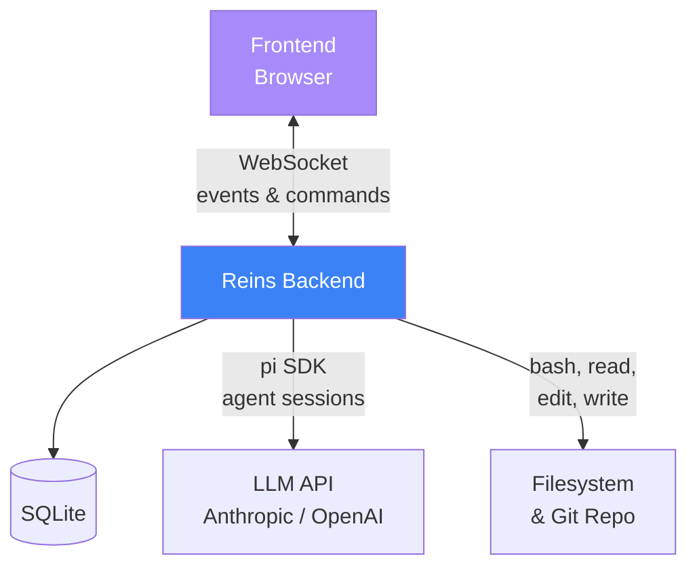
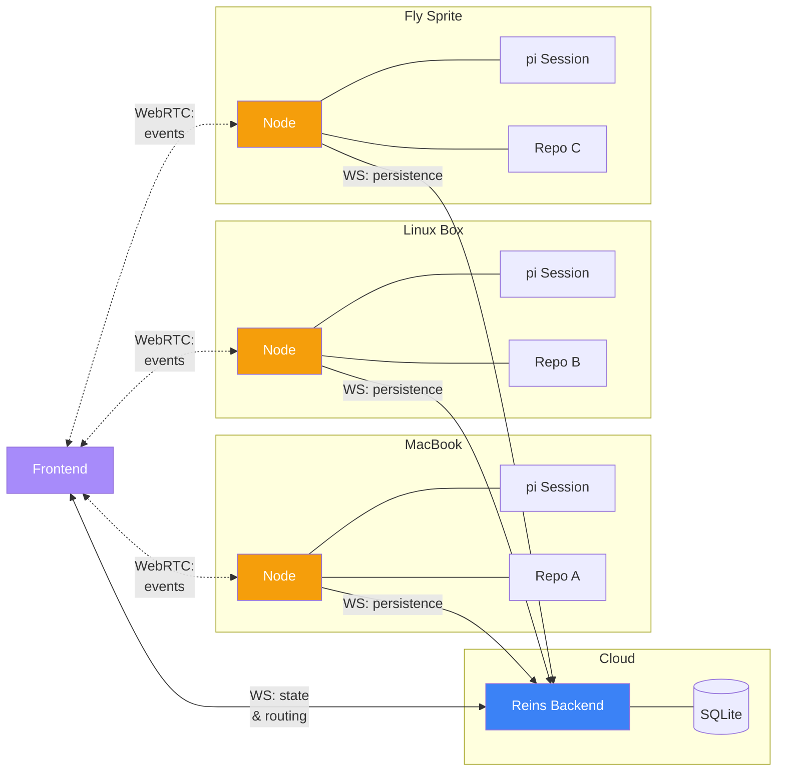
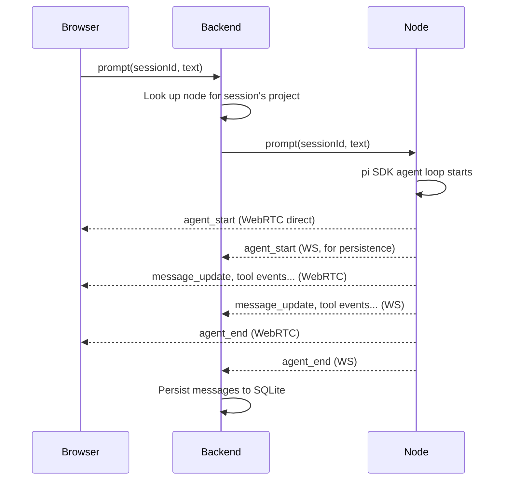
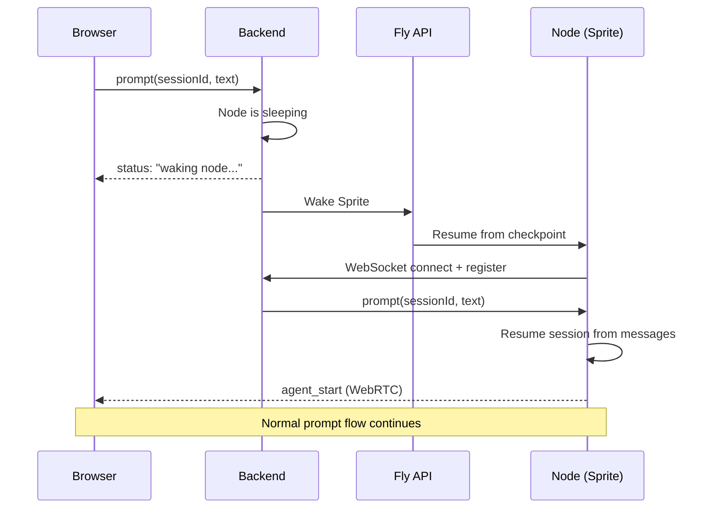

# Node Architecture

Status: **internal routing, semantic contract, canonical node storage and in-process node-owned Pi runtime assembly/cache implemented for new sessions**; separate processes and remote readiness remain open. The older sketches below are historical, not the current implementation.

## Remaining work (in order)

- [x] **Node owns new-session Pi execution in-process:** `packages/node` assembles Pi from its canonical binding/storage and caches/reopens live runtimes; backend `SessionManager.open()` rejects node-owned sessions and legacy server-owned sessions keep their old path. This is NOT a separate process.
- [x] **Node-owned SQLite migrations:** `packages/node/src/migrations.ts` owns numbered, named, transactional node migrations in its own `migrations` table. Startup creates fresh schema including attachments; nonempty databases without a ledger and unknown migration names fail closed. It does not compare reconstructed historical schemas or run backend migrations. Binding no longer initializes schema per call. This does not migrate server-owned sessions or restore missing node storage.
- [ ] **Bridge server-owned product capabilities:** define narrow calls for task/model policy, DB-backed tools and lifecycle events; replace in-process attachment fetch with authenticated transfer (done over the JSON-RPC link: `session.committed`, chunked `attachment.fetch`, and chunked, idempotent `attachment.store`; tool-result images get node-assigned attachment IDs offline in Pi's `after_tool` hook, with a node storage-adapter safety net for results Pi commits without the hook, and their bytes are uploaded from the ordered session outbox ahead of the commits that reference them, so neither `session.committed` nor `session.event` carries image bytes and no run waits on the network; authentication still pending with the transport). Lifecycle and browser events are done: browser UI deltas are best-effort `session.event` notifications with per-session seq; run lifecycle is durable `session.started`/`session.settled` reports in the node's ordered per-session outbox, applied once per (session, run, kind) with the parent report enqueued atomically (see node-contract.md). Runs that never settle because the node died mid-run still leave the session running (crash recovery open); Agent tools are done: all tool definitions run on the node, and `create_task`/`search`/`execute` call the dedicated `project.createTask`/`script.search`/`script.execute` requests (plus a `script.cancel` notification), scoped by the server from the session row; `internal-node.ts` no longer imports `SessionManager` (see node-contract.md *Agent tools*). Server retains durable image bytes; node bytes are an execution cache, except that node-created tool-result images are the only copy until their outbox upload is acknowledged. Task/model policy is done: the server freezes model, thinking level and a task snapshot at session creation and sends them in `session.provision`; the node creates Pi's lane with the model (Pi's lane is then the only copy), stores the task snapshot with its binding, and opens with no server call, checking out the task branch with node-local git and rendering the system prompt on the node (see node-contract.md *Session configuration*). Model changes are a queued `session.setModel` command applied in outbox order, replacing the server's direct call on the node's live runtime (see node-contract.md *Model changes*); the credential store is the last in-process dependency of `startNode()`. Design the server-owned credential adapter and OAuth refresh semantics, but do not implement credentials yet.
- [ ] **Design server–node transport and protocol:** use JSON-RPC 2.0 over a bidirectional WebSocket as the starting choice for local and remote nodes; specify authentication, method schemas, ordering, payload limits and compatible-version negotiation before building the daemon. Durable admission and replay remain application responsibilities.
- [ ] **Make delivery recoverable:** durable node admission receipts, sequenced replication/events and reconnect fencing over that transport. Every server→node session command now crosses the JSON-RPC link (`session.provision`, `session.prompt`, `session.steer`, `session.setModel`, `session.abort`, `session.resumePending`; no backend production code calls `Node.send`). Delivery exceptions and node rejections are terminal failures removed from the server outbox; submitted work (provision, prompt, steer, setModel) whose RPC outcome is unknown is requeued and replayed, which converges by command-ID receipt or, when Pi admitted before the receipt, by Pi's durable `reinsId` dedupe; immediate controls (abort, resumePending) fail to their caller (see node-contract.md *Session commands on the wire*). Dispatches interrupted by a server restart are still marked `unknown` and not replayed.
- [ ] **Split local processes:** server-only and node-only entrypoints plus a combined startup command; test separation, reconnect and process restart with its disk intact. Node dev reload is deferred. Prerequisite done: the server holds and calls no live node runtime. `Node` exposes only `send`/`attach`/`stop` (runtime access is a marked test seam, `nodeRuntimesForTesting`); session views, task deletion, code-review submission and `/api/health` read node activity from projections (`nodeSessionActivity`: durable `activity_state` plus pending outbox input), `SessionInstance.wait` resolves on the durable settlement receipt and replica transcript, code-review feedback is a queued `session.prompt`, ws abort forwards to node-owned sessions without a runtime lookup, and `ensureSessionOpen` no longer opens node sessions (see node-contract.md *Server reads projections only*). Open: `/activity` no longer reconciles a node session left `running` by a node that died mid-run (crash recovery).
- [ ] **Migrate existing sessions:** one-time, verified copy of complete canonical AgentHarness state from server SQLite to node SQLite; no transcript reconstruction.
- [ ] **Refresh idle runtimes per turn:** close and reopen an idle Pi runtime before new input so it picks up new code; keep active runs alive, and measure reopen cost.
- [ ] **Node management screen:** show nodes, connection status and approved project sources, with source selection for new sessions after connectivity exists.
- [ ] **Remote rollout:** enrollment/source approval, scoped filesystem and git operations, and remaining remote feature parity after the local process path works.

Current transport/recovery checkpoint: a tested JSON-RPC peer supports hello, provision and status but is not authenticated or running in a separate process. Internal node-owned provision is routed through it over an in-memory loopback socket pair (same schemas, negotiation and handlers a remote node uses); unknown-outcome/unavailable provision RPCs are requeued and replayed idempotently via the node receipt rather than failed. Prompt, steer, abort, pending resume and runtime open remain direct in-process calls. Node provision receipts are recorded after the binding and Pi's lane creation, so a replay converges; prompt/steer receipts are **not** atomic with Pi admission, so current delivery exceptions are reported as failures and removed without retry. Node replication now awaits acknowledgement and retains pending commits until then. Attachment refs for new node-owned inputs are fetched and checksum-verified once before Pi admission, materialized in a disposable node SQLite cache, and hydrated locally during synchronous provider conversion. Historical refs that were never cached are not fetched on reopen. Missing node bindings reject new inputs with a definite `not_found` before Pi admission; the server notifies the submitting client and the frontend refreshes activity instead of leaving optimistic streaming visible. Failed commands are deleted after notifying any connected submitting client; previously queued work proceeds once its failed predecessor is removed. Existing startup handling for interrupted dispatches is unchanged in this slice. The server still supplies bytes through an in-process callback, not a transport method. The checklist remains open until command/event delivery across disconnects is proven end-to-end; node disk restoration is not an agreed requirement.

Details, decisions and historical sketches follow; this checklist is the short status view.

## Internal-node canonical storage spike (current)

New sessions created on the internal source have `sessions.storage_owner = 'internal-node'`; all pre-existing sessions retain the `server` default and continue using server SQLite directly. Provision through the in-process `@reins/node/node` instance created by `startNode()` durably binds the new session ID and source ID in a separate SQLite database (`~/.reins/node/storage.db`, independent of `reins.db`). Subsequent prompts/steers lazily open Pi with a `PiStorageAdapter` on that node database. Restart/reopen loads its real AgentHarness lane from that database, not from server display history. Internal node runtime, resource discovery, tools and credentials still run in the server process; this is **not** a remote daemon or a server without checkout access.

`PiStorageAdapter.commit()` serializes per instance; within one node SQLite transaction it prepares and validates the entire batch against `harness_next_seq`, applies entries (with parent ancestry), values, lists and usage, advances the sequence, and records the exact prepared `CommittedWrite[]` in the node's per-session `session_outbox` (shared with durable run lifecycle reports, see node-contract.md). The node DB also stores the immutable session binding (`sessionId`, `sourceId`, `cwd`, `createdAt`, `parentSessionId`); open checks the persisted source/path before using it. Delivery replays those committed writes in sequence into the server's existing harness tables, with a receipt in the same server transaction as the replay; only then is the node outbox batch deleted/acknowledged. A lost ack rechecks the identical receipt; a gap/divergent receipt fails closed. On open or provision pending batches drain before execution. Normal commit admission waits for replication and propagates a delivery error (the node write remains durable). The server's history/tree/context readers continue to read their usual tables, now a **read-only replica** for these sessions; ordinary `PiStorageAdapter.commit()` on the server rejects node-owned sessions. Server rows have their own SQLite row IDs, but harness IDs, parent links, global sequences, entry JSON, values, lists and usage derive from the exact node writes. `node_replica_receipts` is server delivery metadata, not a second transcript writer.

The spike tests verify real provision/prompt, exact table projections and display reads, close/reopen after replacing the node SQLite connection, and failed delivery followed by replay without duplicates. It does **not** prove remote process crash recovery, pending steering/compaction, transport retries, or crash atomicity between separate SQLite databases beyond the tested outbox/receipt window. Pi credentials, attachments, metadata/activity, DB-backed custom tools, model lookup and filesystem/git still depend on server state. In particular, outbox command admission has no node-side receipt keyed by the command ID; lost acknowledgements are reported as failed and the failed command removed, without automatic retry. Today a missing node DB at `~/.reins/node/storage.db` fails closed: the server retains browseable history and images, but cannot resume Pi from that replica. Back up node storage only if preserving those running conversations matters. Future ephemeral disks may intentionally end sessions when discarded; restoring Pi from the server replica is not a requirement unless explicitly chosen later. Do not migrate existing sessions or promote this to a remote daemon without addressing these gates.

## In-process node module slice (current)

`handler.install()` acquires the in-process internal node before starting the server command dispatcher and releases its lease on uninstall; overlapping handler installs reuse the same node runtime cache so a server handler reload does not abort an active run. The dispatcher still owns durable scheduling/claim/settle and resolves the current source from the server DB. It passes an explicit immutable `{sourceId,cwd,createdAt,parentSessionId}` binding, resolved and checked against server project/source/session identity, to `@reins/node/node` on provision and addressed commands. Node code verifies the stored binding (including on reopen), owns the separate SQLite schema, canonical Pi storage adapter and pending commit outbox, and executes provision/prompt/steer/abort/resumePending with a node-owned Pi assembly and live runtime cache. It imports **no** backend state, DB accessors, session/source tables or `ServerState`. The node's storage adapter is shared with legacy server sessions, but the server's adapter enforces read-only replicas for node-owned sessions. Server-side exact replica application and receipts live in `node-replica.ts`; `runtimes/internal-node.ts` supplies the callback and product policy to the in-process node; the node package selects and owns its own database. The node removes batches only after delivery succeeds. Server-owned sessions keep their original runtime/storage path in `legacy-session-execution.ts`. No old-session migration or network daemon.

**Intermediate dependency, not a separate process:** `startNode()` now owns new-session Pi assembly, cwd-scoped native tools/resources/skill expansion, the runtime cache and passive reopen. Session configuration (model, thinking level, task snapshot) is frozen at creation and travels in `session.provision`; the node keeps the model only in Pi's lane and the task with its binding, so opening needs no server; the node checks out the task branch and renders the system prompt itself. The only remaining in-process dependency is the DB-backed Pi credential store passed to `startNode()`, a live JS object, **not a serializable operation**; Pi and native host tools still run inside the server process and share its checkout. `ServerState.sessions` holds legacy server-owned runtimes only. Node-owned waits still reach the node runtime through in-process lookup, not server runtime-map insertion; model changes are queued `session.setModel` commands. On install overlap the same SQLite connection retains the node and its active runs. Node SQLite is injected in tests independently of product SQLite; its default path is `~/.reins/node/storage.db`. The server owns product state, replica reads, scheduling and UI. Tests exercise installed handler → dispatcher → provision → prompt/image/finish → exact replica → passive node-DB reopen, and node-only Pi without product tables. This does not establish transport replay safety, node-side command receipts, DB-independent credential/tool policy, idle node cache eviction, or a remote-ready host process.

Next smallest follow-up: replace the nonserializable credential/attachment/custom-tool/lifecycle callbacks with explicit bounded policy messages and node-local staging where needed. Keep server-owned sessions on their legacy adapter. Resolve command admission receipts and reconnect fencing separately, before transport.

## Process split: next incremental plan (2026-04)

**Decision: do not launch a stand-alone node executable yet.** `startNode()` cannot be moved to another process by replacing its injected `openRuntime` with an RPC back to `SessionManager.open()`: that would leave Pi, tools and checkout access in the server and manufacture a daemon that only owns SQLite. Likewise, moving only the node DB across IPC would break synchronous canonical writes/replication semantics. Preserve the importer-removal migration and all existing server-owned sessions; do not read/write a live database while developing this split.

1. **First unblock runtime ownership, in-process with isolated imports (implemented for new node-owned sessions).** The native AgentHarness Pi runtime/drive/reopen module now lives at `packages/node/src/runtime/pi-runtime.ts`, cwd-scoped native read/write/edit/bash and `NodeExecutionEnv` construction at `packages/node/src/runtime/tools.ts`, local resource/skill discovery and slash expansion at `packages/node/src/resources/`, and Pi model/resource context creation at `packages/node/src/runtime/context.ts` with an injected credential store. A node-only test runs and reopens Pi against node SQLite without any product tables; source-local skill expansion is tested across two different checkouts. `startNode()` now assembles and caches new node-owned Pi from canonical node storage via `runtime/build.ts`, using a narrow *in-process* server policy input. `SessionManager.open()` explicitly rejects these sessions; old server-owned sessions keep their original adapter. Node runtime objects no longer enter `ServerState.sessions`. The server supplies live credentials, product tools, task/system prompt and lifecycle callbacks; attachment materialization now fetches server-owned bytes in-process before admission, while provider hydration reads node SQLite synchronously. Before process separation, replace these in-process objects with explicit bounded policy operations and an authenticated attachment transfer. Its input must be the durable node binding plus an explicit bounded *server policy* interface (model/settings, attachment bytes, DB tools, task branch policy, session lifecycle/observer), not `ServerState`, `SessionManager`, server `getDb()`, or server-side checkout access. Keep legacy server-owned session opening as a separate adapter. Add boundary tests that construct and resume node-owned Pi from node SQLite with no backend session manager, and fail import-isolation checks on accidental product DB access. Versioned node DBs must remain readable; experimental unversioned node DBs instead fail closed (see node SQLite startup below). No history import or synthetic transcript.
2. **Resolve nonlocal dependencies before moving the process.** Legacy `SessionManager.open()` caches only server-owned runtimes in `state.sessions`. New node-owned Pi is assembled/cached in `packages/node`, but `SessionInstance` persists lifecycle and reports child outcomes via product DB and addressed sends; the in-process observer emits browser events; Reins application tools run on the node and reach product models/scripting only through `script.execute`/`script.search`/`project.createTask`; the server injects `createDbCredentialStore()` into node Pi context and async attachment fetch from product SQLite before prompt admission. Node binding, not server rows, provides created-at/parent/cwd. Specify explicit typed policy calls, cancellation, result limits and error mapping for each. In particular, Pi's provider conversion calls attachment hydration synchronously today; a network callback cannot replace it. The current in-process node materializes verified server-owned attachment bytes before prompt admission and keeps canonical input as references; replace its injected JS fetch callback with authenticated transfer when processes separate. Provider conversion hydrates synchronously from the node's disposable cache. Credential access is an open design gate: the server remains the durable credential owner, while Pi on the node will need an async credential-store adapter over the authenticated server–node connection. Do not assume `modify(provider, fn)` can be proxied as RPC: the callback is not serializable and OAuth refresh-token rotation must be coordinated on the server (or use a separately justified versioned update protocol). Defer implementing or finalizing this adapter for now. DB-backed custom tools now use explicit execute/search/createTask requests rather than remote JS or a product DB handle (done). Task branch checkout happens on the node from the provisioned task snapshot (done). Model changes to active sessions travel as the queued `session.setModel` command (done); auth changes still need a control path. The in-process server currently looks up node-owned live runtimes for bounded waits and health/activity projections; replace these direct object lookups with node observations/commands before process separation. Node idle runtimes currently remain cached until explicit close or process exit; add safe node-owned idle eviction without aborting active admissions/runs. Server file/git/project/task routes remain local-only and must fail closed for remote sources.
3. **Only then add local process transport.** Keep server DB and node SQLite independent (node path defaults to `~/.reins/node/storage.db`, not `REINS_DATA_DIR`); require explicit test paths. Start with JSON-RPC 2.0 over a bidirectional WebSocket for both local and remote nodes rather than a custom length-prefixed framing protocol. Choose and secure the local endpoint (loopback or Unix socket) before implementation; remote transport requires authenticated TLS. Cap message size (initial target 1 MiB; the in-process link is uncapped, so remote transport needs chunked `session.committed`), in-flight calls (initial target 64), and event buffering; pause input rather than drop canonical writes or terminal outcomes. No user-supplied endpoint path or generic shell command in browser traffic. `@reins/node/protocol` owns validated JSON-RPC methods/params/results and negotiation, separate from existing semantic `@reins/node/contract`; `packages/node/src/process/` owns the node connection, canonical DB, Pi and runtime cache, while `packages/backend/src/node-transport/` owns the server peer, source routing, replica application and product-policy request handler. Negotiate `hello {minVersion,maxVersion,capabilities,instanceId}` → `ready {version,capabilities,epoch}` using JSON-RPC methods; choose a common version and capability intersection, rejecting only if no common version or a required operation capability is absent. New optional capabilities are not a hard failure. On each connection generate a fresh server epoch and reject replies/events from older epochs.

   Local v1 JSON-RPC method sketch (not the existing semantic contract; implemented names follow *Wire method naming* in `docs/dev/node-contract.md`, e.g. `session.provision`, `session.committed`): server calls `node.command` with `{epoch,commandId?,op,sessionId,binding?,args}`; the JSON-RPC `id` correlates one result or error, while `commandId` is the durable server outbox ID, never a transport retry ID. Map bounded domain errors `invalid_request`, `unsupported`, `unavailable`, `forbidden`, `busy`, `internal` into validated JSON-RPC error data. Node calls `server.events` with `{epoch,sessionId,firstSeq,events}` and receives `{throughSeq}` for a committed contiguous prefix; durable kinds `replica_commit` (startSeq + exact writes JSON), `run_started` and `run_settled` (native run ID/status) must be replayable. Transient stream notifications may be coalesced/omitted after disconnect with an explicit resync. Node calls scoped `server.policy` methods for narrowed attachments/tools/task policy (credentials deferred), not a raw SQL proxy. Server issues provision/prompt/steer/abort/resume only for authorized source bindings; node verifies stored session binding before admission. Result means admission, not run completion. Timeouts/disconnects on mutating commands are `unknown`; never blindly replay prompt/steer/abort. Server applies exact `CommittedWrite[]` + receipt in one transaction and acks only then; node retains pending commits until ack and replays them after reconnect. A durable node-side command receipt/reconciliation is required before automatic retry. Node session sequences and server receipt prefixes must be validated; do not infer runs from display snapshots. No network enrollment or remote credentials in the local slice.
4. **Entrypoints and development.** A server-only executable must never instantiate a node or open node SQLite; a node-only executable must never open product SQLite. A combined dev supervisor launches both with a private socket and restarts a crashed node on reconnect; it must not restart a running node just because its code changed. Preserve existing server handler hot reload without closing/aborting node runs; node code reload is explicitly deferred. Process-owner, storage schema, protocol framing, socket configuration **and node code changes** are *restart-required*; schema migrations run only at startup. Test subprocesses with temporary DBs and a checkout inaccessible to the server, node crash/reconnect, incompatible and overlapping versions, bounded frames and an active run across server handler reload. Preserve a legacy all-in-one path until old server-owned sessions have a safe migration or an explicitly supported legacy execution owner.

**Node SQLite startup (implemented):** `initializeNodeStorage()` delegates to the node-only migration runner, never backend migrations. Its own `migrations` table records `001_canonical_node_storage` (binding, canonical lane, replication and receipts) , `002_node_attachments` (disposable image cache), `003_session_outbox` (ordered outbox), `004_session_task` (provisioned task snapshot), `005_attachment_uploads` (attachment upload rows in the outbox) and `006_node_attachment_content` (content index on the attachment cache); a fresh DB applies all of them transactionally. Missing named migrations run with their ledger inserts in the same transaction. The ledger, not a reconstructed SQL schema or `PRAGMA user_version`, determines what has run. A nonempty database without the ledger (including the prior `user_version` experiment) and unknown migration names fail startup; the runner does not scan for schema mismatches or automatically repair tables. An operator may manually discard/recreate the old node DB after stopping the process; **doing so makes its node-owned sessions unresumable** (server history/images remain readable). Startup owns migration (`getNodeDb()` / first `startNode()` on an injected connection); `bindNodeSession()` only checks/inserts the binding, so repeated provision no longer runs schema setup. Do not run this runner against product SQLite or a live user's node DB in tests. On-disk storage remains canonical: back it up before upgrading; no automatic downgrade or rollback after a successful upgrade. Migration failure throws during node startup before admission, without reset or automatic deletion; a future standalone node daemon should exit nonzero on this uncaught failure. Schema migrations require a node process restart and should preserve existing data.

**Current checkpoint:** for new node-owned sessions the immutable node binding drives Pi assembly/reopen, native runtime/tools/resources live under `packages/node`, and the node cache owns the live runtime; server lifecycle/broadcast and exact replica still work through injected in-process policy/receipt callbacks. Server-owned sessions are unchanged and never silently migrated. No independent process, local transport, supervisor, reconnect fencing or subprocess process-separation tests exist yet. The process split is blocked on making policy/credentials/attachments/tools/event delivery serializable and durable, not on choosing an IPC library.

## Motivation

Reins currently runs as a single server that owns everything: the database, agent sessions, git operations, and filesystem access. This means you can only work with repos on the machine running the server.

The goal is to support multiple machines — e.g., a Mac and a Linux box — each with their own repos, connected to a single Reins backend. This also opens the door to a hosted backend with users connecting their own machines as execution nodes.

## Direction agreed for the first slice

- Route browser traffic, including agent events, through the server. Do not build WebRTC or direct browser–node connections initially; diagrams below retain the earlier exploration, not the first-slice target.
- Organize around a server-owned product state/policy seam and a daemon-owned host-local execution seam. The server owns projects, session metadata, client APIs, routing and read projections; the node owns canonical AgentHarness persistence for newly bound sessions, plus Pi runtime, filesystem, git and tools. The server must not need local repo access for future remote sessions.
- Bind a session to an execution daemon. Model project identity separately from host-specific source paths so one project may be available on multiple machines; do not assume one authoritative node per project.
- Investigate Reins' existing session, tool, filesystem, and git entry points before finalizing commands. Candidate commands: session start/resume, prompt, steer, abort, file reads/listing, git status/diff. Specify correlation, typed errors, ordering, persistence, retry/reconnect, and versioning for commands/results/events. Validate whether server-reconstructed messages can faithfully resume pi sessions before choosing the durable session source of truth.
- Keep the first implementation slice internal-node-only: establish node/source identity and route existing sessions through the in-process execution seam without changing browser behavior. A working external daemon and server-relayed events are the next slice, gated on canonical storage feasibility. Defer cloud sleep/wake, installers, auto-update, and direct browser transport.

## Investigation: actual seams (2026-04)

- `packages/backend/src/ws.ts` validates browser prompt/steer blocks and `clientId`, opens sessions, and acknowledges admission; abort currently acknowledges *before* awaiting cancellation. `runtimes/session-manager.ts` creates DB rows, resolves `project.path`, creates Pi runtimes, attaches broadcast and custom tools; `session-instance.ts` owns addressed sends and child reports. `routes/sessions.ts` exposes explicit pending-operation resume. Keep browser protocol separate from daemon RPC.
- `runtimes/pi/storage-adapter.ts` writes canonical AgentHarness entries, branch/lane values, lists and usage directly to server SQLite (`session_messages`, `pi_values`, `pi_lists`, `pi_usage`). `docs/dev/session-message-persistence.md` explicitly rejects message snapshots as a replay source. **Server-reconstructed display messages cannot be assumed to resume Pi**: they omit lane operation/inbox state, branch ancestry and usage. Do not ship the earlier `resume_session(messages)` sketch. Canonical storage ownership needs a deliberate transfer mechanism.
- `models/projects.ts` treats `project.path` as local cwd; `routes/projects.ts` checks local existence. `models/tasks.ts`, `models/projects.ts`, `routes/git.ts` and `git.ts` perform branch/checkout/push/rebase locally. `models/workspace.ts` and `routes/files.ts` mediate working-tree/ref listing and reads plus changed-file/diff projections. `runtimes/pi/agent-harness-builder.ts` uses cwd-scoped native tools; Reins custom `tools/` and `scripting/` reach DB-backed project/session models and git, so moving Pi alone does **not** remove server repo access or allow custom tools unchanged.

## Skill and resource ownership

Skills are **source/daemon-local execution resources**, not project-wide server records. Two sources for one project can legitimately have different repo skills, user-global skills, AGENTS files, and installed tools. The daemon runs Pi's `DefaultResourceLoader` in the selected source cwd when opening a session; it supplies discovered skill metadata, context files and prompt templates to the harness. Skill bodies and relative references are read on that daemon during execution. The server need not mirror skill files or require the same set on every host.

For new node-owned sessions, Pi discovery and slash expansion run inside the node module against the bound source cwd. Legacy server-owned sessions still expand through `runtimes/session-manager.ts`. Both paths are currently in the **same server process**; no independent daemon owns the checkout yet. For remote sessions it must execute on the **bound daemon**, before durable prompt admission, against the same source used by the Pi loader. Keep the browser's submitted text/clientId and optimistic reconciliation intact; return a typed `skill_not_found` or `skill_read_failed` admission error when explicit slash invocation fails, rather than silently executing an unexpanded command or searching the server filesystem. Resolve collisions and invocation permissions with Pi's discovered list so advertised and invocable skills cannot disagree.

For UI discovery, add a read-only `resources.list` command scoped to `sourceId` returning skill name, description, source, invocation flag and location (and prompt-template metadata if needed). It is a live per-source view, not a durable global catalog; refresh on open or explicitly, tolerate offline sources by showing no current inventory. Do not send skill bodies to the browser by default. Relative references stay relative to daemon paths and agent read/bash tools run there. A resumed session retains canonical conversation but re-discovers available resources on its bound source; if a skill changed between turns, subsequent invocations use the current version. Pinning skill versions for reproducibility is deferred. Tests should cover two sources with different skills, slash invocation on a server without the repo, removed skill after reconnect, and relative reference reads.

## Proposed minimal contract (target, not yet implemented)

Use a separate versioned `node-protocol` module with runtime-validated discriminated wire schemas and explicit results, rather than reusing browser WS events as control messages. One authenticated outbound daemon WS per host; server authorizes each session/source against that host before dispatch or event acceptance. On connect daemon sends `{type:"hello",version:1,daemonId,instanceId,sources:[{sourceId,projectId,path}]}`; server replies `{type:"ready",version:1,connectionId}` or closes with `version_mismatch`/`unauthorized`. Paths never define project identity; register source bindings explicitly (no automatic remote-URL merge). A queued session's source may change; the dispatcher resolves its current source (and node) from the session at dispatch time. Different sessions of one project may choose different sources. Connection instance fences stale senders; reconnect replaces the old socket.

Server → daemon `{type:"command",requestId,sessionId?,op,args}`; daemon → server `{type:"result",requestId,ok:true,value}` or `{type:"result",requestId,ok:false,error:{code,message,retryable}}`. `requestId` is server-generated and unique per command; response must match pending request and operation, at most once. v1 operations (semantic, not generic shell):

| Operation | Inputs → result / admission |
|---|---|
| `session.provision` | sessionId and server-resolved sourceId → `{provisioned}` after durable admission; Pi opens/reopens lazily on addressed commands, without transcript synthesis |
| `session.prompt`, `session.steer` | sessionId, `clientId`, validated content blocks → `{inputId}` after *durable* harness admission; clientId is idempotency key per session |
| `session.resumePending` | sessionId → `{started}` for explicit passive operation continuation |
| `session.abort` | sessionId → `{aborted}` only after abort completes (unlike current browser WS early ack) |
| `workspace.list`, `workspace.read` | sourceId, scoped relative path and optional ref → existing listing/content DTOs; reject escape paths |
| `workspace.status`, `workspace.diff` | sourceId, optional ref/branch and paging/size limits → existing workspace projection DTOs |
| `resources.list` | sourceId → current daemon-local skill/prompt metadata; no skill bodies |

Do not claim this list covers task branch mutation, project sync, git push/rebase, uploads, model catalog/credentials or DB-backed custom tools. Those call sites must be migrated or explicitly unavailable for remote sources before a remote session is considered complete. `sourceId` must be resolved server-side from the session for session commands; daemon verifies its local binding and path. Never accept a browser-supplied host path or arbitrary executable command.

Daemon → server `{type:"events",sessionId,instanceId,firstSeq,events:[{seq,kind,payload}]}`; monotonically increasing daemon-local per-session sequence, including durable canonical-entry notifications and normalized streaming events. Server validates ownership, commits durable entries/state first, then relays display events to browser in order; responds `{type:"events_ack",sessionId,throughSeq}` for a contiguous prefix. Missing sequence triggers replay request, duplicates are ignored; bounded batches/backpressure and payload limits are required. Stream updates may be coalesced but canonical entries and terminal outcomes may not be dropped. Lifecycle transitions must derive from durable native run IDs, not merely `agent_end` display events. Correlate terminal events with run ID, not request ID (admission is not completion). Unknown op/version → typed `unsupported`, wrong owner → `forbidden`, offline → `unavailable`, stale instance → `stale_connection`, invalid args → `invalid_request`, busy → `busy`, missing → `not_found`, unexpected → `internal`; transport timeout is **unknown outcome**, not an implicit retry. Do not blindly replay prompt/steer/abort on reconnect; use a durable server command outbox with stable command IDs and reconcile admission before retrying the same ID. Read-only calls may retry. Offline session creation can persist a session and a queued start intent atomically; execution starts only when its bound node reconnects, never on an alternate source without explicit reassignment.

**Resume ownership decision (supersedes the original server-canonical proposal):** new internal-node sessions use node-local SQLite as canonical AgentHarness storage; server SQLite holds an exact, ordered read replica for product history/tree reads. The synchronous `PiStorageAdapter` transaction/sequence checks and local reads made a networked server-canonical adapter a poor first slice. The local spike proves node DB reopen, not network delivery. A remote implementation needs authenticated replication, recovery, fencing and credentials; do not synthesize a lane from display messages.

## Incremental implementation slices

1. **First implementation slice — internal node only (implemented):** add stable `nodes` and `sources` rows; migrate existing projects to internal sources and sessions to source affinity. Keep `project_id` temporarily, enforcing agreement with the source's project. Route existing session open/prompt/steer/abort/explicit resume through an in-process node adapter with unchanged browser behavior. Add contract tests for routing and identity constraints. No external daemon, wire transport, or remote-session UI; local files/git/tools continue to work. Do not claim the server is repo-independent yet.
2. **Second slice — contract package and local execution seam (implemented):** define a versioned `@reins/node/contract` export for command/result/event schemas and their semantics, with no server DB, Pi or browser imports, enforced by lint. The server owns a source-based node router whose internal adapter satisfies those semantics without serializing over a socket; later a transport adapter uses the same contract. State version negotiation explicitly: incompatible daemon versions fail closed on connect, and every wire-shape/meaning change requires a version bump (or tested compatibility). No daemon executable, network transport or auto-update in this slice. Route existing browser commands, session creation, scripting-directed sends and child reports through the source-based seam; centralize unsupported-node errors and move internal-source default selection out of `session-store.ts` into creation policy. Preserve admission, lifecycle, local filesystem/git/tool behavior and browser APIs with tests; avoid inventing wire commands for unimplemented remote capabilities.
The contract now lives at `packages/node/src/contract.ts` as the isolated `@reins/node/contract` export; the node package is separately buildable and the current semantic v3 validates command/result/event shapes (including attachment references and source-session metadata) only; it deliberately does not assert a wire envelope, correlation, durability, or replay behavior. `runtimes/node-execution.ts` selects the internal adapter by the persisted source for browser and scripting/child deliveries; `session-manager.ts` owns runtime construction and creation policy supplies an explicit source to `session-store.ts`. Session children inherit their caller's source. Browser APIs and local tools remain unchanged. External sources fail closed. At the time of this seam slice canonical AgentHarness storage stayed in server SQLite; the later internal-node storage spike above changes ownership **only for new internal sessions**. Do not infer remote reopen from either slice. Network admission, event sequencing, credentials, local resource discovery and repo-independent server operation remain gated below.

3. **Delivery-policy slice (partial, safe staging only):** one semantic node command interface, with per-operation delivery policy rather than a durable record for every RPC. `session.provision` is `submit-work`; abort and pending resume remain immediate controls, while prompt/steer use durable admission pending separate decisions. File/git reads and status/diff are transient requests: offline returns unavailable rather than creating queued work. A durable work submission is not a transport retry: specify stable submission ID, atomic session creation + submission, queued/dispatching/admitted/failed projection, source resolved from the session at actual dispatch (no scheduling-time snapshot), and node-side durable admission dedup/reconciliation for lost acknowledgements. Do not implement a session-specific `session_start_intents` table or merely rename it to a generic queue. First test policy classification and design offline/lost-ack interface behavior; only then choose persistence and dispatch implementation. No daemon, network, plugin placement or event outbox in this slice. The prior experimental start-intent implementation was discarded because it could not deduplicate Pi admission after acknowledgement loss. The generic `node_command_outbox` store now supports atomic session creation plus queued work, a stable command ID and session reference (source is resolved at actual dispatch, not frozen or copied into the outbox), offline retention, and a conservative dispatch projection. **Internal session creation now schedules and dispatches through `node-command-store.ts` and `models/node-command-dispatcher.ts`:** The internal provision adapter admits the session without constructing Pi, but it has no node-side durable admission receipt keyed by command ID. Pi storage commits canonical entries only when later addressed commands lazily open the runtime. A lost acknowledgement (or process death while dispatching) cannot distinguish admitted from unadmitted. `unknown` is blocked from replay; an error from a send is also unknown even if the node may have received it. No exactly-once guarantee. Safe replay and offline background dispatch remain blocked until an adapter can reconcile a durable node-side admission receipt with the same ID; do not infer admission from display messages or an in-memory runtime map. Internal creation now returns `{id, scheduling}` immediately after the atomic session/outbox commit; HTTP project/task creation returns the persisted session view (including `scheduling`) with 201, without waiting for Pi. Provision dispatch does not materialize the runtime; the internal node adapter lazily opens/reopens Pi for addressed inputs or explicit pending resume. Browser prompt/steer and scripting child/independent start persist input immediately and deliver to Pi only after provision admission; unknown provisions fence later input and failed provisions reject it during dispatch. Unavailable sources remain queued rather than falling back to the server checkout. Prompt and steer are now enqueued in the existing `node_command_outbox` keyed by `(session_id, command_json.clientId)` via an expression index, with session-local insertion order and an acknowledgement after commit; queued input survives restart and dispatches only after admitted provision. Interrupted sends become `unknown` and fence later inputs until manual reconciliation; this is not exactly-once admission. Browser input is still validated before enqueue, and canonical Pi entries still reconcile optimistic messages. Abort and explicit resume are not queued. External sources still cannot execute work. One ordered outbox scan/wake/claim/settle lifecycle handles open and input commands; unresolved predecessors fence only their session, not other sessions; one generic dispatcher resolves the current session source at send time and delivers validated commands to the internal node adapter; generic transport owns claim/settle/unknown bookkeeping, while the adapter interprets provision/prompt/steer, owns lazy Pi admission and handles product-facing outcome notifications (legacy persisted open/reopen is unsupported). Provision scheduling notifications use the session model's broadcast convention, while input failures use a server-owned `(sessionId, clientId)` recipient registry to notify only the submitting connected WS client; failures remain in the outbox when that client disconnects (no durable UI replay yet), while scripting start/send/child reporting return after enqueue and explicit wait remains observation. Session lists/details project `queued`, `dispatching`, `admitted`, `failed`, `unknown`, availability and explicit failure text separately from runtime activity. No external daemon executes work yet. Startup DB initialization (not handler installation) marks interrupted dispatching rows unknown. Hot-reload installs must not reinterpret a still-running previous handler's work. A periodic scan recovers lost wake hints; stop clears the interval. Unknown outcomes cannot replay without a durable receipt. `failed` represents only an explicit negative result, not transport loss. The internal dispatcher is not a network queue or full offline feature delivery. Refactor follow-up: server submission/projection and wake hints live in `models/node-command-projection.ts`; a single dispatcher calls `node-command-transport.ts` for claim/send/settle and invokes the command-only internal adapter. Server notifications live outside the adapter. `deliveryPolicy` now classifies provision, prompt and steer as durable submissions. The test-only `dispatchWork` entry point was removed; production dispatcher tests cover reassignment, offline retention, ordering and interruption. Local runtime opening is registered at server install rather than imported by the adapter from the session manager. This does **not** resolve known rejection presentation, bounded waits, slow cross-session blocking during serial dispatch, abort ordering/completion, or durable visibility of asynchronous input failures. Unknown outcomes still require manual reconciliation.
4. **Remote readiness gate:** design and test the remaining server command/node event outbox behavior (including offline start and acknowledgement loss over transport), then choose transport framing (e.g. JSON-RPC or Connect) against those semantics. Test a transport-backed canonical Pi storage adapter against the current local adapter: create, prompt, steering, compaction/branch, restart/reopen and pending-operation continuation with exact IDs and usage. Verify DB/custom-tool calls and resource loading assumptions. Define `node-protocol` schemas and transport tests for version, ownership, correlation, event ordering and disconnect after admission. Stop if canonical storage cannot safely cross the transport.
5. **Next implementation slice — one external daemon:** launch one manually configured daemon on another machine/process, relay browser events through the server and route selected new sessions plus scoped read/list/status/diff. Existing sessions stay on the internal node; never silently move a live session. Test reconnect and remote resume with the server unable to access the checkout. Move task/git mutations and DB-backed tools behind explicit server-policy/daemon-execution calls; block unsupported remote operations instead of falling back to server filesystem.
6. **Node UI after connectivity exists:** implement the node management screen in the remaining-work checklist above. A read-only list can precede enrollment controls; decide whether offline nodes appear in the source picker and what action is allowed before shipping.
7. Later: pairing/key lifecycle UI, full git/task parity, cloud wake, installers/updates and optional direct transport. Use a separate server port/DB for development.

### Decisions still open / gates

- Canonical node-local storage with transactional committed-write outbox and server receipt is exercised in-process for new internal sessions. Remote replication still requires ownership/fencing, authenticated transport, backpressure, crash recovery, and pending-operation/compaction tests. Server-replay-by-messages remains invalid.
- How server-owned DB tools (`create_task`, `execute`/`search`, `api.sessions`) are exposed to daemon Pi without giving it arbitrary DB authority; which git mutations remain policy on server versus host execution; attachment bytes and OAuth refresh/key custody. Confirm Pi and Reins skill discovery/invocation semantics can be unified before remote prompt routing.
- **Durable dispatch and delivery:** only submit-work operations use the server work-submission outbox; transient queries and immediate control operations use request-now semantics. Creation may persist a session before scheduling; future asynchronous placement may assign or update its source before the start command is scheduled for dispatch. The dispatcher reads the session's current source when sending; coordination of changes after actual admission is a separate session policy decision, not an outbox snapshot or trigger. If the chosen node is offline, the start command waits in the server outbox; show placement pending/failed separately from queued/dispatching/admitted and runtime activity. Commands carry stable IDs; the daemon must durably deduplicate at admission and report prior outcomes after reconnect. Disconnect after admission but before acknowledgement is unknown outcome, never permission to create a second run. A node event outbox holds sequenced durable notifications until the server commits their effects and acknowledges a contiguous prefix; canonical AgentHarness storage remains the only transcript writer, not the event outbox. Decide retry/backoff, cancellation while queued or provisioning, retention, ordering of steer/abort around queued start, payload cap/large binary transfer, crash atomicity between storage write and event publication, and interrupted-run recovery before promising lossless behavior.
- **Future placement hook (not a protocol prerequisite):** retain the ability for a server-created session's source—and thus node—to change before its start is scheduled. The dispatcher reads the current source; hooks never dispatch to nodes directly. Design async hook ordering, durable provisioning, retries, cancellation, cleanup and UI states when implementing plugin-driven placement. The current internal-node path still requires a source at creation; no unplaced-session schema or hook implementation is required for the first external node.
- **External-node identity is a gate, not a later installer detail:** do not store reusable node bearer credentials on the server. Enroll each node with a node-generated private key retained on the node and a server-stored public key; use a short-lived, one-use enrollment grant only for initial pairing, and authenticate reconnects by proving private-key possession with a fresh server challenge bound to the connection (or mutually authenticated TLS). Use TLS for encryption and verify server identity on the node; specify replay protection, key rotation/revocation, grant scoping, and how the server securely stores only grant verifiers before external transport ships. A leaked server DB/public-key list alone must not permit impersonating a node. This does **not** protect a node from a compromised *running server* that can issue authorized commands; node-side authorization/approval and trust policy remain separate open work. Also resolve per-source grants, host-path changes, source-selection UX and audit policy before claiming hosted security.

## External-node enrollment and connection authentication (design proposal)

Threat boundary: a stolen **server database snapshot** (including node rows and grant verifiers) must not let an attacker impersonate a node. A compromised **live server** can dispatch authorized prompts and read server-visible outputs/storage; node authentication does not protect against it. Local node private-key compromise permits impersonation until revocation. TLS with hostname verification is mandatory, including enrollment; prohibit insecure certificate bypass. A reverse proxy must forward only verified identity context, never client-supplied identity headers.

Recommended v1, single-server self-hosted pairing:

1. An authenticated administrator creates an explicit pending node pairing with allowed project IDs and expiry (e.g. 10 minutes). Generate 256 random bits as a one-use grant; display once over the authenticated UI or CLI, store only a keyed verifier (HMAC under a server secret **outside the DB**, constant-time comparison), expiry, scope and consumed timestamp. Never log the grant or put it in a URL. If the deployment secret is unavailable, fail closed; a DB-only attacker must not be able to brute-force or redeem the grant. Grant possession alone authorizes only enrollment, not session commands.
2. Daemon locally generates an Ed25519 keypair using an OS CSPRNG, stores the private key with restrictive file permissions / OS keystore where available, and posts the grant plus public key to the TLS server. Pairing is an authenticated atomic compare-and-consume transaction; bind a newly issued opaque node ID to that public key and grant's project scope. Reject expired/consumed grants. The administrator verifies the node fingerprint through an independent channel before approving source access if an adversary could intercept the grant; grant secrecy alone cannot prove physical host identity. Duplicate concurrent redemption must yield one winner.
3. Each outbound WS connection starts unauthenticated. Server sends a CSPRNG nonce (at least 256 bits), short deadline, protocol version and server-generated connection challenge ID; daemon signs a canonical, domain-separated tuple of version, server origin, node ID, challenge ID and nonce. Server verifies the stored public key, node enabled state and challenge freshness; consume challenge exactly once (including failed verification), bind authenticated node ID and connection instance to the socket, then accept `hello`. Reject unsolicited `hello`, replayed/expired challenge, wrong origin/version, or attempts to change node ID. Challenge state is ephemeral server-side; do not persist reusable auth secrets. Use server-side node ID only for authorization, never trust claimed IDs in messages. Reconnect creates a new challenge and fences the previous connection; replacing a socket does not transfer in-flight command outcomes. Bound signed data must have a deterministic encoding and length limits.
4. `hello.sources` advertises capabilities, not grants. Administrator explicitly binds each `sourceId` to this node and project and approves its local path/fingerprint at registration; changing a path or project requires reapproval. Server dispatches only to approved source bindings of the authenticated node, and daemon independently checks source ID maps to its configured local path. Never infer ownership from git remote or allow a daemon to claim another node's source. Record enrollment, source approvals/path changes, key changes, revocations, authentication failures and dispatch decisions in a bounded audit log without credentials or sensitive content.
5. Rotation: require proof by the current key for a key-update request signed by the *new* key; commit replacement atomically, close old connections, invalidate old challenges, and require a fresh connection. If old key is lost or compromised, revoke and re-enroll through administrator approval; never silently rotate from DB state alone. Revocation disables node/key and all its source access, closes active socket, rejects pending responses/events and new connections; prompt admissions already committed remain unknown outcome until reconciled against canonical storage. Scope/expiration of pairing grants and explicit revocation must be tested with concurrent enrollment and replay.

Alternative: mTLS client certificates can bind identity during TLS handshake and avoid an application-level challenge, but requires CA issuance, certificate validation/revocation and proxy pass-through configuration; DB-only resistance requires CA signing key outside DB and pinned CA trust. A static bearer token (even hashed at rest) is simpler but leaks usable authority if daemon token or server logs escape, and DB-only resistance depends on verifier storage/entropy; avoid as durable node identity. Application signing over TLS is the minimal portable first transport, not request signing of every command: after authentication the socket and server-side ownership checks provide channel binding, while TLS provides confidentiality and server authenticity. If TLS terminates at a proxy, trust its hop to the app explicitly (private network or authenticated TLS) and reject direct app access.

Incremental gate: add grant issuance/redemption, node public-key registration, challenge handshake, and server-side socket identity before sending any remote command; exercise DB-snapshot-only theft, stolen/expired/competing grants, nonce replay, wrong-origin signatures, reconnect fencing and revocation in transport tests. UI source approvals and hosted operator trust controls may follow but until then external sources must be manually approved and advertised as self-hosted only. Decide deployment secret custody/recovery, who may create grants in a multi-user instance, fingerprint confirmation UX, key-at-rest storage on each OS, and whether rotation needs an overlap window before hosted rollout.

## Current architecture

```mermaid
graph TD
    Browser[Frontend\nBrowser]
    Backend[Reins Backend]
    DB[(SQLite)]
    FS[Filesystem\n& Git Repo]
    LLM[LLM API\nAnthropic / OpenAI]

    Browser <-->|WebSocket\nevents & commands| Backend
    Backend --> DB
    Backend -->|pi SDK\nagent sessions| LLM
    Backend -->|bash, read,\nedit, write| FS

    style Backend fill:#3b82f6,color:#fff
    style Browser fill:#a78bfa,color:#fff
```

Everything runs on one machine. The backend owns the database, the agent loop, tool execution, and filesystem access.

## Earlier architecture sketch (not the agreed first-slice transport)

```mermaid
graph LR
    Browser[Frontend]

    subgraph Cloud
        Backend[Reins Backend]
        DB[(SQLite)]
        Backend --- DB
    end

    subgraph MacBook
        Mac[Node]
        MacPi[pi Session]
        MacRepo[Repo A]
        Mac --- MacPi
        Mac --- MacRepo
    end

    subgraph Linux Box
        Linux[Node]
        LinuxPi[pi Session]
        LinuxRepo[Repo B]
        Linux --- LinuxPi
        Linux --- LinuxRepo
    end

    subgraph Fly Sprite
        Sprite[Node]
        SpritePi[pi Session]
        SpriteRepo[Repo C]
        Sprite --- SpritePi
        Sprite --- SpriteRepo
    end

    Browser <-->|WS: state\n& routing| Backend
    Browser <-.->|WebRTC:\nevents| Mac
    Browser <-.->|WebRTC:\nevents| Linux
    Browser <-.->|WebRTC:\nevents| Sprite

    Mac -->|WS: persistence| Backend
    Linux -->|WS: persistence| Backend
    Sprite -->|WS: persistence| Backend

    style Backend fill:#3b82f6,color:#fff
    style Browser fill:#a78bfa,color:#fff
    style Mac fill:#f59e0b,color:#fff
    style Linux fill:#f59e0b,color:#fff
    style Sprite fill:#f59e0b,color:#fff
```

The backend is the control plane — persistence, routing, WebRTC signaling. Nodes are the data plane — each runs pi SDK locally with the user's API keys, executes tools against local filesystems, and streams events directly to frontends via WebRTC. The backend eavesdrops on the node's WS connection for persistence.

### Prompt flow

```mermaid
sequenceDiagram
    participant B as Browser
    participant S as Backend
    participant N as Node

    B->>S: prompt(sessionId, text)
    S->>S: Look up node for session's project
    S->>N: prompt(sessionId, text)
    N->>N: pi SDK agent loop starts
    N-->>B: agent_start (WebRTC direct)
    N-->>S: agent_start (WS, for persistence)
    N-->>B: message_update, tool events... (WebRTC)
    N-->>S: message_update, tool events... (WS)
    N-->>B: agent_end (WebRTC)
    N-->>S: agent_end (WS)
    S->>S: Persist messages to SQLite
```

### Waking a sleeping node

```mermaid
sequenceDiagram
    participant B as Browser
    participant S as Backend
    participant F as Fly API
    participant N as Node (Sprite)

    B->>S: prompt(sessionId, text)
    S->>S: Node is sleeping
    S-->>B: status: "waking node..."
    S->>F: Wake Sprite
    F->>N: Resume from checkpoint
    N->>S: WebSocket connect + register
    S->>N: prompt(sessionId, text)
    N->>N: Resume session from messages
    N-->>B: agent_start (WebRTC)
    Note over N,B: Normal prompt flow continues
```

## Architecture details

### Backend (cloud/central)

The backend becomes a coordination and persistence layer:

- SQLite database (sessions, messages, tasks, projects)
- WebSocket server for frontend clients
- WebSocket server (or acceptor) for node connections
- Routes prompts and commands to the correct node
- Persists messages and events streamed back from nodes
- Serves the frontend UI
- Does NOT run pi SDK, execute tools, or access repos

### Node (user's machine)

A daemon running on any machine with a codebase:

- Runs the pi SDK agent sessions
- Executes coding tools (bash, read, edit, write) locally
- Performs git operations locally
- Holds the user's own LLM API keys — authenticates directly with model providers
- Manages model selection and thinking level
- Connects to the backend over WebSocket
- Registers which projects (directories) it serves
- Streams agent events back to the backend

### Thick node design

The node is essentially today's backend for a single machine, minus the DB and UI. This is the preferred approach because:

- **User's own API keys** — the node authenticates with model providers directly, so the backend never handles credentials
- **Model selection is local** — the backend doesn't need to know which model a session uses
- **Skill and resource discovery** — pi's `DefaultResourceLoader` discovers skills, extensions, context files, and AGENTS.md from the repo's filesystem. This must run on the machine with the repo. Running pi on the node means skill discovery just works with no file proxying.
- **Simpler protocol** — the backend says "prompt session X with this text," the node handles the full agent loop and streams events back
- **Closer to current architecture** — the node is a thin wrapper around what `sessions.ts` already does

## Earlier protocol sketch (subject to contract investigation)

The backend-to-node protocol mirrors the existing backend-to-frontend event protocol:

**Backend → Node:**
- `prompt` (sessionId, text, images?)
- `steer` (sessionId, text)
- `abort` (sessionId)
- `create_session` (projectId, opts)
- `resume_session` (sessionId, messages)

**Node → Backend:**
- All `AgentSessionEvent` types (agent_start, message_update, tool_execution_start, etc.)
- Session created/resumed confirmations
- File content responses (proxied from frontend requests)
- Diff data responses (proxied from frontend requests)

## Project-node affinity

A project is tied to the node that has its repo on disk. When a node connects, it registers its available project directories. The backend maps projects to nodes. If a node disconnects, its projects become unavailable (sessions are preserved in SQLite but can't be prompted until the node reconnects).

## What changes

| Concern | Current (single server) | Node architecture |
|---|---|---|
| Agent sessions | Backend creates/runs pi SDK | Node creates/runs pi SDK |
| Tool execution | Local to backend | Local to node |
| Git operations | Local to backend | Local to node |
| API keys | Backend env/config | Node env/config |
| Message persistence | Backend writes to SQLite | Node streams events → backend writes to SQLite |
| File API | Backend reads local fs | Backend proxies to node |
| Diff API | Backend runs git locally | Backend proxies to node |
| Frontend WS | Backend ↔ Frontend | Backend ↔ Frontend (unchanged) |
| Session resume | Backend loads from SQLite, creates pi session | Backend loads from SQLite, sends messages to node, node creates pi session |

## Cloud nodes (Fly Sprites)

Fly Sprites are disposable, durable cloud computers that spin up in ~1 second and support checkpoint/restore. A Sprite is a natural node — clone a repo onto it, start the node daemon, connect to the Reins backend.

**What Reins manages — node sleep/wake lifecycle:**

The backend tracks node state: online, sleeping, or offline. When a user prompts a session whose node is sleeping, the backend triggers a wake (e.g., via Fly API), waits for the node to reconnect and re-register, then routes the prompt. From the user's perspective, there's a brief wake delay (~1s for Sprites) before the agent responds.

- Node disconnects gracefully (idle timeout) → backend marks it as sleeping
- User prompts a sleeping node's session → if the node supports wake (cloud node with a wake API), backend triggers it and waits for reconnect. If not (e.g., a MacBook that's closed), the prompt is queued and the UI shows "Node offline — waiting for it to come back"
- Node reconnects → re-registers projects, resumes sessions from SQLite messages, receives any queued prompts
- Node disappears without graceful disconnect → backend marks as offline after heartbeat timeout

Nodes register whether they're wakeable (cloud nodes provide a wake callback/URL) or passive (personal machines that the backend can't reach). The UI reflects this — a sleeping cloud node shows "Starting..." while a disconnected MacBook shows "Offline."

**What Reins does NOT manage:**

How a Sprite (or any cloud node) is provisioned, configured, or set up is outside Reins' scope. Installing tools, cloning repos, authenticating CLI tools, checkpointing — that's the user's responsibility, potentially aided by skills or scripts. Reins only cares that a node daemon connects and registers projects.

**Cost model:** Cloud nodes like Sprites only cost money while awake. The backend's sleep/wake lifecycle management keeps them asleep when idle. A user could have one node per project or share a node across projects.

## Open questions

- **Authentication**: Frontend account authentication and user-scoped authorization remain separate decisions; passkeys are a candidate, not a prerequisite for the internal-node slice. External-node identity is described in the enrollment proposal above.
- **Multiple nodes, same project**: What if the same repo exists on two machines? Allow both, or enforce single-node-per-project?
- **Latency and direct connections**: A backend-relayed event stream adds a network hop. To minimize latency, use WebRTC data channels for direct frontend ↔ node streaming. The backend acts as the signaling server (it already has WS connections to both), brokering the WebRTC handshake. Agent events flow peer-to-peer with no relay hop. The node separately sends events to the backend over its existing WS for persistence. WebRTC handles NAT traversal via STUN/TURN, so it works across networks. Degrades gracefully — if direct connection fails, fall back to two-hop relay through the backend.
- **Offline/disconnected**: What can the backend do while a node is offline? View history, browse old sessions — but not prompt or view current files.
- **Node discovery**: Does the user configure node URLs in the backend, or do nodes discover/register with the backend?
- **Migration path**: How to get from the current single-server architecture to this without a big bang rewrite? The node daemon could start as an optional mode — run Reins as today (all-in-one) or run backend + node separately.
- **Privacy and trust**: Connecting a node gives the backend (and its operator) the ability to route prompts that execute on the user's machine. The backend also receives all events for persistence, including file contents and bash output. For self-hosted backends this is fine (you trust yourself). For a hosted multi-user service, this is a serious trust surface — a compromised or malicious backend could exfiltrate data or execute arbitrary commands via crafted prompts. Mitigations to explore: end-to-end encryption (backend persists encrypted blobs), node-side tool permissions and approval gates, audit logging of all backend-initiated commands, scoped node permissions. Self-hosted should remain the primary model.
- **ACP (Agent Communication Protocol)**: Investigate whether [ACP](https://agentcommunicationprotocol.dev/) could serve as the protocol between backend and nodes (or between agents across nodes). May provide a standard for the command/event channel rather than building a bespoke WebSocket protocol.
- **Development sandboxing**: This work requires a separate Reins instance — can't rip apart session/tool execution on the same copy being used for daily development. Run a second instance on a different port/DB for the node architecture work.
