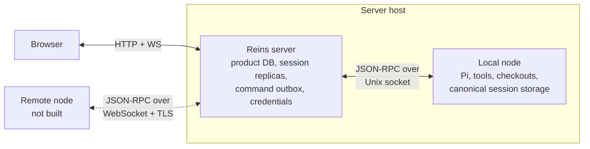

# Node Architecture

Status: **local process split done; remote nodes not started.** Every session runs on a node; the server stores, replicates, dispatches through a durable outbox, relocates sessions and serves the UI. The local node is a separate process linked over a Unix socket. The completed phase is recorded in [completed/node-local-process-split.md](completed/node-local-process-split.md); the current design is in [node-contract.md](../dev/node-contract.md) and [node-runtime.md](../dev/node-runtime.md), with decisions in ADRs [008](../adr/008-server-hub-session-relocation.md)–[013](../adr/013-server-holds-credentials.md).

## Motivation

Support multiple machines (e.g. a Mac and a Linux box, or disposable cloud machines), each with their own checkouts, connected to one Reins server, and eventually a hosted server with users connecting their own machines as nodes. Browser traffic, including agent events, stays routed through the server.

```mermaid
graph LR
    Browser[Browser] <-->|HTTP + WS| Server
    subgraph Server host
        Server[Reins server\nproduct DB, session replicas,\ncommand outbox, credentials]
        Local[Local node\nPi, tools, checkouts,\ncanonical session storage]
        Server <-->|JSON-RPC over\nUnix socket| Local
    end
    Remote[Remote node\nnot built] <-.->|JSON-RPC over\nWebSocket + TLS| Server
```

## Remaining work

- [ ] **Remote transport:** JSON-RPC over WebSocket + TLS behind the same `WireSocket` seam, with enrollment and authentication before any method (credentials above all) is served (see *External-node enrollment* below). Chunk `session.committed` and bound prompt size so both fit a capped remote frame; consider a per-node cap or fairness in the dispatcher so one slow node cannot hold every delivery slot.
- [ ] **Remote rollout:** creating `nodes` rows through enrollment, source approval, and moving the remaining server-local operations behind the node (see *Remote readiness* below). Test with a checkout the server cannot access, and with incompatible or overlapping node versions.
- [ ] **Node crash recovery:** a node killed mid-run (SIGKILL, crash) leaves Pi's operation pending with an unknown outcome and the server's `activity_state` `running`; nothing reconciles it, and a prompt admitted after the restart waits behind the pending operation until an explicit resume (`POST /api/sessions/:id/resume`). Graceful shutdown (SIGTERM) already aborts and settles runs.
- [ ] **Credential lookups per runtime open:** opening a runtime makes hundreds of `credentials.get` calls, because Pi's model runtime checks every registered provider and logged-out results are not cached on the node. Cheap locally, costly remotely. Options: cache logged-out results until the next attach, or narrow which providers Pi checks. (Batching and server push were considered and declined for now.)
- [ ] **Relocation follow-ups:**
  - [ ] Cross-node moves between two real node processes (today tested with a second loopback node).
  - [ ] Moving sessions with active runs (today moves wait for idle).
- [ ] **Refresh idle runtimes per turn:** close and reopen an idle Pi runtime before new input so it picks up new code; keep active runs alive, and measure reopen cost. Idle runtimes are currently cached until explicit close or process exit.
- [ ] **Node management screen:** list nodes, connection status and project sources, with source selection for new sessions once projects have sources on several nodes (replacing the "first source" default with a per-project choice). Decide whether offline nodes appear in the source picker.

## Check before finishing this build

- **Process-test hygiene:** the process test helper (`__tests__/helpers/processes.ts`) kills only the direct child, so a killed or timed-out run can leave orphaned server processes (four were once found running from deleted `/tmp/reins-proc-*` dirs); kill the process group on cleanup and on test-runner exit. Separately, `__tests__/index.test.ts` starts the real entrypoint without choosing a port (`REINS_PORT`), so it collides with a running dev server and can hang until timeout; give it a free port.

## Remote readiness

Server code that still assumes the checkout is local and must move behind node requests (or fail closed for remote sources) before a remote session is complete:

- `models/workspace.ts` and `routes/files.ts`: working-tree/ref listing and reads, changed-file summaries and diffs.
- `models/tasks.ts`, `models/projects.ts`, `routes/git.ts`, `git.ts`: branch creation, checkout, push, rebase, remote sync; `routes/projects.ts` checks local path existence.
- `project.createTask` runs on the server and creates the branch there.

Candidate node requests, all `request-now` (answered immediately, `unavailable` when offline, never queued):

| Request | Inputs → result |
|---|---|
| `workspace.list`, `workspace.read` | sourceId, scoped relative path, optional ref → existing listing/content DTOs; reject escaping paths |
| `workspace.status`, `workspace.diff` | sourceId, optional ref/branch, paging/size limits → existing workspace projection DTOs |
| `resources.list` | sourceId → the node's current skill/prompt-template metadata (no bodies). **Skills part built** as `skills.list {sourceId, cwd}` → `{skills: [{name, description}]}` (node-contract.md *Skills*); the server sends the source's path like a binding, since the node has no source configuration to verify it against yet. Prompt templates remain open. |

`sourceId` is resolved server-side from the session; the node verifies it maps to its configured path. Never accept a browser-supplied host path or an arbitrary command.

**Skills and resources are node-local.** Two sources of one project can have different repo skills, user-global skills and AGENTS files; the node discovers them in the bound cwd at every open, and slash expansion runs on the node before admission. For UI suggestions, `resources.list` is a live per-source view (refresh on open; an offline source shows no inventory). Explicit slash invocation that cannot resolve should return a typed admission error (`skill_not_found`/`skill_read_failed`) rather than sending unexpanded text. Pinning skill versions is deferred. Tests should cover two sources with different skills, invocation on a server without the repo, and relative reference reads.

**Other remote gaps:** idle node runtime eviction without aborting admissions or runs; a control path for auth changes to reach nodes (today a logout reaches a node only on reconnect or next refresh); node storage backup expectations for disposable machines (the server replica can re-hydrate, losing only undelivered commits).

## External-node enrollment and connection authentication (design proposal)

Threat boundary: a stolen **server database snapshot** (including node rows and grant verifiers) must not let an attacker impersonate a node. A compromised **live server** can dispatch authorized prompts and read server-visible outputs/storage; node authentication does not protect against it. Local node private-key compromise permits impersonation until revocation. TLS with hostname verification is mandatory, including enrollment; prohibit insecure certificate bypass. A reverse proxy must forward only verified identity context, never client-supplied identity headers. Do not store reusable node bearer credentials on the server.

Recommended v1, single-server self-hosted pairing:

1. An authenticated administrator creates an explicit pending node pairing with allowed project IDs and expiry (e.g. 10 minutes). Generate 256 random bits as a one-use grant; display once over the authenticated UI or CLI, store only a keyed verifier (HMAC under a server secret **outside the DB**, constant-time comparison), expiry, scope and consumed timestamp. Never log the grant or put it in a URL. If the deployment secret is unavailable, fail closed; a DB-only attacker must not be able to brute-force or redeem the grant. Grant possession alone authorizes only enrollment, not session commands.
2. The node locally generates an Ed25519 keypair using an OS CSPRNG, stores the private key with restrictive file permissions / OS keystore where available, and posts the grant plus public key to the TLS server. Pairing is an authenticated atomic compare-and-consume transaction; bind a newly issued opaque node ID to that public key and the grant's project scope. Reject expired/consumed grants. The administrator verifies the node fingerprint through an independent channel before approving source access if an adversary could intercept the grant. Duplicate concurrent redemption must yield one winner.
3. Each outbound WS connection starts unauthenticated. The server sends a CSPRNG nonce (at least 256 bits), short deadline, protocol version and server-generated challenge ID; the node signs a canonical, domain-separated tuple of version, server origin, node ID, challenge ID and nonce. The server verifies the stored public key, node enabled state and challenge freshness; consumes the challenge exactly once (including failed verification); binds the authenticated node ID and connection to the socket; then accepts `node.hello` (whose `nodeId` must match). Reject unsolicited `hello`, replayed/expired challenges, wrong origin/version, or attempts to change node ID. Reconnect creates a new challenge and fences the previous connection (the existing epoch mechanism). Signed data must have a deterministic encoding and length limits.
4. Sources are approved, not claimed: the administrator binds each `sourceId` to this node and project and approves its local path/fingerprint; changing a path or project requires reapproval. The server dispatches only to approved source bindings of the authenticated node, and the node checks the source ID maps to its configured path. Record enrollment, source approvals/path changes, key changes, revocations, authentication failures and dispatch decisions in a bounded audit log without credentials or sensitive content.
5. Rotation: require proof by the current key for a key-update request signed by the *new* key; commit replacement atomically, close old connections, invalidate old challenges, and require a fresh connection. If the old key is lost or compromised, revoke and re-enroll through administrator approval. Revocation disables the node/key and its source access, closes the active socket, rejects pending responses/events and new connections.

Alternative: mTLS client certificates bind identity during the TLS handshake but require CA issuance, validation/revocation and proxy pass-through; DB-only resistance requires the CA signing key outside the DB. A static bearer token (even hashed at rest) leaks usable authority if the node token or server logs escape; avoid it as durable node identity. If TLS terminates at a proxy, trust its hop explicitly (private network or authenticated TLS) and reject direct app access.

Gate: grant issuance/redemption, public-key registration, challenge handshake and server-side socket identity before any remote command; exercise DB-snapshot-only theft, stolen/expired/competing grants, nonce replay, wrong-origin signatures, reconnect fencing and revocation in transport tests. Decide deployment secret custody/recovery, who may create grants in a multi-user instance, fingerprint confirmation UX, key-at-rest storage per OS, and whether rotation needs an overlap window before hosted rollout.

## Cloud nodes (future)

Disposable cloud machines (e.g. Fly Sprites, which resume from checkpoint in about a second) are natural nodes. Reins would manage only a sleep/wake lifecycle: track nodes as online, sleeping or offline; on a prompt for a sleeping wakeable node, trigger a wake and let the queued command deliver on reconnect (the outbox already holds work for disconnected nodes); show "Starting…" for a waking cloud node and "Offline" for an unreachable personal machine. Provisioning the machine (tools, clones, CLI auth) stays outside Reins. Node storage on such machines may be discarded; the server replica re-hydrates sessions, losing only undelivered commits.

## Open questions

- **Frontend authentication:** account authentication and user-scoped authorization are separate from node identity; passkeys are a candidate.
- **Privacy and trust:** a node lets the server route prompts that execute on the user's machine, and the server receives all events and transcripts. Fine for self-hosting; for a hosted multi-user service, explore node-side tool permissions and approval gates, audit logging of server-initiated commands, scoped node permissions and end-to-end encrypted storage. Self-hosted remains the primary model.
- **Latency:** server-relayed events add a hop for remote nodes. Direct browser–node streaming (e.g. WebRTC data channels with the server as signaling) is a possible later optimization with fallback to the relay.
- **Multiple sources per project:** the model allows it; decide the default-source policy and UX once it is real.
- **Protocol standards:** whether ACP could carry the server–node command/event channel (see [ADR-006](../adr/006-acpx-as-runtime-replacement.md) for the runtime-level evaluation).
