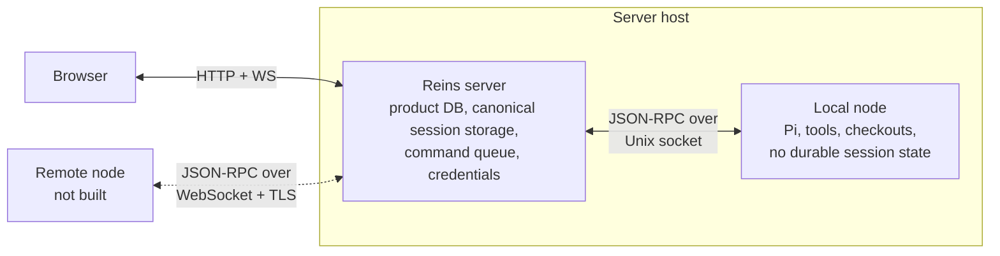

# Node Architecture

Status: **local process split done; switching to server-canonical storage ([ADR-015](../adr/015-server-canonical-storage-stateless-node.md)); remote nodes not started.** Every session runs on a node; the server stores every session, dispatches work through a durable queue and serves the UI. The local node is a separate process linked over a Unix socket. The completed first phase is recorded in [completed/node-local-process-split.md](completed/node-local-process-split.md); the design it built is in [node-contract.md](../dev/node-contract.md) and [node-runtime.md](../dev/node-runtime.md), which describe the code as it is today and are updated slice by slice below.

## Motivation

Support multiple machines (e.g. a Mac and a Linux box, or disposable cloud machines), each with their own checkouts, connected to one Reins server, and eventually a hosted server with users connecting their own machines as nodes. Browser traffic, including agent events, stays routed through the server.

```mermaid
graph LR
    Browser[Browser] <-->|HTTP + WS| Server
    subgraph Server host
        Server[Reins server\nproduct DB, canonical session storage,\ncommand queue, credentials]
        Local[Local node\nPi, tools, checkouts,\nno durable session state]
        Server <-->|JSON-RPC over\nUnix socket| Local
    end
    Remote[Remote node\nnot built] <-.->|JSON-RPC over\nWebSocket + TLS| Server
```

## Current phase: server-canonical storage, stateless node

The first phase made the node the canonical owner of each session's AgentHarness storage, with the server keeping an exact replica ([ADR-009](../adr/009-node-canonical-storage-server-replica.md)). Reconciling the two copies is where most of the node code and most of its open problems live. [ADR-015](../adr/015-server-canonical-storage-stateless-node.md) reverses it: **the server's SQLite is the only session storage, and the node forwards every Pi storage read and commit over the link.**

What this removes: node SQLite, node migrations, `session_outbox`, `session.committed`, watermarks and batch hashes, `session.hydrate`/`session.snapshot`, relocation with `revertTo`, `not_owner` fencing and drop, `node_session_deletions`/`session.delete`, `session.provision`, the `placement_status` state machine, the move dialog and move-targets endpoint, and the `@reins/pi-sql-storage` package split. Crash recovery, cross-node moves, moving active sessions and node backups stop being problems.

What stays: the link (`@reins/node-protocol`: peer, NDJSON framing, hello/epochs, heartbeat), the command queue for prompt/steer/setModel with per-session ordering and replay of unknown outcomes, immediate abort/resume, lifecycle reports, opaque `session.event` relay, chunked attachments, server-held credentials, Reins tools calling the server, `skills.list`, the process split and supervisor.

### Slices

Each slice ships green with the existing suite while the current server and node keep running.

1. **Storage over the wire.** Add `storage.read {sessionId, op, args}` and `storage.commit {sessionId, writes}` (strict schemas in `schema.ts`, node→server base methods). The server serves them from `PiStorageAdapter` on its own database, fenced with the existing `readable`/`owned` checks; `commit` runs Pi's `prepareStorageCommit` and `validateCommittedWrites` inside its transaction. Add `RemoteStorage` in `packages/node` implementing Pi's `Storage` over the peer. Prove it with Pi's `createStorageConformance` through the loopback link. No behavior changes.
2. **Per-session storage mode.** `sessions.storage_mode` (`node` | `server`, default `node`). For `server` sessions: creation writes the main lane on the server (move `createMainLane` where the backend can use it) and places the session `provisioned` with no provision command; session commands carry the mode and the task snapshot; the node opens with `RemoteStorage`, verifies nothing against node storage and never touches its SQLite; `session.committed`, hydrate and re-hydration are skipped. Fencing is unchanged. Existing sessions are untouched. Flip the default for new sessions behind an env flag, exercise it, then flip it for everyone.
3. **Migrate old sessions.** A `node` session that is idle on the server with no undelivered node outbox rows already has an exact server copy. The server switches its mode and the node drops its copy through the path a `not_owner` refusal takes today. Nothing is copied. Run it for every remaining `node` session at startup or on first use.
4. **Delete.** With no `node` sessions left: node SQLite, migrations, `session_outbox`, hydrate, snapshot paging and digests, relocation, watermarks, the placement machine, deletions propagation, the move UI, and the lint rules that only guarded the storage split. Fold `pi-sql-storage` into the backend. Rewrite node-contract.md and node-runtime.md for the result and move this phase to `completed/`.

Follow-ups once the switch is complete:

- **Idle runtime eviction:** close runtimes idle for a fixed period (they hold nothing durable), which also picks up new node code between turns.
- **Crash recovery:** a reconnecting node lists its live sessions in `node.hello`; the server settles every other `running` session on that node as interrupted.
- **Moving a session:** one `UPDATE sessions SET source_id` when idle, plus `session.close` to the previous node. Sessions with active runs still wait for idle.
- **Forks and tree navigation:** server-side over the canonical copy (Pi's `createForkSnapshot` needs only a `SessionReader`); see [conversation-tree.md](conversation-tree.md).

### Deferred: write-behind for high-latency links

Not built. Recorded so it is not rediscovered. Per-call latency on a remote link adds up (see *Measurements*): at 40 ms per storage call a three-tool run pays about 3.8 s. If that matters once a remote node exists, add a second node-side `Storage` decorator, used only on remote links, that serves reads from an in-memory copy of what Pi has read (the node is the sole writer while it holds the session, and entries are immutable) and forwards commits asynchronously, in order, over the same `storage.commit` method. It is a write-behind cache with crash semantics: nothing durable, no replay, no watermarks; a rejected commit or a dropped link aborts the run and drops the runtime, and the server stays consistent through the last applied commit. It must not grow into a second source of truth. The wire protocol is the same either way, so it is a node-only change. Build it only after measuring a real remote node; a Mac and a Linux box on one network (1 to 20 ms) are unlikely to need it.

### Measurements

Storage calls the current adapter sees for one scripted prompt (faux provider, `noop` tool), counted with a proxy around `PiStorageAdapter`:

| Phase | Storage calls | Of which commits | Bytes |
|---|---|---|---|
| Open runtime | 7 | 1 | < 1 KB |
| Run with 3 tool calls | 40 to 70 | 30 to 50 | ~70 KB |
| Run with 0 tool calls | 21 | 9 | ~45 KB |

Commits are small (median under 1 KB); most are lane bookkeeping (list and value writes for operation state, tool placement and checkpoints). Reads are one `scanBranch` from the tip back to the last compaction per LLM turn plus a few point lookups; Pi keeps no transcript in memory.

Wall time of the same run with artificial latency on every storage call:

| Per call | 3 tool calls | 10 tool calls |
|---|---|---|
| 0 ms (local SQLite) | 21 ms | |
| 5 ms | 530 ms | |
| 40 ms | 3.8 s | 8.4 s |

A raw Unix-socket JSON round trip on the dev machine is about 4 µs; with the peer, zod and SQLite, budget 0.1 to 0.3 ms per call, so a tool-heavy run pays 10 to 30 ms locally.

Session sizes in the dev database (for cold opens and forks): sessions with 400+ messages average 1.85 MB of entry JSON (max 8.5 MB, about 2.6 KB per message) and compress about 20:1; lane values are under 10 KB per session. A cold open reads lane values plus the post-compaction tail, not the whole session.

## Remaining work (after the switch)

- [ ] **Remote transport:** JSON-RPC over WebSocket + TLS behind the same `WireSocket` seam, with enrollment and authentication before any method (credentials above all) is served (see *External-node enrollment* below). Bound prompt size to the remote frame cap; consider a per-node cap or fairness in the dispatcher so one slow node cannot hold every delivery slot.
- [ ] **Remote rollout:** creating `nodes` rows through enrollment, source approval, and moving the remaining server-local operations behind the node (see *Remote readiness* below). Test with a checkout the server cannot access, and with incompatible or overlapping node versions.
- [ ] **Credential lookups per runtime open:** opening a runtime makes hundreds of `credentials.get` calls, because Pi's model runtime checks every registered provider and logged-out results are not cached on the node. Cheap locally, costly remotely. Options: cache logged-out results until the next attach, or narrow which providers Pi checks.
- [ ] **Node management screen:** list nodes, connection status and project sources, with source selection for new sessions once projects have sources on several nodes (replacing the "first source" default with a per-project choice). Decide whether offline nodes appear in the source picker.
- [ ] **Plugin-started nodes:** a plugin that starts a node for a session or task is a server-side placement decision (pick or create the source before the first command is dispatched), not a node-side provisioning step. Add it as a hook in source selection when there is a plugin to use it.

## Check before finishing this build

- **Process-test hygiene:** the process test helper (`__tests__/helpers/processes.ts`) kills only the direct child, so a killed or timed-out run can leave orphaned server processes (four were once found running from deleted `/tmp/reins-proc-*` dirs); kill the process group on cleanup and on test-runner exit. Separately, `__tests__/index.test.ts` starts the real entrypoint without choosing a port (`REINS_PORT`), so it collides with a running dev server and can hang until timeout; give it a free port.

## Remote readiness

Server code that still assumes the checkout is local and must move behind node requests (or fail closed for remote sources) before a remote session is complete:

- `models/workspace.ts` and `routes/files.ts`: working-tree/ref listing and reads, changed-file summaries and diffs.
- `models/tasks.ts`, `models/projects.ts`, `routes/git.ts`, `git.ts`: branch creation, checkout, push, rebase, remote sync; `routes/projects.ts` checks local path existence.
- `project.createTask` runs on the server and creates the branch there.

Candidate node requests, all `request-now` (answered immediately, `unavailable` when offline, never queued):

| Request | Inputs → result |
|---|---|
| `workspace.list`, `workspace.read` | sourceId, scoped relative path, optional ref → existing listing/content DTOs; reject escaping paths |
| `workspace.status`, `workspace.diff` | sourceId, optional ref/branch, paging/size limits → existing workspace projection DTOs |
| `resources.list` | sourceId → the node's current skill/prompt-template metadata (no bodies). **Skills part built** as `skills.list {sourceId, cwd}` → `{skills: [{name, description}]}` (node-contract.md *Skills*); the server sends the source's path like a binding, since the node has no source configuration to verify it against yet. Prompt templates remain open. |

`sourceId` is resolved server-side from the session; the node verifies it maps to its configured path. Never accept a browser-supplied host path or an arbitrary command.

**Skills and resources are node-local.** Two sources of one project can have different repo skills, user-global skills and AGENTS files; the node discovers them in the bound cwd at every open, and slash expansion runs on the node before admission. For UI suggestions, `resources.list` is a live per-source view (refresh on open; an offline source shows no inventory). Explicit slash invocation that cannot resolve should return a typed admission error (`skill_not_found`/`skill_read_failed`) rather than sending unexpanded text. Pinning skill versions is deferred. Tests should cover two sources with different skills, invocation on a server without the repo, and relative reference reads.

**Other remote gaps:** a control path for auth changes to reach nodes (today a logout reaches a node only on reconnect or next refresh).

## External-node enrollment and connection authentication (design proposal)

Threat boundary: a stolen **server database snapshot** (including node rows and grant verifiers) must not let an attacker impersonate a node. A compromised **live server** can dispatch authorized prompts and read server-visible outputs/storage; node authentication does not protect against it. Local node private-key compromise permits impersonation until revocation. TLS with hostname verification is mandatory, including enrollment; prohibit insecure certificate bypass. A reverse proxy must forward only verified identity context, never client-supplied identity headers. Do not store reusable node bearer credentials on the server.

Recommended v1, single-server self-hosted pairing:

1. An authenticated administrator creates an explicit pending node pairing with allowed project IDs and expiry (e.g. 10 minutes). Generate 256 random bits as a one-use grant; display once over the authenticated UI or CLI, store only a keyed verifier (HMAC under a server secret **outside the DB**, constant-time comparison), expiry, scope and consumed timestamp. Never log the grant or put it in a URL. If the deployment secret is unavailable, fail closed; a DB-only attacker must not be able to brute-force or redeem the grant. Grant possession alone authorizes only enrollment, not session commands.
2. The node locally generates an Ed25519 keypair using an OS CSPRNG, stores the private key with restrictive file permissions / OS keystore where available, and posts the grant plus public key to the TLS server. Pairing is an authenticated atomic compare-and-consume transaction; bind a newly issued opaque node ID to that public key and the grant's project scope. Reject expired/consumed grants. The administrator verifies the node fingerprint through an independent channel before approving source access if an adversary could intercept the grant. Duplicate concurrent redemption must yield one winner.
3. Each outbound WS connection starts unauthenticated. The server sends a CSPRNG nonce (at least 256 bits), short deadline, protocol version and server-generated challenge ID; the node signs a canonical, domain-separated tuple of version, server origin, node ID, challenge ID and nonce. The server verifies the stored public key, node enabled state and challenge freshness; consumes the challenge exactly once (including failed verification); binds the authenticated node ID and connection to the socket; then accepts `node.hello` (whose `nodeId` must match). Reject unsolicited `hello`, replayed/expired challenges, wrong origin/version, or attempts to change node ID. Reconnect creates a new challenge and fences the previous connection (the existing epoch mechanism). Signed data must have a deterministic encoding and length limits.
4. Sources are approved, not claimed: the administrator binds each `sourceId` to this node and project and approves its local path/fingerprint; changing a path or project requires reapproval. The server dispatches only to approved source bindings of the authenticated node, and the node checks the source ID maps to its configured path. Record enrollment, source approvals/path changes, key changes, revocations, authentication failures and dispatch decisions in a bounded audit log without credentials or sensitive content.
5. Rotation: require proof by the current key for a key-update request signed by the *new* key; commit replacement atomically, close old connections, invalidate old challenges, and require a fresh connection. If the old key is lost or compromised, revoke and re-enroll through administrator approval. Revocation disables the node/key and its source access, closes the active socket, rejects pending responses/events and new connections.

Alternative: mTLS client certificates bind identity during the TLS handshake but require CA issuance, validation/revocation and proxy pass-through; DB-only resistance requires the CA signing key outside the DB. A static bearer token (even hashed at rest) leaks usable authority if the node token or server logs escape; avoid it as durable node identity. If TLS terminates at a proxy, trust its hop explicitly (private network or authenticated TLS) and reject direct app access.

Gate: grant issuance/redemption, public-key registration, challenge handshake and server-side socket identity before any remote command; exercise DB-snapshot-only theft, stolen/expired/competing grants, nonce replay, wrong-origin signatures, reconnect fencing and revocation in transport tests. Decide deployment secret custody/recovery, who may create grants in a multi-user instance, fingerprint confirmation UX, key-at-rest storage per OS, and whether rotation needs an overlap window before hosted rollout.

## Cloud nodes (future)

Disposable cloud machines (e.g. Fly Sprites, which resume from checkpoint in about a second) are natural nodes, and a stateless node suits them: there is nothing on the machine to back up or re-hydrate. Reins would manage only a sleep/wake lifecycle: track nodes as online, sleeping or offline; on a prompt for a sleeping wakeable node, trigger a wake and let the queued command deliver on reconnect (the command queue already holds work for disconnected nodes); show "Starting…" for a waking cloud node and "Offline" for an unreachable personal machine. Provisioning the machine (tools, clones, CLI auth) stays outside Reins. A distant cloud node is the case most likely to want the deferred write-behind decorator.

## Open questions

- **Frontend authentication:** account authentication and user-scoped authorization are separate from node identity; passkeys are a candidate.
- **Privacy and trust:** a node lets the server route prompts that execute on the user's machine, and the server receives all events and transcripts. Fine for self-hosting; for a hosted multi-user service, explore node-side tool permissions and approval gates, audit logging of server-initiated commands, scoped node permissions and end-to-end encrypted storage. Self-hosted remains the primary model.
- **Latency:** server-relayed events add a hop for remote nodes. Direct browser–node streaming (e.g. WebRTC data channels with the server as signaling) is a possible later optimization with fallback to the relay.
- **Multiple sources per project:** the model allows it; decide the default-source policy and UX once it is real.
- **Protocol standards:** whether ACP could carry the server–node command/event channel (see [ADR-006](../adr/006-acpx-as-runtime-replacement.md) for the runtime-level evaluation).
