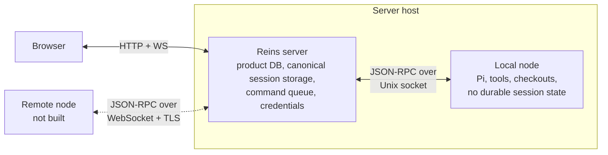

# Node Architecture

Status: **local process split done; server-canonical storage done ([ADR-015](../adr/015-server-canonical-storage-stateless-node.md)); remote nodes not started.** Every session runs on a node; the server stores every session, dispatches work through a durable queue and serves the UI. The node holds nothing durable: its Pi runtime reads and commits each session on the server over the link. The local node is a separate process linked over a Unix socket. The completed phases are recorded in [completed/node-local-process-split.md](completed/node-local-process-split.md) and [completed/server-canonical-storage.md](completed/server-canonical-storage.md); the current design is in [node-contract.md](../dev/node-contract.md) and [node-runtime.md](../dev/node-runtime.md).

## Motivation

Support multiple machines (e.g. a Mac and a Linux box, or disposable cloud machines), each with their own checkouts, connected to one Reins server, and eventually a hosted server with users connecting their own machines as nodes. Browser traffic, including agent events, stays routed through the server.

```mermaid
graph LR
    Browser[Browser] <-->|HTTP + WS| Server
    subgraph Server host
        Server[Reins server\nproduct DB, canonical session storage,\ncommand queue, credentials]
        Local[Local node\nPi, tools, checkouts,\nno durable session state]
        Server <-->|JSON-RPC over\nUnix socket| Local
    end
    Remote[Remote node\nnot built] <-.->|JSON-RPC over\nWebSocket + TLS| Server
```

## Server-canonical storage (done)

The server's SQLite is the only session storage and the node holds nothing durable ([ADR-015](../adr/015-server-canonical-storage-stateless-node.md)). How it was delivered, the storage-traffic measurements behind the decision and the deferred write-behind decorator for high-latency links (not built: build it only after measuring a real remote node) are in [completed/server-canonical-storage.md](completed/server-canonical-storage.md).

## Simplification follow-up (implemented in an isolated worktree)

Keep Pi and host-local execution together on nodes. Moving Pi to a server-side worker process would retain much of the command/storage/lifecycle/recovery machinery and add another link to tools-only nodes; it is not the proposed simplification.

Prioritize deletions and deeper modules within the existing process split:

1. **Done: unused command-settlement waiting removed.** No `NodeHub.commandSettled`, dispatcher waiter map or waiter reconciliation. Tests observe queue settlement directly. Session-level `api.sessions.wait` stays.
2. **Done: child replies project on the server.** `session.settled` carries native `run_end.tipId`; the server reads that exact ancestry through `loadBranchMessages`. Node reply reads/promises and the reply/error wire fields are removed. Tests cover delayed settlement against a newer main tip, projection failures and the existing failed/aborted lifecycle effects. Child report/outbox/activity changes remain transactional. Protocol version is now **4**.
3. **Done: one process-lifetime hub/dispatcher.** Product handlers in `node-services.ts` swap per reload; existing node links/epochs and in-flight calls survive. Routing and dispatch use current product services. Handler install/uninstall is gone. `@reins/node-protocol` stays external to dev bundles to preserve schema/error identities; process-owned changes warn that restart is required. Real-process tests prove link preservation and in-flight delivery across reload. Real disconnect recovery and atomic claims stay. See [ADR-016](../adr/016-process-owned-node-hub.md).
4. **Done: one command-delivery module.** `nodes/commands.ts` resolves source/binding, sends the command and classifies the outcome. The extra `sendNodeCommand` wrapper and success `kind` vocabulary are gone; `NodeResult.value` preserves the validated wire result. Command and wire schemas reuse input/model fields and result schemas. Persisted intent remains distinct from execution-time binding; queued work remains distinct from immediate controls.
5. **Done, with user approval: dormant Claude SDK runtime deleted.** Implementation, runtime-specific tests/fixture, trace/repro scripts, SDK/CLI dependencies and import-rule exceptions are removed. Historical runtime identifiers remain readable/rejected as unavailable; future support would be a node integration.

Verification: root typecheck and lint pass; all **1,744 tests pass in two consecutive full runs**. Real-process interruption tests wait for the preceding run to settle and for the slow provider to start, rather than treating a committed message as proof of runtime readiness. Bundle tests verify that protocol constructors and process-owned database/store code are not cloned into reloadable handlers.

Rollout: changes were implemented/tested in `/tmp/reins-node-simplification`, away from the live checkout's watchers. **After importing, restart the server and node together** at a deliberate idle point; protocol 3 nodes cannot use protocol 4 settlements. Do not rely on hot reload for this cutover.

**Hydration clarification:** session hydration/replication is already gone. There is no active `session.hydrate`, `session.snapshot` or `session.provision`; old names remain in migration history/tests and can also appear in ignored, stale `packages/node/dist` build output (current package exports point to `src`). Moving an idle session updates its source and best-effort closes the old runtime. `hydratePrompt` remains intentionally: it resolves image attachment references into bytes for model-provider requests, not session relocation or transcript reconstruction.

## Remaining work

- [ ] **Idle runtime eviction:** close runtimes idle for a fixed period (they hold nothing durable), which also bounds node memory and picks up new node code between turns.
- [ ] **Forks and tree navigation on the server:** over the canonical copy (Pi's `createForkSnapshot` needs only a `SessionReader`); see [conversation-tree.md](conversation-tree.md).
- [ ] **Chunked storage calls:** `storage.read`/`storage.commit` are not chunked, so a read result or commit over the frame cap fails its run; a remote link with a smaller cap needs them chunked.
- [ ] **Remote release gate:** handshake, version policy, node identity and node config format (see *Remote release gate* below), decided before transport code.
- [ ] **Remote transport:** JSON-RPC over WebSocket + TLS behind the same `WireSocket` seam, with enrollment and authentication before any method (credentials above all) is served (see *External-node enrollment* below). Bound prompt size to the remote frame cap; consider a per-node cap or fairness in the dispatcher so one slow node cannot hold every delivery slot.
- [x] **Node→server streams:** `stream.data`/`stream.end`/`stream.cancel` (protocol 5), the node sender paced by socket drain and the per-connection server registry exposing each stream as a `ReadableStream` (capped in memory). See node-contract.md *Streams*. No opening method exists yet.
- [ ] **Git and file operations behind the node:** the first stream consumers. `/diff/patch` (today git stdout piped to the response) becomes a stream-opening node request whose body the route returns; large file reads likewise. Chunks are text only, so binary content (image and PDF previews) needs a binary chunk encoding or stays a bounded reply. Part of *Remote rollout*.
- [ ] **Background process output (later):** stream a node-side process's output over the same primitive, resuming from an offset after a reconnect (the node keeps the output; offsets are already absolute). Decide whether the server spills a long-lived stream to disk instead of failing it at the buffer cap.
- [ ] **Remote rollout:** creating `nodes` rows through enrollment, source approval, and moving the remaining server-local operations behind the node (see *Remote readiness* below). Test with a checkout the server cannot access, and with incompatible or overlapping node versions.
- [ ] **Credential lookups per runtime open:** opening a runtime makes hundreds of `credentials.get` calls, because Pi's model runtime checks every registered provider and logged-out results are not cached on the node. Cheap locally, costly remotely. Options: cache logged-out results until the next attach, or narrow which providers Pi checks.
- [ ] **Node management screen:** list nodes, connection status and project sources, with source selection for new sessions once projects have sources on several nodes (replacing the "first source" default with a per-project choice). Decide whether offline nodes appear in the source picker.
- [ ] **Process-test speed (optional):** fixed waits (`[slow:3000]`/`[slow:1500]` faux-provider stalls, a 2s sleep, reconnect backoff) are most of `server-process.process-test.ts`'s ~17s; a provider that blocks until the test releases it would roughly halve it.
- [ ] **Plugin-started nodes:** a plugin that starts a node for a session or task is a server-side placement decision (pick or create the source before the first command is dispatched), not a node-side provisioning step. Add it as a hook in source selection when there is a plugin to use it.

## Remote release gate

The local split locks nothing in: the node stores nothing, the local node always ships and restarts with the server, and server schema changes are append-only migrations. The first remote release is different: a remote node is installed on another machine and will lag the server, so what that release puts on the wire or on the node's disk is hard to change afterwards. Settle these first, before transport code:

1. **Handshake stability.** The handshake is the one part every node and server version must keep understanding. Today the node speaks first (`node.hello`) and the server accepts exactly one protocol version (`server-peer.ts`), failing with a bare "No common protocol version". The remote handshake needs: the server-first authentication challenge (see *External-node enrollment* below), which changes the order; hello parsing that tolerates unknown fields (`helloParams` is a `strictObject`, so any added field breaks an older server); and a mismatch error whose data carries the server's supported versions, so any future node can say "upgrade to vN".
2. **Version policy.** Recommended for self-hosted v1: lockstep (the node must match the server's protocol version), with the clear mismatch error above and an easy node update path. Supporting a window of node versions means keeping old commands working; defer it until there is a reason. Decide before the release, because it determines what the handshake carries.
3. **Node identity.** Whatever credential a node stores can only be replaced by re-pairing that machine. Ship the keypair/challenge design below in the first remote release rather than a shared token to migrate later.
4. **Node config format.** The remote node's local config (server URL, node ID, key location, approved source paths) lives outside server migrations; give it a version field from the start.

Required for remote but not sticky: moving server-local checkout operations behind the node (*Remote readiness* below), chunked storage calls, a minimal pairing UI (create a grant, approve sources) and a source picker once a project has sources on two nodes. The full node management screen can follow.

## Remote readiness

Server code that still assumes the checkout is local and must move behind node requests (or fail closed for remote sources) before a remote session is complete:

- `models/workspace.ts` and `routes/files.ts`: working-tree/ref listing and reads, changed-file summaries and diffs.
- `models/tasks.ts`, `models/projects.ts`, `routes/git.ts`, `git.ts`: branch creation, checkout, push, rebase, remote sync; `routes/projects.ts` checks local path existence.
- `project.createTask` runs on the server and creates the branch there.

Candidate node requests, all `request-now` (answered immediately, `unavailable` when offline, never queued). Unbounded results (a patch, a large file) cross as streams (node-contract.md *Streams*) rather than one reply:

| Request | Inputs → result |
|---|---|
| `workspace.list`, `workspace.read` | sourceId, scoped relative path, optional ref → existing listing/content DTOs; reject escaping paths |
| `workspace.status`, `workspace.diff` | sourceId, optional ref/branch, paging/size limits → existing workspace projection DTOs |
| `resources.list` | sourceId → the node's current skill/prompt-template metadata (no bodies). **Skills part built** as `skills.list {sourceId, cwd}` → `{skills: [{name, description}]}` (node-contract.md *Skills*); the server sends the source's path like a binding, since the node has no source configuration to verify it against yet. Prompt templates remain open. |

`sourceId` is resolved server-side from the session; the node verifies it maps to its configured path. Never accept a browser-supplied host path or an arbitrary command.

**Skills and resources are node-local.** Two sources of one project can have different repo skills, user-global skills and AGENTS files; the node discovers them in the bound cwd at every open, and slash expansion runs on the node before admission. For UI suggestions, `resources.list` is a live per-source view (refresh on open; an offline source shows no inventory). Explicit slash invocation that cannot resolve should return a typed admission error (`skill_not_found`/`skill_read_failed`) rather than sending unexpanded text. Pinning skill versions is deferred. Tests should cover two sources with different skills, invocation on a server without the repo, and relative reference reads.

**Other remote gaps:** a control path for auth changes to reach nodes (today a logout reaches a node only on reconnect or next refresh).

## External-node enrollment and connection authentication (design proposal)

Threat boundary: a stolen **server database snapshot** (including node rows and grant verifiers) must not let an attacker impersonate a node. A compromised **live server** can dispatch authorized prompts and read server-visible outputs/storage; node authentication does not protect against it. Local node private-key compromise permits impersonation until revocation. TLS with hostname verification is mandatory, including enrollment; prohibit insecure certificate bypass. A reverse proxy must forward only verified identity context, never client-supplied identity headers. Do not store reusable node bearer credentials on the server.

Recommended v1, single-server self-hosted pairing:

1. An authenticated administrator creates an explicit pending node pairing with allowed project IDs and expiry (e.g. 10 minutes). Generate 256 random bits as a one-use grant; display once over the authenticated UI or CLI, store only a keyed verifier (HMAC under a server secret **outside the DB**, constant-time comparison), expiry, scope and consumed timestamp. Never log the grant or put it in a URL. If the deployment secret is unavailable, fail closed; a DB-only attacker must not be able to brute-force or redeem the grant. Grant possession alone authorizes only enrollment, not session commands.
2. The node locally generates an Ed25519 keypair using an OS CSPRNG, stores the private key with restrictive file permissions / OS keystore where available, and posts the grant plus public key to the TLS server. Pairing is an authenticated atomic compare-and-consume transaction; bind a newly issued opaque node ID to that public key and the grant's project scope. Reject expired/consumed grants. The administrator verifies the node fingerprint through an independent channel before approving source access if an adversary could intercept the grant. Duplicate concurrent redemption must yield one winner.
3. Each outbound WS connection starts unauthenticated. The server sends a CSPRNG nonce (at least 256 bits), short deadline, protocol version and server-generated challenge ID; the node signs a canonical, domain-separated tuple of version, server origin, node ID, challenge ID and nonce. The server verifies the stored public key, node enabled state and challenge freshness; consumes the challenge exactly once (including failed verification); binds the authenticated node ID and connection to the socket; then accepts `node.hello` (whose `nodeId` must match). Reject unsolicited `hello`, replayed/expired challenges, wrong origin/version, or attempts to change node ID. Reconnect creates a new challenge and fences the previous connection (the existing epoch mechanism). Signed data must have a deterministic encoding and length limits.
4. Sources are approved, not claimed: the administrator binds each `sourceId` to this node and project and approves its local path/fingerprint; changing a path or project requires reapproval. The server dispatches only to approved source bindings of the authenticated node, and the node checks the source ID maps to its configured path. Record enrollment, source approvals/path changes, key changes, revocations, authentication failures and dispatch decisions in a bounded audit log without credentials or sensitive content.
5. Rotation: require proof by the current key for a key-update request signed by the *new* key; commit replacement atomically, close old connections, invalidate old challenges, and require a fresh connection. If the old key is lost or compromised, revoke and re-enroll through administrator approval. Revocation disables the node/key and its source access, closes the active socket, rejects pending responses/events and new connections.

Alternative: mTLS client certificates bind identity during the TLS handshake but require CA issuance, validation/revocation and proxy pass-through; DB-only resistance requires the CA signing key outside the DB. A static bearer token (even hashed at rest) leaks usable authority if the node token or server logs escape; avoid it as durable node identity. If TLS terminates at a proxy, trust its hop explicitly (private network or authenticated TLS) and reject direct app access.

Gate: grant issuance/redemption, public-key registration, challenge handshake and server-side socket identity before any remote command; exercise DB-snapshot-only theft, stolen/expired/competing grants, nonce replay, wrong-origin signatures, reconnect fencing and revocation in transport tests. Decide deployment secret custody/recovery, who may create grants in a multi-user instance, fingerprint confirmation UX, key-at-rest storage per OS, and whether rotation needs an overlap window before hosted rollout.

## Cloud nodes (future)

Disposable cloud machines (e.g. Fly Sprites, which resume from checkpoint in about a second) are natural nodes, and a stateless node suits them: there is nothing on the machine to back up or re-hydrate. Reins would manage only a sleep/wake lifecycle: track nodes as online, sleeping or offline; on a prompt for a sleeping wakeable node, trigger a wake and let the queued command deliver on reconnect (the command queue already holds work for disconnected nodes); show "Starting…" for a waking cloud node and "Offline" for an unreachable personal machine. Provisioning the machine (tools, clones, CLI auth) stays outside Reins. A distant cloud node is the case most likely to want the deferred write-behind decorator.

## Open questions

- **Frontend authentication:** account authentication and user-scoped authorization are separate from node identity; passkeys are a candidate.
- **Privacy and trust:** a node lets the server route prompts that execute on the user's machine, and the server receives all events and transcripts. Fine for self-hosting; for a hosted multi-user service, explore node-side tool permissions and approval gates, audit logging of server-initiated commands, scoped node permissions and end-to-end encrypted storage. Self-hosted remains the primary model.
- **Latency:** server-relayed events add a hop for remote nodes. Direct browser–node streaming (e.g. WebRTC data channels with the server as signaling) is a possible later optimization with fallback to the relay.
- **Multiple sources per project:** the model allows it; decide the default-source policy and UX once it is real.
- **Protocol standards:** whether ACP could carry the server–node command/event channel (see [ADR-006](../adr/006-acpx-as-runtime-replacement.md) for the runtime-level evaluation).
